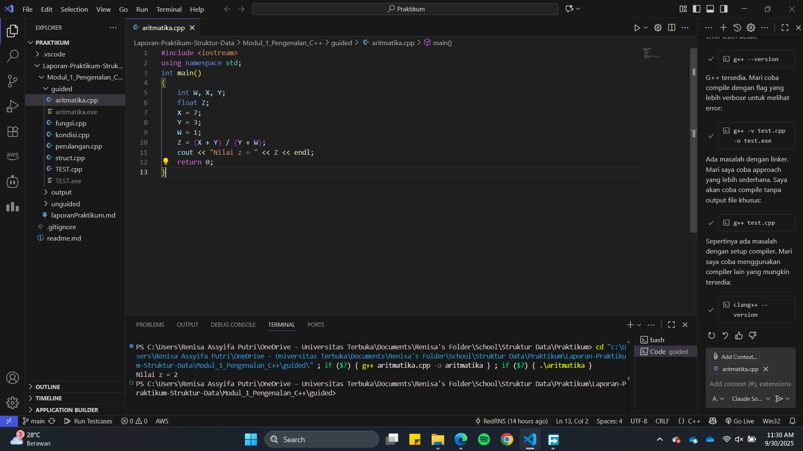
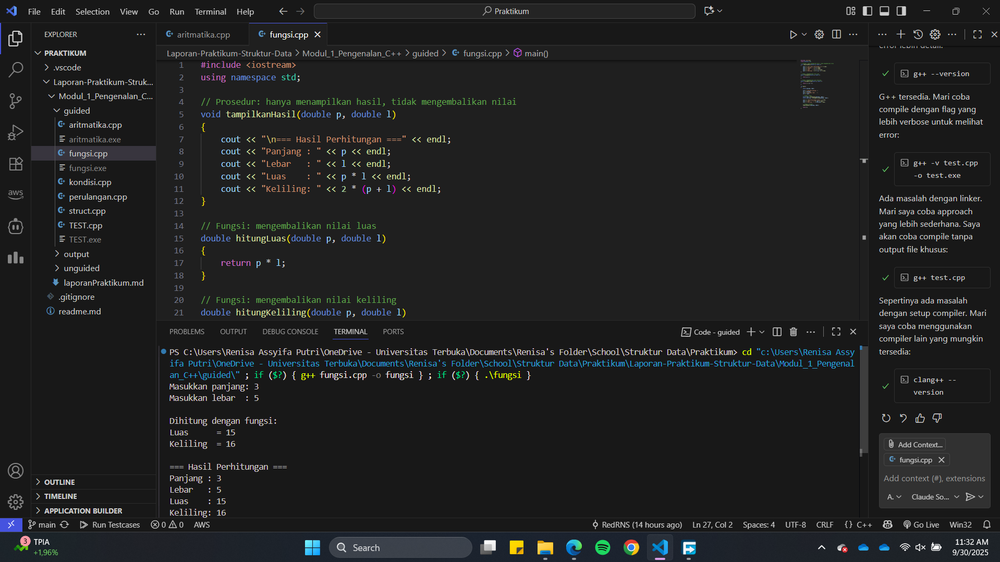
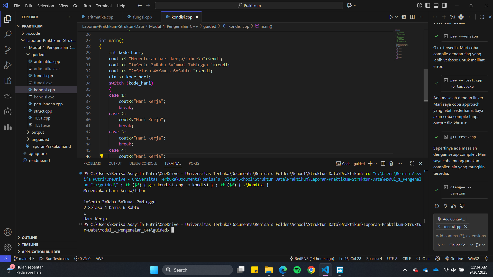
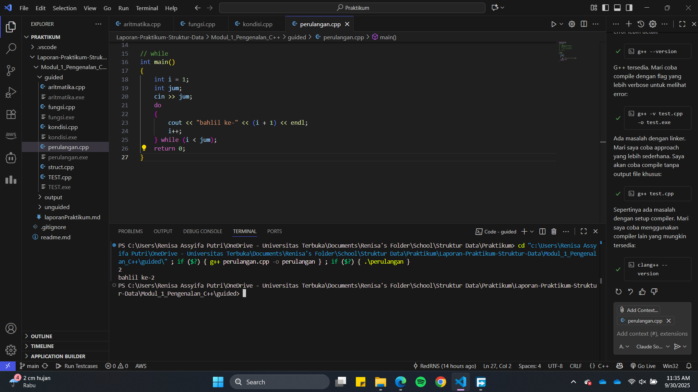
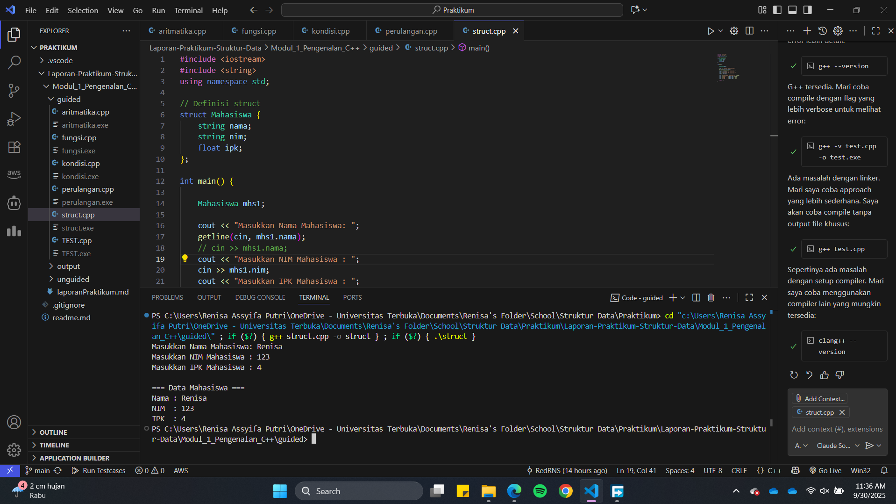
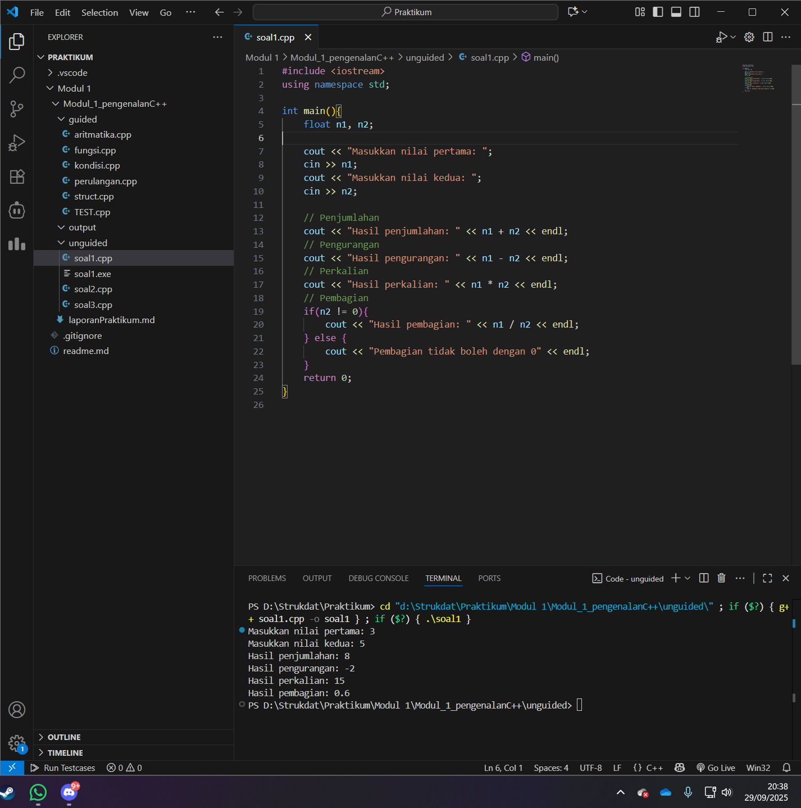
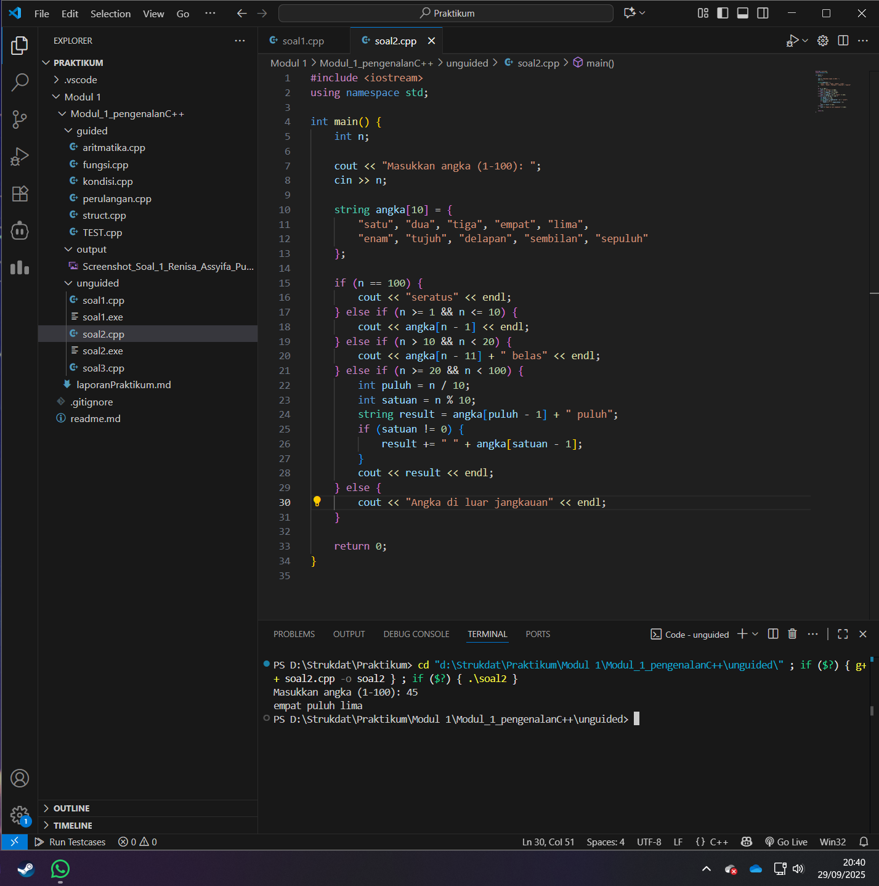
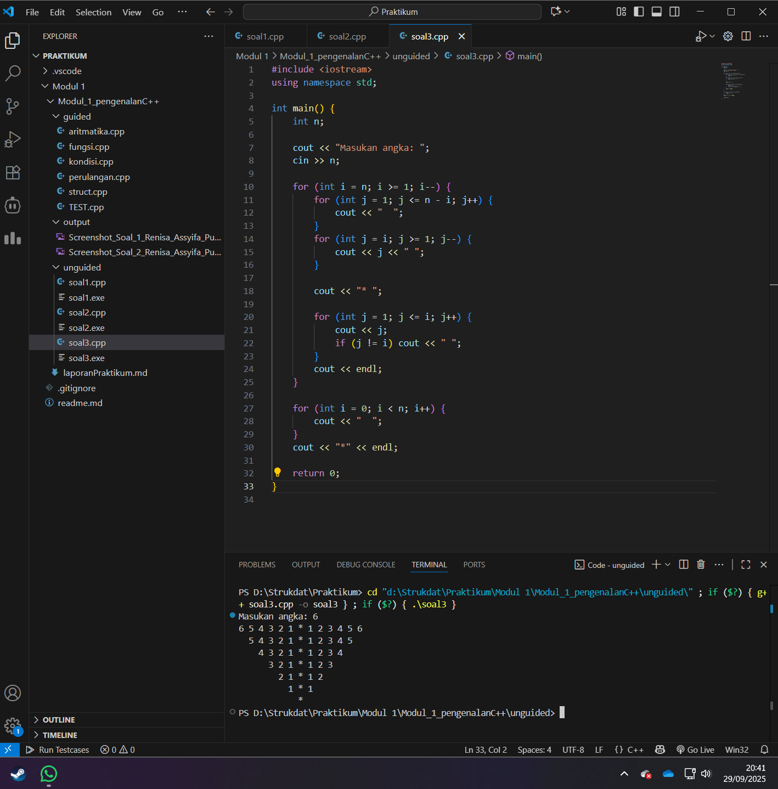

# <h1 align="center">Laporan Praktikum Modul 1 <br> Pengenalan C++</h1>

<p align="center">Renisa Assyifa Putri - 103112400123</p>

## Dasar Teori

### 1. Pengenalan C++

C++ adalah bahasa pemrograman tingkat menengah yang dikembangkan oleh Bjarne Stroustrup sebagai pengembangan dari bahasa C. C++ menggabungkan pemrograman prosedural dengan pemrograman berorientasi objek (OOP) sehingga menjadikannya bahasa yang powerful dan fleksibel.

### 2. Struktur Dasar Program C++

Setiap program C++ memiliki struktur dasar sebagai berikut:

```cpp
#include <iostream>  // Preprocessor directive
using namespace std; // Menggunakan namespace standard

int main() {         // Fungsi utama
    // Kode program
    return 0;        // Mengembalikan nilai 0 (program berhasil)
}
```

### 3. Tipe Data

C++ menyediakan berbagai tipe data untuk menyimpan berbagai jenis informasi:

- **int**: Bilangan bulat (contoh: 10, -5, 0)
- **float**: Bilangan desimal presisi tunggal (contoh: 3.14f)
- **double**: Bilangan desimal presisi ganda (contoh: 3.14159)
- **char**: Karakter tunggal (contoh: 'A', '1')
- **string**: Rangkaian karakter (contoh: "Hello World")
- **bool**: Nilai boolean (true atau false)

**Contoh penggunaan:**
```cpp
int umur = 20;
float ipk = 3.75;
string nama = "Renisa";
bool lulus = true;
```

### 4. Operator Aritmatika

Operator yang digunakan untuk operasi matematika:
- `+` : Penjumlahan
- `-` : Pengurangan
- `*` : Perkalian
- `/` : Pembagian
- `%` : Modulus (sisa bagi)

### 5. Struktur Kontrol Percabangan

**a. IF-ELSE**

Digunakan untuk membuat keputusan berdasarkan kondisi tertentu:
```cpp
if (kondisi) {
    // Kode jika kondisi true
} else {
    // Kode jika kondisi false
}
```

**b. SWITCH-CASE**

Digunakan untuk memilih salah satu dari banyak alternatif:
```cpp
switch (variabel) {
    case nilai1:
        // Kode untuk nilai1
        break;
    case nilai2:
        // Kode untuk nilai2
        break;
    default:
        // Kode jika tidak ada yang cocok
}
```

### 6. Struktur Kontrol Perulangan

**a. FOR Loop**

Digunakan saat jumlah iterasi sudah diketahui:
```cpp
for (int i = 0; i < n; i++) {
    // Kode yang diulang
}
```

**b. WHILE Loop**

Digunakan saat perulangan bergantung pada kondisi:
```cpp
while (kondisi) {
    // Kode yang diulang
}
```

**c. DO-WHILE Loop**

Mirip while tetapi selalu dieksekusi minimal 1 kali:
```cpp
do {
    // Kode yang diulang
} while (kondisi);
```

### 7. Fungsi dan Prosedur

**Fungsi** adalah blok kode yang mengembalikan nilai:
```cpp
int tambah(int a, int b) {
    return a + b;
}
```

**Prosedur** (void function) adalah fungsi yang tidak mengembalikan nilai:
```cpp
void tampilkanPesan() {
    cout << "Hello!" << endl;
}
```

### 8. Struct

Struct memungkinkan pengelompokan data dengan tipe yang berbeda:
```cpp
struct Mahasiswa {
    string nama;
    string nim;
    float ipk;
};

// Penggunaan:
Mahasiswa mhs1;
mhs1.nama = "Renisa";
mhs1.nim = "103112400123";
mhs1.ipk = 3.85;
```

### 9. Input dan Output

- **cout**: Untuk menampilkan output ke layar
- **cin**: Untuk menerima input dari keyboard
- **getline()**: Untuk membaca input berupa baris teks lengkap

```cpp
string nama;
cout << "Masukkan nama: ";
getline(cin, nama);
cout << "Halo, " << nama << endl;
```

## Guided

### Soal 1 Aritmatika

```cpp
#include <iostream>
using namespace std;
int main()
{
    int W, X, Y;
    float Z;
    X = 7;
    Y = 3;
    W = 1;
    Z = (X + Y) / (Y + W);
    cout << "Nilai z = " << Z << endl;
    return 0;
}
```

> Output
> 

Program ini melakukan perhitungan matematis sederhana. Nilai Z didapatkan dari hasil pembagian antara (X + Y) dengan (Y + W). Nilai variabel X, Y, dan W telah ditentukan secara hardcode di dalam program. Hasil akhir dari operasi tersebut yang disimpan dalam variabel Z bertipe float kemudian dicetak ke layar.

### Soal 2 Fungsi

```cpp
#include <iostream>
using namespace std;

// Prosedur: hanya menampilkan hasil, tidak mengembalikan nilai
void tampilkanHasil(double p, double l)
{
    cout << "\n=== Hasil Perhitungan ===" << endl;
    cout << "Panjang : " << p << endl;
    cout << "Lebar   : " << l << endl;
    cout << "Luas    : " << p * l << endl;
    cout << "Keliling: " << 2 * (p + l) << endl;
}

// Fungsi: mengembalikan nilai luas
double hitungLuas(double p, double l)
{
    return p * l;
}

// Fungsi: mengembalikan nilai keliling
double hitungKeliling(double p, double l)
{
    return 2 * (p + l);
}

int main()
{
    double panjang, lebar;

    cout << "Masukkan panjang: ";
    cin >> panjang;
    cout << "Masukkan lebar  : ";
    cin >> lebar;

    // Panggil fungsi
    double luas = hitungLuas(panjang, lebar);
    double keliling = hitungKeliling(panjang, lebar);

    cout << "\nDihitung dengan fungsi:" << endl;
    cout << "Luas      = " << luas << endl;
    cout << "Keliling  = " << keliling << endl;

    // Panggil prosedur
    tampilkanHasil(panjang, lebar);

    return 0;
}

```

> Output
> 

Program ini mendemonstrasikan cara menghitung luas dan keliling dari persegi panjang. Input berupa nilai panjang dan lebar diterima dari pengguna. Program mengimplementasikan dua fungsi (hitungLuas dan hitungKeliling) yang masing-masing mengembalikan nilai hasil perhitungan, serta satu prosedur (tampilkanHasil) yang bertugas menampilkan keseluruhan hasil secara langsung tanpa mengembalikan nilai.

### Soal 3 Perkondisian

```cpp
#include <iostream>
using namespace std;

// Contoh 1: Struktur IF sederhana
void contohIF() {
    double tot_pembelian, diskon;
    cout << "\n=== Contoh IF Sederhana ===" << endl;
    cout << "Total pembelian: Rp";
    cin >> tot_pembelian;
    diskon = 0;
    if (tot_pembelian >= 100000)
        diskon = 0.05 * tot_pembelian;
    cout << "Besar diskon = Rp" << diskon << endl;
}

// Contoh 2: Struktur IF-ELSE
void contohIFELSE() {
    double tot_pembelian, diskon;
    cout << "\n=== Contoh IF-ELSE ===" << endl;
    cout << "Total pembelian: Rp";
    cin >> tot_pembelian;
    if (tot_pembelian >= 100000)
        diskon = 0.05 * tot_pembelian;
    else
        diskon = 0;
    cout << "Besar diskon = Rp" << diskon << endl;
}

// Contoh 3: Struktur SWITCH-CASE
void contohSWITCH() {
    int kode_hari;
    cout << "\n=== Contoh SWITCH-CASE ===" << endl;
    cout << "Menentukan hari kerja/libur\n" << endl;
    cout << "1=Senin 3=Rabu 5=Jumat 7=Minggu" << endl;
    cout << "2=Selasa 4=Kamis 6=Sabtu" << endl;
    cout << "Masukkan kode hari: ";
    cin >> kode_hari;
    switch (kode_hari)
    {
    case 1:
    case 2:
    case 3:
    case 4:
    case 5:
        cout << "Hari Kerja" << endl;
        break;
    case 6:
    case 7:
        cout << "Hari Libur" << endl;
        break;
    default:
        cout << "Kode masukan salah!!!" << endl;
    }
}

int main()
{
    int pilihan;
    cout << "=== Program Struktur Kontrol Percabangan ===" << endl;
    cout << "1. Contoh IF" << endl;
    cout << "2. Contoh IF-ELSE" << endl;
    cout << "3. Contoh SWITCH-CASE" << endl;
    cout << "Pilih contoh (1-3): ";
    cin >> pilihan;

    switch (pilihan) {
        case 1:
            contohIF();
            break;
        case 2:
            contohIFELSE();
            break;
        case 3:
            contohSWITCH();
            break;
        default:
            cout << "Pilihan tidak valid!" << endl;
    }

    return 0;
}

```

> Output
> 

Program ini mendemonstrasikan tiga jenis struktur kontrol percabangan dalam C++. Program didesain secara modular dengan tiga fungsi terpisah: `contohIF()` untuk percabangan IF sederhana yang menghitung diskon berdasarkan total pembelian, `contohIFELSE()` untuk percabangan IF-ELSE dengan kondisi alternatif, dan `contohSWITCH()` untuk percabangan SWITCH-CASE yang menentukan apakah suatu hari merupakan hari kerja atau libur. Fungsi main() berfungsi sebagai menu utama yang memungkinkan pengguna memilih contoh yang ingin dijalankan. Program ini terstruktur dan memberikan pemahaman yang baik tentang perbedaan setiap jenis percabangan.

### Soal 4 Perulangan

```cpp
#include <iostream>
using namespace std;

// Contoh 1: Perulangan FOR
void contohFOR() {
    int jum;
    cout << "\n=== Contoh FOR Loop ===" << endl;
    cout << "Jumlah perulangan: ";
    cin >> jum;
    for (int i = 0; i < jum; i++) {
        cout << "Perulangan ke-" << (i + 1) << endl;
    }
}

// Contoh 2: Perulangan WHILE
void contohWHILE() {
    int jum, i = 0;
    cout << "\n=== Contoh WHILE Loop ===" << endl;
    cout << "Jumlah perulangan: ";
    cin >> jum;
    while (i < jum) {
        cout << "Perulangan ke-" << (i + 1) << endl;
        i++;
    }
}

// Contoh 3: Perulangan DO-WHILE
void contohDOWHILE() {
    int jum, i = 0;
    cout << "\n=== Contoh DO-WHILE Loop ===" << endl;
    cout << "Jumlah perulangan: ";
    cin >> jum;
    do {
        cout << "Perulangan ke-" << (i + 1) << endl;
        i++;
    } while (i < jum);
}

int main()
{
    int pilihan;
    cout << "=== Program Struktur Perulangan ===" << endl;
    cout << "1. Contoh FOR" << endl;
    cout << "2. Contoh WHILE" << endl;
    cout << "3. Contoh DO-WHILE" << endl;
    cout << "Pilih contoh (1-3): ";
    cin >> pilihan;

    switch (pilihan) {
        case 1:
            contohFOR();
            break;
        case 2:
            contohWHILE();
            break;
        case 3:
            contohDOWHILE();
            break;
        default:
            cout << "Pilihan tidak valid!" << endl;
    }

    return 0;
}
```

> Output
> 

Program ini mendemonstrasikan tiga jenis struktur perulangan dalam C++ secara lengkap dan terstruktur. Program dibagi menjadi tiga fungsi: `contohFOR()` untuk perulangan FOR yang cocok digunakan saat jumlah iterasi sudah diketahui, `contohWHILE()` untuk perulangan WHILE yang kondisinya dicek di awal sebelum eksekusi, dan `contohDOWHILE()` untuk perulangan DO-WHILE yang memastikan kode dieksekusi minimal satu kali karena kondisi dicek di akhir. Fungsi main() menyediakan menu interaktif yang memungkinkan pengguna memilih jenis perulangan yang ingin dipelajari. Setiap contoh menerima input jumlah perulangan dari pengguna dan menampilkan nomor iterasi secara berurutan untuk memberikan visualisasi yang jelas tentang cara kerja masing-masing jenis perulangan.

### Soal 5 Struct

```cpp
#include <iostream>
#include <string>
using namespace std;

// Definisi struct
struct Mahasiswa {
    string nama;
    string nim;
    float ipk;
};

int main() {

    Mahasiswa mhs1;

    cout << "Masukkan Nama Mahasiswa: ";
    getline(cin, mhs1.nama);
    // cin >> mhs1.nama;
    cout << "Masukkan NIM Mahasiswa : ";
    cin >> mhs1.nim;
    cout << "Masukkan IPK Mahasiswa : ";
    cin >> mhs1.ipk;

    cout << "\n=== Data Mahasiswa ===" << endl;
    cout << "Nama : " << mhs1.nama << endl;
    cout << "NIM  : " << mhs1.nim << endl;
    cout << "IPK  : " << mhs1.ipk << endl;

    return 0;
}

```

> Output
> 

Program ini mengilustrasikan penggunaan struct untuk mengelompokkan data yang saling terkait. Struct dengan nama Mahasiswa didefinisikan untuk menampung tiga data: nama, nim, dan ipk. Program meminta pengguna memasukkan ketiga data tersebut kemudian menampilkannya kembali dalam format yang terstruktur.

### Soal 6 Test

```cpp
#include <iostream>
using namespace std;
int main()
{
    string ch;
    cout << "Masukkan sebuah karakter: ";
    // cin >> ch;
    ch = getchar();  //Menggunakan getchar() untuk membaca satu karakter
    cout << "Karakter yang Anda masukkan adalah: " << ch << endl;
    return 0;
}

```

Program ini didesain untuk membaca karakter tunggal dari input pengguna. Fungsi getchar() digunakan untuk menangkap karakter pertama yang dimasukkan kemudian karakter tersebut dicetak kembali ke layar sebagai output.

## Unguided

### Soal 1

Buatlah program yang menerima input-an dua buah bilangan bertipe float, kemudian memberikan output-an hasil penjumlahan, pengurangan, perkalian, dan pembagian dari dua bilangan tersebut.

```cpp
#include <iostream>
using namespace std;

int main(){
    float n1, n2;

    cout << "Masukkan nilai pertama: ";
    cin >> n1;
    cout << "Masukkan nilai kedua: ";
    cin >> n2;

    // Penjumlahan
    cout << "Hasil penjumlahan: " << n1 + n2 << endl;
    // Pengurangan
    cout << "Hasil pengurangan: " << n1 - n2 << endl;
    // Perkalian
    cout << "Hasil perkalian: " << n1 * n2 << endl;
    // Pembagian
    if(n2 != 0){
        cout << "Hasil pembagian: " << n1 / n2 << endl;
    } else {
        cout << "Pembagian tidak boleh dengan 0" << endl;
    }
    return 0;
}

```

> Output
> 

Program C++ ini berfungsi sebagai kalkulator sederhana yang melakukan empat operasi aritmatika dasar. Program meminta pengguna memasukkan dua bilangan desimal (n1 dan n2) kemudian menampilkan hasil dari penjumlahan, pengurangan, perkalian, dan pembagian kedua bilangan tersebut. Terdapat kondisi khusus untuk operasi pembagian untuk mencegah terjadinya error akibat pembagian dengan nol.

### Soal 2

Buatlah sebuah program yang menerima masukan angka dan mengeluarkan angka tersebut dalam bentuk tulisan. Angka yang diinput user adalah positif mulai dari 0 s.d 100.

```cpp
#include <iostream>
using namespace std;

int main() {
    int n;

    cout << "Masukkan angka (1-100): ";
    cin >> n;

    string angka[10] = {
        "satu", "dua", "tiga", "empat", "lima",
        "enam", "tujuh", "delapan", "sembilan", "sepuluh"
    };

    if (n == 100) {
        cout << "seratus" << endl;
    } else if (n >= 1 && n <= 10) {
        cout << angka[n - 1] << endl;
    } else if (n > 10 && n < 20) {
        cout << angka[n - 11] + " belas" << endl;
    } else if (n >= 20 && n < 100) {
        int puluh = n / 10;
        int satuan = n % 10;
        string result = angka[puluh - 1] + " puluh";
        if (satuan != 0) {
            result += " " + angka[satuan - 1];
        }
        cout << result << endl;
    } else {
        cout << "Angka di luar jangkauan" << endl;
    }

    return 0;
}

```

> Output
> 

Program ini berfungsi sebagai konverter angka menjadi teks dalam Bahasa Indonesia untuk rentang 1 hingga 100. Program menggunakan logika percabangan untuk menangani beberapa kasus. Untuk angka 1-10, program mengambil string dari array yang telah didefinisikan. Untuk angka belasan (11-19), program menggabungkan nama satuan dengan akhiran "belas". Untuk angka puluhan (20-99), angka dipecah menjadi puluhan dan satuan untuk dirangkai. Terdapat kasus khusus untuk angka 100 dan pesan error akan muncul jika angka yang diinput berada di luar jangkauan yang ditentukan.

### Soal 3

Buatlah program yang dapat memberikan input dan output seperti segitiga dengan angka

```cpp
#include <iostream>
using namespace std;

int main() {
    int n;

    cout << "Masukan angka: ";
    cin >> n;

    for (int i = n; i >= 1; i--) {
        for (int j = 1; j <= n - i; j++) {
            cout << "  ";
        }
        for (int j = i; j >= 1; j--) {
            cout << j << " ";
        }

        cout << "* ";

        for (int j = 1; j <= i; j++) {
            cout << j;
            if (j != i) cout << " ";
        }
        cout << endl;
    }

    for (int i = 0; i < n; i++) {
        cout << "  ";
    }
    cout << "*" << endl;

    return 0;
}

```

> Output
> 

Program ini dirancang untuk menghasilkan pola piramida angka terbalik yang simetris berdasarkan input n dari pengguna. Program menggunakan perulangan bersarang (nested loop) dimana loop terluar mengontrol baris sedangkan loop di dalamnya mengatur pencetakan spasi untuk indentasi, urutan angka menurun di sisi kiri, karakter * di tengah, dan urutan angka menaik di sisi kanan. Setelah pola utama selesai, baris tambahan yang hanya berisi karakter * di tengah dicetak sebagai penutup.

## Kesimpulan

Praktikum Modul 1 tentang Pengenalan C++ ini telah memberikan pemahaman fundamental tentang konsep-konsep dasar pemrograman C++. Beberapa hal penting yang dapat disimpulkan:

1. **Struktur Dasar Program**: Setiap program C++ memiliki struktur yang terdiri dari preprocessor directive, namespace, dan fungsi main() sebagai titik awal eksekusi program.

2. **Tipe Data dan Variabel**: Pemahaman tentang berbagai tipe data (int, float, double, string, char) sangat penting untuk menyimpan dan memanipulasi data sesuai kebutuhan.

3. **Operator Aritmatika**: Operator aritmatika dasar (+, -, *, /, %) merupakan fondasi untuk melakukan perhitungan matematis dalam program.

4. **Struktur Kontrol Percabangan**: Penggunaan if-else dan switch-case memungkinkan program membuat keputusan berdasarkan kondisi tertentu sehingga program menjadi lebih dinamis dan interaktif.

5. **Struktur Perulangan**: For, while, dan do-while loop memberikan kemampuan untuk mengeksekusi blok kode secara berulang yang sangat berguna untuk pemrosesan data berulang dan pembuatan pola.

6. **Fungsi dan Prosedur**: Modularitas kode melalui fungsi dan prosedur membuat program lebih terstruktur, mudah dipahami, dan dapat digunakan kembali (reusable).

7. **Struct**: Penggunaan struct memungkinkan pengelompokan data yang saling berkaitan menjadi satu kesatuan sehingga memudahkan pengelolaan data yang kompleks.

8. **Input/Output**: Penguasaan cin dan cout sebagai mekanisme dasar untuk interaksi dengan pengguna merupakan keterampilan esensial dalam pemrograman.

Melalui praktikum ini, kemampuan berpikir logis dan komputasional dalam memecahkan masalah pemrograman telah diasah melalui berbagai latihan mulai dari kalkulator sederhana, konverter angka ke teks, hingga pembuatan pola angka. Konsep-konsep ini akan menjadi fondasi yang kuat untuk mempelajari materi struktur data yang lebih kompleks di modul-modul selanjutnya.

## Referensi

1. Wijayanto, B. A., & Anistyasari, Y. (2022). E-Modul Pembelajaran Coding Berbasis Pengenalan Budaya Indonesia untuk Meningkatkan Computational Thinking. Jurnal Obsesi: Jurnal Pendidikan Anak Usia Dini, 6(4), 2866–2874. https://obsesi.or.id/index.php/obsesi/article/view/2323

2. Safitri, I. (2022). Pembelajaran Coding di Sekolah Dasar. Jurnal Pendidikan Indonesia (JPI), 3(3), 201–210. https://jpion.org/index.php/jpi/article/view/326

3. Prabowo, A., & Setiawan, A. (2019). Learning Tool for Robotics Basic Programming Based on Contextual Teaching and Learning to Improve Problem-Solving Skills. Jurnal Pendidikan Teknologi dan Kejuruan, 25(2), 159–167. https://jurnal.uny.ac.id/index.php/jptk/article/view/22856
