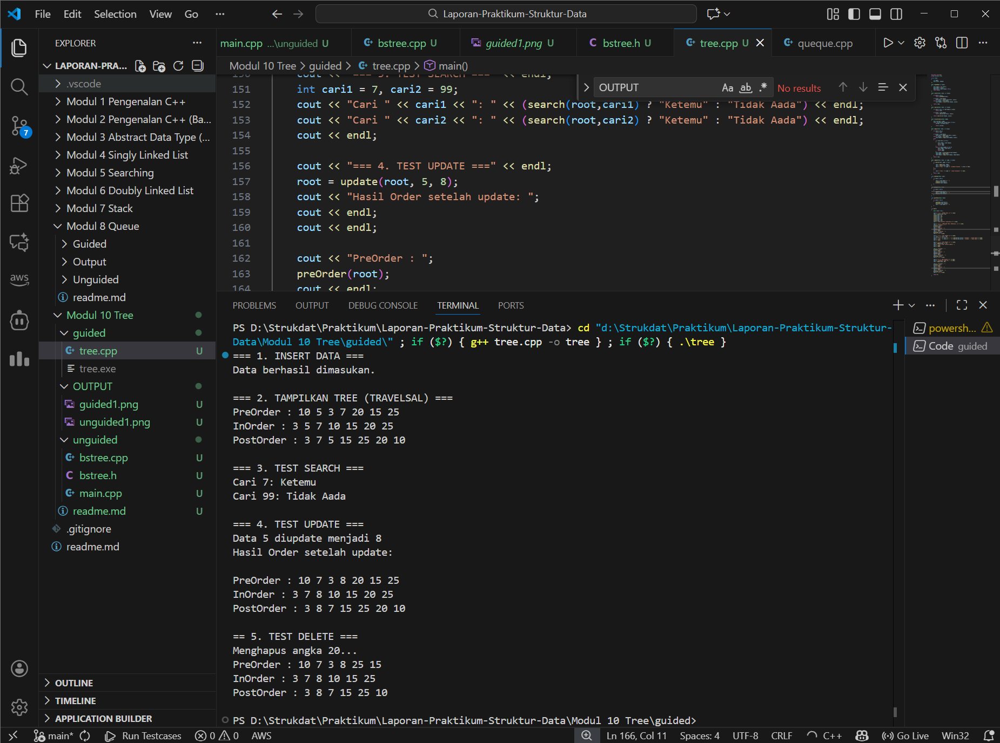
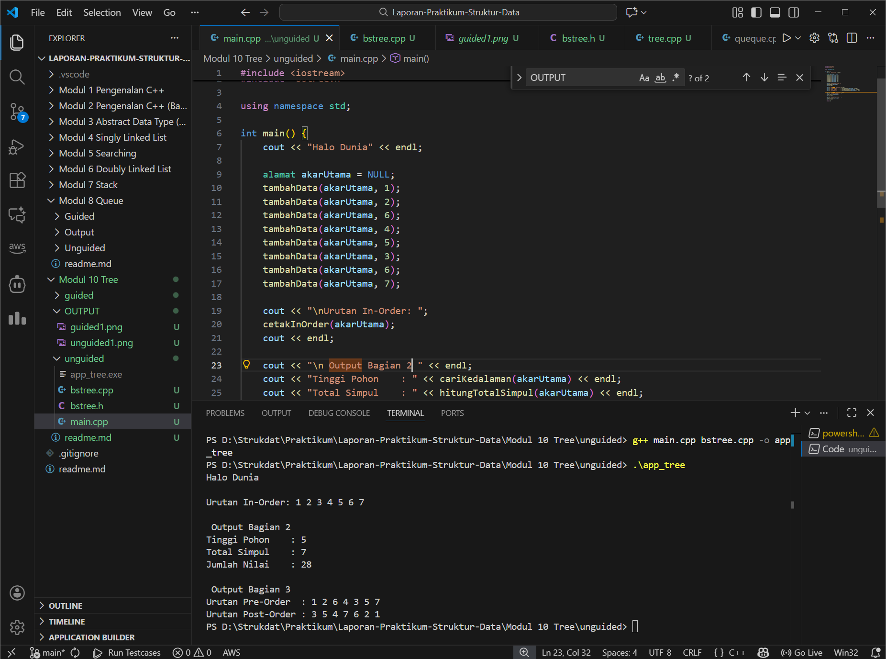

# <h1 align="center">Laporan Praktikum Modul 10 <br>Tree</h1>

<p align="center">Renisa Assyifa Putri - 103112400123</p>

## Dasar Teori
Rekursi adalah teknik pemrograman yang memungkinkan suatu fungsi untuk memanggil dirinya sendiri dalam menyelesaikan permasalahan secara berulang. Teknik ini memiliki beberapa keunggulan, antara lain menghasilkan kode yang lebih mudah dibaca (readability), memiliki struktur modular, dan dapat digunakan kembali (reusability). Supaya fungsi rekursif berjalan dengan baik tanpa mengalami infinite loop, dibutuhkan dua komponen penting yaitu base case yang berfungsi sebagai kondisi pemberhentian, dan recursive step yang melakukan pemanggilan fungsi itu sendiri sampai base case terpenuhi. Meski menghasilkan kode yang lebih ringkas, rekursi membutuhkan memori stack yang lebih besar dan waktu eksekusi yang lebih lama jika dibandingkan dengan pendekatan iteratif.

Tree atau pohon dalam struktur data merupakan struktur non-linear yang memiliki karakteristik hirarkis, dapat direpresentasikan sebagai graf terhubung tanpa sirkuit. Node paling atas disebut Root (akar) yang tidak memiliki parent, sementara node lainnya memiliki satu parent. Beberapa istilah penting dalam tree antara lain Leaf (daun) yaitu node tanpa child, Internal Nodes untuk node yang memiliki child, serta Height (tinggi) atau Depth untuk mengukur level maksimum dari tree tersebut. Salah satu jenis tree yang sering digunakan adalah Binary Tree, yaitu tree yang setiap node-nya maksimal memiliki dua child.

Binary Search Tree (BST) adalah implementasi khusus dari Binary Tree yang menerapkan aturan pengurutan tertentu. Pada BST, nilai di Left Child harus lebih kecil dari nilai parent-nya, sedangkan nilai di Right Child harus lebih besar. Dengan aturan ini, operasi pencarian (searching), penyisipan (insertion), dan penghapusan (deletion) dapat dilakukan dengan efisien. Untuk membaca seluruh data dalam tree, ada tiga metode traversal yang umum digunakan: Pre-order (Root, Kiri, Kanan), In-order (Kiri, Root, Kanan), dan Post-order (Kiri, Kanan, Root).

## Guided

### Guided 1
```c++
#include <iostream>
using namespace std;

struct Node
{
    int data;
    Node *kiri, *kanan;
};

Node *buatNode(int nilai)
{
    Node *baru = new Node();
    baru->data = nilai;
    baru->kiri = baru->kanan = NULL;
    return baru;
}

Node *insert(Node *root, int nilai)
{
    if (root == NULL)
        return buatNode(nilai);
    
    if (nilai < root->data)
        root->kiri = insert(root->kiri, nilai);
    else if (nilai > root->data)
        root->kanan = insert(root->kanan, nilai);

    return root;
}

Node *search(Node *root, int nilai)
{
    if (root == NULL || root->data == nilai)
        return root;

    if (nilai < root->data)
        return search(root->kiri, nilai);

    return search(root->kanan, nilai);
}

Node *nilaiTerkecil(Node *node)
{
    Node *current = node;
    while (current && current->kiri != NULL)
        current = current->kiri;

        return current;
}

Node *hapus(Node *root, int nilai)
{
    if (root == NULL)
        return root;

    if (nilai < root->data)
        root->kiri = hapus(root->kiri, nilai);
    else if (nilai > root->data)
        root->kanan = hapus(root->kanan, nilai);
    else
    {
        if (root->kiri == NULL)
        {
            Node *temp = root->kanan;
            delete root;
            return temp;
        }
        else if (root->kanan == NULL){
            Node *temp = root->kiri;
            delete root;
            return temp;
        }
        Node *temp = nilaiTerkecil(root->kanan);
        root->data = temp->data;
        root->kanan = hapus(root->kanan, temp->data);
    }
    return root;
}

Node *update(Node *root, int Lama, int baru)
{
    if (search(root, Lama) != NULL)
    {
        root = hapus(root, Lama);
        root = insert(root, baru);
        cout << "Data " << Lama << " diupdate menjadi " << baru << endl;
    }
    else
    {
        cout << "Data " << Lama << " tidak ditemukan!" << endl;
    }
    return root;
}

void preOrder(Node *root)
{
    if (root != NULL)
    {
        cout << root->data << " ";
        preOrder(root->kiri);
        preOrder(root->kanan);
    }
}

void inOrder(Node *root)
{
    if (root != NULL)
    {
        inOrder(root->kiri);
        cout << root->data << " ";
        inOrder(root->kanan);
    }
}

void postOrder(Node *root)
{
    if (root != NULL)
    {
        postOrder(root->kiri);
        postOrder(root->kanan);
        cout << root->data << " ";
    }
}

int main()
{
    Node *root = NULL;

    cout << "=== 1. INSERT DATA ===" << endl;
    root = insert(root, 10);
    insert(root, 5);
    insert(root, 20);
    insert(root, 3);
    insert(root, 7);
    insert(root, 15);
    insert(root, 25);
    cout << "Data berhasil dimasukan.\n" << endl;

    cout << "=== 2. TAMPILKAN TREE (TRAVELSAL) ===" << endl;
    cout << "PreOrder : ";
    preOrder(root);
    cout << endl;
    cout << "InOrder : ";
    inOrder(root);
    cout << endl;
    cout << "PostOrder : ";
    postOrder(root);
    cout << "\n" << endl;

    cout << "=== 3. TEST SEARCH ===" << endl;
    int cari1 = 7, cari2 = 99;
    cout << "Cari " << cari1 << ": " << (search(root,cari1) ? "Ketemu" : "Tidak Aada") << endl;
    cout << "Cari " << cari2 << ": " << (search(root,cari2) ? "Ketemu" : "Tidak Aada") << endl;
    cout << endl;

    cout << "=== 4. TEST UPDATE ===" << endl;
    root = update(root, 5, 8);
    cout << "Hasil Order setelah update: ";
    cout << endl;
    cout << endl;

    cout << "PreOrder : ";
    preOrder(root);
    cout << endl;
    cout << "InOrder : ";
    inOrder(root);
    cout << endl;
    cout << "PostOrder : ";
    postOrder(root);
    cout << "\n" << endl;

    cout << "== 5. TEST DELETE ===" << endl;
    cout << "Menghapus angka 20..." << endl;
    root = hapus(root, 20);

    cout << "PreOrder : ";
    preOrder(root);
    cout << endl;
    cout << "InOrder : ";
    inOrder(root);
    cout << endl;
    cout << "PostOrder : ";
    postOrder(root);
    cout << "\n" << endl;

    return 0;
}
```

#### Output Guided 1



#### Penjelasan Guided 1

Program ini mengimplementasikan Binary Search Tree (BST) secara lengkap dalam satu file. Program menyediakan operasi CRUD (Create, Read, Update, Delete) yang dapat digunakan untuk mengelola data dalam struktur tree. Beberapa fitur utama yang tersedia meliputi fungsi `search()` untuk mencari nilai tertentu, fungsi `update()` yang menggabungkan proses penghapusan dan penyisipan kembali data baru, serta fungsi `hapus()` yang dapat menangani berbagai kondisi penghapusan node baik itu node tanpa child, node dengan satu child, maupun node dengan dua child.

## Unguided

### Soal 1 - 3

#### 1. bstree.h

```cpp
#ifndef POHON_H
#define POHON_H
#include <iostream>

using namespace std;

typedef int tipeInfo;
typedef struct Simpul *alamat;

struct Simpul {
    tipeInfo data;
    alamat kiri;
    alamat kanan;
};

alamat buatSimpul(tipeInfo x);
void tambahData(alamat &akar, tipeInfo x);
void cetakInOrder(alamat akar);

int hitungTotalSimpul(alamat akar);
int jumlahkanSemuaData(alamat akar);
int cariKedalaman(alamat akar);
void cetakPreOrder(alamat akar);
void cetakPostOrder(alamat akar);

#endif
```

#### 2. bstree.cpp

```cpp
#include "bstree.h"

alamat buatSimpul(tipeInfo x) {
    alamat P = new Simpul;
    if (P != NULL) {
        P->data = x;
        P->kiri = NULL;
        P->kanan = NULL;
    }
    return P;
}

void tambahData(alamat &akar, tipeInfo x) {
    if (akar == NULL) {
        akar = buatSimpul(x);
    } else {
        if (x < akar->data) {
            tambahData(akar->kiri, x); 
        } else if (x > akar->data) {
            tambahData(akar->kanan, x); 
        }
    }
}

void cetakInOrder(alamat akar) {
    if (akar != NULL) {
        cetakInOrder(akar->kiri);
        cout << akar->data << " ";
        cetakInOrder(akar->kanan);
    }
}

void cetakPreOrder(alamat akar) {
    if (akar != NULL) {
        cout << akar->data << " ";
        cetakPreOrder(akar->kiri);
        cetakPreOrder(akar->kanan);
    }
}

void cetakPostOrder(alamat akar) {
    if (akar != NULL) {
        cetakPostOrder(akar->kiri);
        cetakPostOrder(akar->kanan);
        cout << akar->data << " ";
    }
}

int hitungTotalSimpul(alamat akar) {
    if (akar == NULL) {
        return 0;
    } else {
        return 1 + hitungTotalSimpul(akar->kiri) + hitungTotalSimpul(akar->kanan);
    }
}

int jumlahkanSemuaData(alamat akar) {
    if (akar == NULL) {
        return 0;
    } else {
        return akar->data + jumlahkanSemuaData(akar->kiri) + jumlahkanSemuaData(akar->kanan);
    }
}

int cariKedalaman(alamat akar) {
    if (akar == NULL) {
        return 0;
    } else {
        int dalamKiri = cariKedalaman(akar->kiri);
        int dalamKanan = cariKedalaman(akar->kanan);
        
        if (dalamKiri > dalamKanan)
            return (dalamKiri + 1);
        else 
            return (dalamKanan + 1);
    }
}
```

#### 3. main.cpp

```cpp
#include <iostream>
#include "bstree.h"

using namespace std;

int main() {
    cout << "Halo Dunia" << endl;
    
    alamat akarUtama = NULL; 
    tambahData(akarUtama, 1);
    tambahData(akarUtama, 2);
    tambahData(akarUtama, 6);
    tambahData(akarUtama, 4);
    tambahData(akarUtama, 5);
    tambahData(akarUtama, 3);
    tambahData(akarUtama, 6);
    tambahData(akarUtama, 7);
    
    cout << "\nUrutan In-Order: ";
    cetakInOrder(akarUtama); 
    cout << endl;

    cout << "\n Output Bagian 2 " << endl;
    cout << "Tinggi Pohon    : " << cariKedalaman(akarUtama) << endl;
    cout << "Total Simpul    : " << hitungTotalSimpul(akarUtama) << endl;
    cout << "Jumlah Nilai    : " << jumlahkanSemuaData(akarUtama) << endl;

    cout << "\n Output Bagian 3" << endl;
    cout << "Urutan Pre-Order  : ";
    cetakPreOrder(akarUtama);
    cout << endl;
    
    cout << "Urutan Post-Order : ";
    cetakPostOrder(akarUtama);
    cout << endl;

    return 0;
}
```

#### Output Soal 1 - 3



#### Penjelasan Soal 1 - 3

Program ini merupakan implementasi Binary Search Tree (BST) dengan struktur modular yang dibagi menjadi tiga file terpisah, yaitu file header (`bstree.h`), file implementasi (`bstree.cpp`), dan file program utama (`main.cpp`). Program berfokus pada operasi-operasi dasar BST seperti penambahan node melalui fungsi `tambahData()`, dan tiga metode traversal yaitu `cetakInOrder()`, `cetakPreOrder()`, dan `cetakPostOrder()`.

Selain operasi dasar tersebut, program juga menyediakan fungsi-fungsi untuk menganalisis properti tree. Fungsi `cariKedalaman()` digunakan untuk menghitung tinggi maksimum tree, fungsi `hitungTotalSimpul()` menghitung jumlah seluruh node yang ada, dan fungsi `jumlahkanSemuaData()` menjumlahkan semua nilai yang tersimpan dalam tree. Semua fungsi traversal dan perhitungan menggunakan teknik rekursif dalam implementasinya.

## Referensi

1. GeeksforGeeks. (2025). Binary Search Tree Data Structure. Diakses dari https://www.geeksforgeeks.org/cpp/cpp-binary-search-tree/ pada 29 November 2025.

2. GeeksforGeeks. (2025). Deletion in Binary Search Tree. Diakses dari https://www.geeksforgeeks.org/dsa/deletion-in-binary-search-tree/ pada 29 November 2025.

3. GeeksforGeeks. (2025). Tree Traversals (Inorder, Preorder and Postorder). Diakses dari https://www.geeksforgeeks.org/dsa/tree-traversals-inorder-preorder-and-postorder/ pada 29 November 2025.