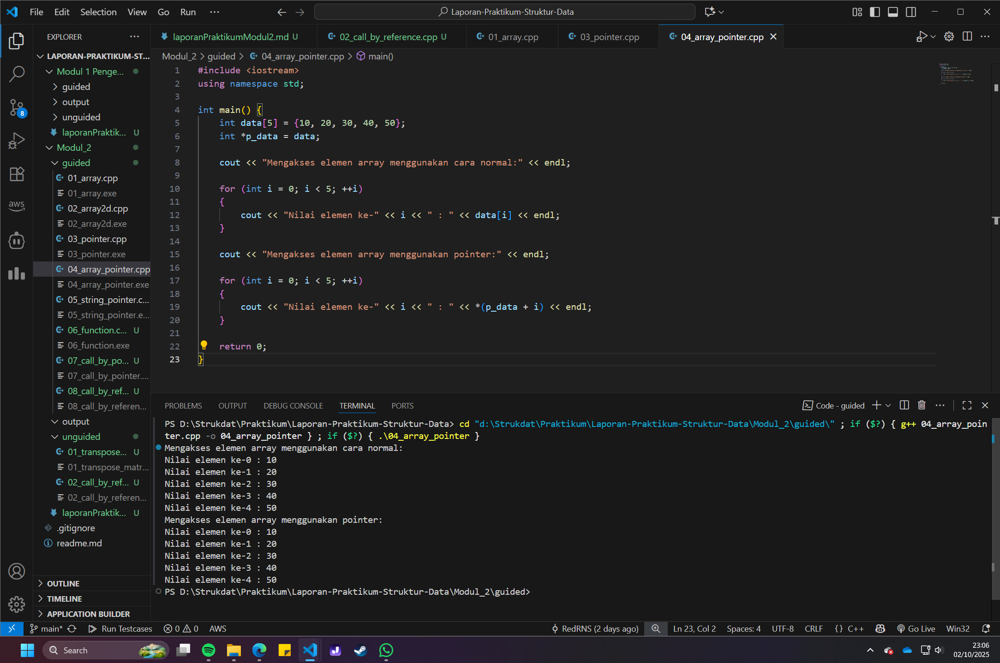

# <h1 align="center">Laporan Praktikum Modul 2 <br> Pengenalan C++ (Bagian Kedua)</h1>

<p align="center">Renisa Assyifa Putri - 103112400123</p>

## Dasar Teori

### 1. Array (Larik)

**Array** adalah struktur data yang digunakan untuk menyimpan kumpulan elemen dengan tipe data yang sama dalam satu nama variabel. Setiap elemen dapat diakses melalui indeks yang dimulai dari 0.

**a. Array Satu Dimensi**

Deklarasi dan inisialisasi:
```cpp
// Deklarasi dengan ukuran
int nilai[5];

// Deklarasi dengan inisialisasi
int angka[5] = {10, 20, 30, 40, 50};

// Ukuran otomatis dari compiler
int data[] = {1, 2, 3, 4}; // ukuran 4
```

Cara akses elemen:
```cpp
int nilai[3] = {10, 20, 30};
cout << nilai[0];  // Output: 10 (elemen pertama)
cout << nilai[2];  // Output: 30 (elemen ketiga)
nilai[1] = 25;     // Mengubah elemen kedua
```

**b. Array Dua Dimensi**

Digunakan untuk merepresentasikan struktur seperti matriks atau tabel:
```cpp
// Deklarasi matriks 3x3
int matriks[3][3] = {
    {1, 2, 3},
    {4, 5, 6},
    {7, 8, 9}
};

// Akses elemen
cout << matriks[0][0];  // Output: 1 (baris 0, kolom 0)
cout << matriks[1][2];  // Output: 6 (baris 1, kolom 2)
```

### 2. Pointer (Penunjuk)

**Pointer** adalah variabel khusus yang menyimpan alamat memori dari variabel lain. Pointer sangat powerful untuk manipulasi memori dinamis dan efisiensi program.

**Operator Pointer:**
- `&` (address-of): Mendapatkan alamat memori variabel
- `*` (dereference): Mengakses nilai di alamat yang ditunjuk pointer

**Contoh penggunaan:**
```cpp
int umur = 25;
int *ptr;           // Deklarasi pointer
ptr = &umur;        // ptr menyimpan alamat umur

cout << umur;       // Output: 25 (nilai umur)
cout << &umur;      // Output: 0x... (alamat memori umur)
cout << ptr;        // Output: 0x... (alamat yang disimpan ptr)
cout << *ptr;       // Output: 25 (nilai di alamat ptr)

*ptr = 30;          // Mengubah nilai umur melalui pointer
cout << umur;       // Output: 30
```

**Ilustrasi Memori:**
```
Memori:  [Alamat]    [Nilai]
         0x1000      25        <- variabel umur
         0x2000      0x1000    <- pointer ptr
```

### 3. Hubungan Array dan Pointer

Nama array adalah pointer konstan yang menunjuk ke elemen pertama:
```cpp
int data[5] = {10, 20, 30, 40, 50};
int *p = data;  // p menunjuk ke data[0]

// Cara akses yang ekuivalen:
cout << data[2];    // Output: 30
cout << *(data+2);  // Output: 30 (pointer arithmetic)
cout << p[2];       // Output: 30
cout << *(p+2);     // Output: 30
```

**Pointer Arithmetic:**
```cpp
int arr[] = {10, 20, 30};
int *p = arr;

cout << *p;         // Output: 10
cout << *(p+1);     // Output: 20
cout << *(p+2);     // Output: 30
p++;                // p bergeser ke elemen berikutnya
cout << *p;         // Output: 20
```

### 4. String dan Pointer

**String sebagai Array:**
```cpp
char nama[] = "Renisa";  // Array karakter (modifiable)
nama[0] = 'B';           // Bisa diubah
```

**String sebagai Pointer:**
```cpp
const char *pesan = "Hello";  // String literal (immutable)
pesan = "World";              // Pointer bisa diarahkan ke string lain
// pesan[0] = 'h';            // ERROR: tidak bisa mengubah string literal
```

### 5. Mekanisme Passing Parameter

**a. Call by Value**

Fungsi menerima salinan nilai, perubahan tidak mempengaruhi variabel asli:
```cpp
void ubahNilai(int x) {
    x = 100;  // Hanya mengubah salinan lokal
}

int main() {
    int angka = 50;
    ubahNilai(angka);
    cout << angka;  // Output: 50 (tidak berubah)
}
```

**b. Call by Pointer**

Fungsi menerima alamat memori, bisa mengubah nilai asli:
```cpp
void ubahNilai(int *x) {
    *x = 100;  // Mengubah nilai di alamat x
}

int main() {
    int angka = 50;
    ubahNilai(&angka);  // Kirim alamat dengan &
    cout << angka;      // Output: 100 (berubah)
}
```

**c. Call by Reference**

Sintaks lebih sederhana, efek sama dengan call by pointer:
```cpp
void ubahNilai(int &x) {
    x = 100;  // Mengubah nilai asli langsung
}

int main() {
    int angka = 50;
    ubahNilai(angka);  // Tidak perlu &
    cout << angka;     // Output: 100 (berubah)
}
```

**Perbandingan:**

| Aspek | Call by Value | Call by Pointer | Call by Reference |
|-------|---------------|-----------------|-------------------|
| Sintaks pemanggilan | `func(x)` | `func(&x)` | `func(x)` |
| Parameter fungsi | `void func(int x)` | `void func(int *x)` | `void func(int &x)` |
| Akses nilai | `x` | `*x` | `x` |
| Mengubah asli | ❌ Tidak | ✅ Ya | ✅ Ya |
| Overhead | Salin nilai | Salin alamat | Alias langsung |

### 6. Operasi Matriks

**Transpose Matriks:**

Mengubah baris menjadi kolom dan sebaliknya:
```cpp
int A[3][3] = {{1,2,3}, {4,5,6}, {7,8,9}};
int T[3][3];

for(int i = 0; i < 3; i++) {
    for(int j = 0; j < 3; j++) {
        T[j][i] = A[i][j];  // Tukar indeks
    }
}

// Hasil:
// A = [1 2 3]    T = [1 4 7]
//     [4 5 6]        [2 5 8]
//     [7 8 9]        [3 6 9]
```

## Guided

### Soal 1 Array Satu Dimensi

```cpp
#include <iostream>

using namespace std;

int main() {
    int nilai[5] = {1 , 2 , 3 , 4 , 5};

    for (int i = 0; i < 5; ++i ) {
        cout << "Elemen ke-" << i << " : " << nilai[i] << endl;
    }

    return 0;
}
```

> Output
> 

Program ini mendemonstrasikan deklarasi dan inisialisasi sebuah array satu dimensi bernama nilai yang memiliki 5 elemen bertipe integer. Program kemudian menggunakan perulangan for untuk mengakses dan mencetak setiap elemen array ke layar, dimulai dari indeks ke-0 hingga ke-4.

### Soal 2 Array Dua Dimensi

```cpp
#include <iostream>

using namespace std;

int main() {
    int matriks[3][3] = {
        {1, 2, 3},
        {4, 5, 6},
        {7, 8, 9}
    };

    for (int i = 0; i < 3; ++i) {
        for (int j = 0; j < 3; ++j) {
            cout << matriks[i][j] << " ";
        }
        // memindah baris setelah setiap baris matriks selesai dicetak
        cout << endl;
    }

    return 0;
}
```

> Output
> 

Program ini menunjukkan penggunaan array dua dimensi untuk merepresentasikan sebuah matriks berukuran 3x3. Program menggunakan perulangan bersarang (nested loop) untuk mengakses setiap elemen berdasarkan indeks baris (i) dan kolom (j), lalu menampilkannya dalam format matriks yang sesuai.

### Soal 3 Pengenalan Pointer

```cpp
#include <iostream>

using namespace std;

int main() {
    int umur = 25;
    int *p_umur;
    p_umur = &umur;

    cout << "Nilai umur: " << umur << endl;
    cout << "Alamat memori 'umur': " << &umur << endl;
    cout << "Nilai 'p_umur' (alamat): " << p_umur << endl;
    cout << "Nilai yang diakses 'p_umur': " << *p_umur << endl;
    cout << "Alamat memori dari pointer 'p_umur' itu sendiri: " << &p_umur << endl;

    return 0;
}
```

> Output
> 

Kode ini menjelaskan konsep dasar pointer. Sebuah variabel pointer p_umur dideklarasikan dan diinisialisasi dengan alamat memori dari variabel umur menggunakan operator &. Program kemudian menampilkan nilai asli, alamat memori variabel, nilai yang disimpan oleh pointer (yang merupakan alamat), nilai yang diakses melalui pointer menggunakan operator *, serta alamat memori dari variabel pointer itu sendiri.

### Soal 4 Hubungan Array dan Pointer

```cpp
#include <iostream>
using namespace std;

int main() {
    int data[5] = {10, 20, 30, 40, 50};
    int *p_data = data; 
    
    cout << "Mengakses elemen array menggunakan cara normal:" << endl;

    for (int i = 0; i < 5; ++i) 
    {
        cout << "Nilai elemen ke-" << i << " : " << data[i] << endl;
    }

    cout << "\nMengakses elemen array menggunakan pointer:" << endl;

    for (int i = 0; i < 5; ++i) 
    {
        cout << "Nilai elemen ke-" << i << " : " << *(p_data + i) << endl;
    }

    return 0;
}
```

> Output
> 

Program ini mengilustrasikan hubungan antara array dan pointer. Elemen-elemen array data diakses dengan dua cara berbeda: pertama, menggunakan notasi indeks data[i] yang umum; kedua, menggunakan notasi pointer *(p_data + i), yang memanfaatkan aritmatika pointer untuk berpindah ke alamat elemen berikutnya dalam array.

### Soal 5 Pointer dan String

```cpp
#include <iostream>
using namespace std;

int main() {
    char pesan_array[] = \"Nasi Padang\";
    const char *pesan_pointer = \"Ayam Bakar 23\";

    cout << "String Array: " << pesan_array << endl;
    cout << "String Pointer: " << pesan_pointer << endl;

    // Mengubah karakter dalam array diperbolehkan
    pesan_array[0] = 'h';
    cout << "String Array setelah diubah: " << pesan_array << endl;

    // Pointer dapat diubah untuk menunjuk ke string lain
    pesan_pointer = "Sariman";
    cout << "String Pointer setelah menunjuk ke string lain: " << pesan_pointer << endl;

    return 0;
}
```

> Output
> 

Program ini menunjukkan perbedaan mendasar antara string yang dideklarasikan sebagai array karakter (char[]) dan sebagai pointer karakter (char *). String sebagai array memungkinkan modifikasi pada tiap karakternya, sementara string sebagai pointer bersifat read-only (literal string), namun pointernya sendiri dapat diarahkan untuk menunjuk ke alamat string literal yang lain.

### Soal 6 Fungsi dan Prosedur

```cpp
#include <iostream>
using namespace std;

int tambah(int a, int b)
{
    return a + b;
}

void tampilkanHasil(int a, int b, int hasil)
{
    cout << "Hasil penjumlahan " << a << " + " << b << " adalah: " << hasil << endl;
}

int main()
{
    int angka1 = 10;
    int angka2 = 5;

    int hasilJumlah = tambah(angka1, angka2);

    tampilkanHasil(angka1, angka2, hasilJumlah);

    return 0;
}
```

> Output
> 

Kode ini membedakan antara fungsi dan prosedur. Fungsi tambah dirancang untuk mengembalikan sebuah nilai hasil penjumlahan (return value). Sebaliknya, tampilkanHasil adalah sebuah prosedur (void) yang hanya menjalankan tugas tertentu, yaitu menampilkan hasil ke layar, tanpa mengembalikan nilai apa pun.

### Soal 7 Call by Pointer

```cpp
#include <iostream>
using namespace std;

void tukar(int *px, int *py)
{
    int temp = *px;
    *px = *py;
    *py = temp;
}

int main()
{
    int a = 10, b = 20;
    cout << "Sebelum ditukar: a = " << a << ", b = " << b << endl;
    tukar(&a, &b);
    cout << "Setelah ditukar: a = " << a << ", b = " << b << endl;
    return 0;
}
```

> Output
> 

Program ini mendemonstrasikan mekanisme call by pointer. Fungsi tukar menerima parameter berupa pointer integer (int*). Di dalam main, alamat dari variabel a dan b dilewatkan ke fungsi menggunakan operator &. Hal ini memungkinkan fungsi tukar untuk memanipulasi dan mengubah nilai asli dari variabel a dan b secara langsung.

### Soal 8 Call by Reference

```cpp
#include <iostream>
using namespace std;

void tukar(int &x, int &y)
{
    int temp = x;
    x = y;
    y = temp;
}

int main()
{
    int a = 10, b = 20;
    cout << "Sebelum ditukar: a = " << a << ", b = " << b << endl;
    tukar(a, b);
    cout << "Setelah ditukar: a = " << a << ", b = " << b << endl;
    return 0;
}
```

> Output
> 

Program ini mengimplementasikan call by reference, sebuah alternatif yang lebih sederhana secara sintaksis dibandingkan call by pointer. Dengan mendeklarasikan parameter sebagai referensi (int &), fungsi tukar dapat secara langsung mengubah nilai variabel a dan b dari main tanpa perlu menggunakan operator & saat pemanggilan atau operator * di dalam fungsi.

## Unguided

### Soal 1

Buatlah sebuah program untuk melakukan transpose pada sebuah matriks persegi berukuran 3x3. Operasi transpose adalah mengubah baris menjadi kolom dan sebaliknya. Inisialisasi matriks awal di dalam kode, kemudian buat logika untuk melakukan transpose dan simpan hasilnya ke dalam matriks baru. Terakhir, tampilkan matriks awal dan matriks hasil transpose.

```cpp
#include <iostream>

using namespace std;

int main() {
    int matriks[3][3] = {
        {1, 2, 3},
        {4, 5, 6},
        {7, 8, 9}
    };

    int hasil_transpose[3][3];

    cout << "Matriks Awal:" << endl;
    for (int i = 0; i < 3; ++i) {
        for (int j = 0; j < 3; ++j) {
            cout << matriks[i][j] << " ";
        }
        cout << endl;
    }

    for (int i = 0; i < 3; ++i) {
        for (int j = 0; j < 3; ++j) {
            hasil_transpose[j][i] = matriks[i][j];
        }
    }

    
    cout << "\nMatriks Hasil Transpose:" << endl;
    for (int i = 0; i < 3; ++i) {
        for (int j = 0; j < 3; ++j) {
            cout << hasil_transpose[i][j] << " ";
        }
        cout << endl; 
    }

    return 0;
}
```
Program di atas dirancang untuk melakukan operasi transpose pada matriks 3x3. Awalnya, matriks sumber diinisialisasi dan ditampilkan. Inti dari program ini terletak pada perulangan bersarang di mana elemen dari matriks sumber pada posisi [i][j] disalin ke matriks tujuan pada posisi [j][i]. Proses ini secara efektif menukar posisi baris dan kolom. Akhirnya, matriks hasil transpose dicetak ke layar untuk menunjukkan hasilnya.

> Output
> 

### Soal 2

Buatlah program yang menunjukkan penggunaan call by reference. Buat sebuah prosedur bernama kuadratkan yang menerima satu parameter integer secara referensi (&). Prosedur ini akan mengubah nilai asli variabel yang dilewatkan dengan nilai kuadratnya. Tampilkan nilai variabel di main() sebelum dan sesudah memanggil prosedur untuk membuktikan perubahannya.

```cpp
#include <iostream>

using namespace std;

void kuadrat(int &angka)
{
    angka = angka * angka;
}

int main()
{
    int nilai = 5;
    cout << "Nilai awal: " << nilai << endl;
    kuadrat(nilai);
    cout << "Nilai setelah dikuadratkan: " << nilai << endl;

    return 0;
}
```
Program ini secara spesifik mendemonstrasikan konsep call by reference. Sebuah variabel nilai diinisialisasi di fungsi main. Prosedur kuadrat didefinisikan untuk menerima parameter int &angka, yang artinya ia menerima referensi (alias) ke variabel asli, bukan salinannya. Ketika prosedur ini dipanggil, operasi angka = angka * angka langsung memodifikasi variabel nilai di main. Hasilnya, nilai variabel sebelum dan sesudah pemanggilan prosedur terbukti berbeda, menunjukkan bahwa perubahan terjadi pada variabel asli.

> Output
> 

## Kesimpulan

Praktikum Modul 2 tentang Pengenalan C++ Bagian Kedua telah memberikan pemahaman mendalam tentang konsep-konsep penting dalam manajemen memori dan struktur data. Beberapa hal penting yang dapat disimpulkan:

1. **Array Satu Dimensi**: Array merupakan struktur data fundamental untuk menyimpan kumpulan data sejenis dengan akses yang efisien melalui indeks. Pemahaman tentang indeksasi (dimulai dari 0) sangat penting untuk menghindari error array out of bounds.

2. **Array Dua Dimensi**: Array multidimensi sangat berguna untuk merepresentasikan struktur data seperti matriks, tabel, atau grid. Penggunaan nested loop menjadi kunci untuk mengakses dan memanipulasi data dalam array dua dimensi.

3. **Pointer**: Konsep pointer adalah salah satu fitur paling powerful dalam C++. Pointer memungkinkan manipulasi memori secara langsung, yang membuka peluang untuk pemrograman yang lebih efisien dan fleksibel. Pemahaman tentang operator & (address-of) dan * (dereference) menjadi fondasi untuk menguasai pointer.

4. **Hubungan Array dan Pointer**: Nama array pada dasarnya adalah pointer konstan yang menunjuk ke elemen pertama. Konsep ini menjelaskan mengapa array dan pointer dapat digunakan secara bergantian dalam banyak kasus, termasuk dalam pointer arithmetic.

5. **String dan Pointer**: Perbedaan antara string sebagai array karakter (char[]) dan string literal (const char*) penting untuk dipahami. Array karakter bersifat mutable, sedangkan string literal adalah immutable.

6. **Mekanisme Passing Parameter**: Tiga cara passing parameter (call by value, call by pointer, dan call by reference) masing-masing memiliki kegunaan spesifik:
   - **Call by value**: Aman karena tidak mengubah nilai asli, cocok untuk fungsi yang hanya perlu membaca nilai
   - **Call by pointer**: Memberikan kontrol penuh atas memori, berguna untuk manipulasi data dan efisiensi
   - **Call by reference**: Sintaks lebih sederhana dibanding pointer, tetapi memiliki kemampuan yang sama untuk mengubah nilai asli

7. **Operasi Matriks**: Implementasi operasi matriks seperti transpose menunjukkan penerapan praktis dari array dua dimensi dan nested loop. Teknik menukar indeks (i,j menjadi j,i) menjadi kunci dalam operasi transpose.

8. **Efisiensi Memori**: Penggunaan pointer dan reference dalam fungsi menghindari overhead dari penyalinan data, terutama untuk struktur data yang besar. Ini menjadi pertimbangan penting dalam pengembangan aplikasi yang membutuhkan performa tinggi.

Pemahaman konsep-konsep ini sangat krusial sebagai fondasi untuk mempelajari struktur data yang lebih kompleks seperti linked list, stack, queue, dan tree yang akan dipelajari di modul-modul selanjutnya. Kemampuan manipulasi memori melalui pointer menjadi dasar dari implementasi struktur data dinamis.

## Referensi

1. Mustakim, M., & Maulana, H. (2024). Penggunaan Struktur Data Stack dalam Pemrograman C++ dengan Pendekatan Array dan Linked List. JUTECH : Jurnal Teknologi Dan Sistem Informasi, 5(2), 484-490. https://jurnal.stkippersada.ac.id/jurnal/index.php/jutech/article/view/4263

2. Syafii, M. (2021). Pemrograman Komputer Menggunakan C++. Universitas Andalas. http://repo.unand.ac.id/32011/

3. Setiadi, B. (2020). Dasar Logika dan Algoritma Pemrograman dengan C++. Unika Soegijapranata. https://www.unika.ac.id/wp-content/uploads/2021/02/ebook-Berdi-Dasar-Logika-Pemrograman-C.pdf


