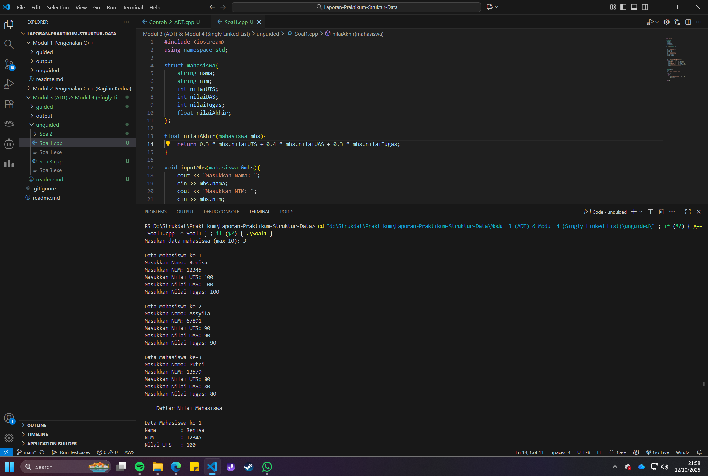
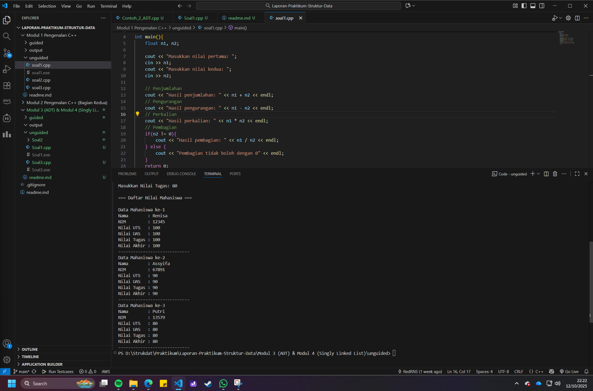
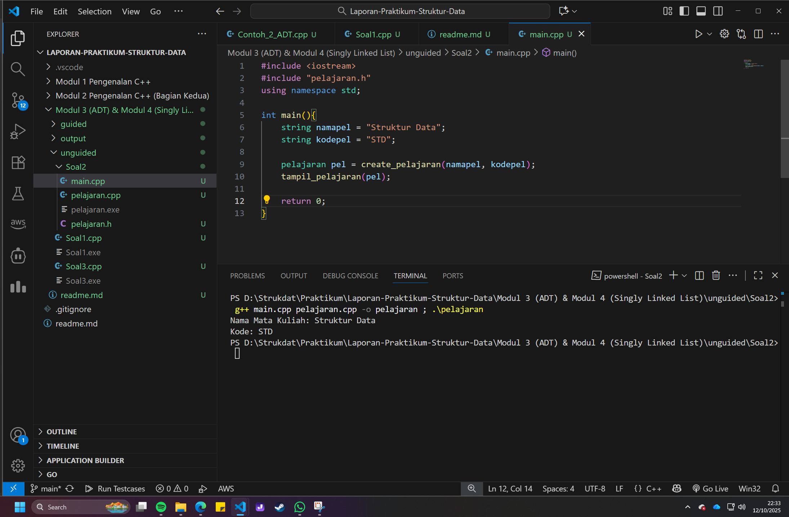

# <h1 align="center">Laporan Praktikum Modul 3 & 4 <br> Abstract Data Type (ADT) & Singly Linked List</h1>

<p align="center">Renisa Assyifa Putri - 103112400123</p>

## Dasar Teori

Abstract Data Type (ADT) adalah sebuah konsep fundamental dalam ilmu komputer yang mendefinisikan sebuah tipe data beserta operasi-operasi yang dapat dilakukan padanya, tanpa mengekspos detail implementasi internalnya. Menurut sumber dari ScienceDirect, pendekatan ini mendorong abstraksi, modularitas, dan enkapsulasi dalam pengembangan perangkat lunak, karena memungkinkan programmer untuk merancang komponen dengan antarmuka yang jelas sambil menyembunyikan kerumitan di dalamnya. Jurnal dari ACM [3] memperkuat hal ini dengan menyoroti bagaimana ADT mendukung keamanan tipe data (type safety) dan kejelasan spesifikasi fungsi, yang sangat relevan saat menggunakan struct untuk mengelola data agar setiap operasi sesuai dengan kontrak yang ditentukan.

Dalam implementasinya di C++, konsep seperti array dan pointer menjadi krusial. Penelitian oleh Logozar, dkk. [1] menunjukkan bahwa performa akses elemen pada static array menggunakan indeks bisa sebanding dengan pointer arithmetic, tergantung pada optimasi compiler. Ini mengindikasikan bahwa akses manual berbasis indeks tidak selalu lebih lambat dari manipulasi pointer. Di sisi lain, dari perspektif pembelajaran, Donyina & Heckel [2] mengidentifikasi bahwa mahasiswa seringkali kesulitan memahami konsep pointer, dereference (*), dan manipulasi alamat memori (&). Mereka menyarankan penggunaan metode visualisasi, seperti transformasi graf, untuk memperjelas cara kerja pointer dan bagaimana array merepresentasikan blok memori yang berkesinambungan, sehingga mempercepat pemahaman konsep abstrak ini.

## Guided

### Soal 1 Sebelum Implementasi ADT

```cpp
#include <iostream>
using namespace std;

struct mahasiswa{
    string nama;
    float nilai1, nilai2;
};

void inputMhs(mahasiswa &m){
    cout << "Masukkan nama: "; 
    cin >> m.nama;
    cout << "Masukkan nilai 1: "; 
    cin >> m.nilai1;
    cout << "Masukkan nilai 2: "; 
    cin >> m.nilai2;
}

float rata2(mahasiswa m){
    return (m.nilai1 + m.nilai2) / 2;
}

int main(){
    mahasiswa mhs; //pemanggilan struct (ADT)
    inputMhs(mhs); //pemanggilan procedure
    cout << "Rata rata : " << rata2(mhs) << endl; //pemanggilan function
    return 0;
}
```

Program C++ di atas mendemonstrasikan penggunaan struct untuk mengelompokkan data mahasiswa yang terdiri dari nama, nilai1, dan nilai2. Program ini memanfaatkan dua fungsi terpisah: inputMhs() untuk mengisi data dan rata2() untuk melakukan kalkulasi. Fungsi inputMhs() menggunakan parameter referensi (&), yang memungkinkan fungsi untuk memodifikasi variabel mhs asli di fungsi main() secara langsung tanpa perlu membuat salinan. Sementara itu, fungsi rata2() menghitung rata-rata nilai dan mengembalikan hasilnya. Pada fungsi main(), sebuah variabel mhs dari tipe mahasiswa dibuat, diisi datanya melalui pemanggilan inputMhs(), dan nilai rata-ratanya ditampilkan dengan memanggil fungsi rata2(). Kode ini menjadi contoh dasar bagaimana struct dan fungsi dapat bekerja sama untuk mengelola data secara terstruktur.

### Soal 2 Implementasi ADT untuk Pelajaran

##### Source Code main.cpp
```C++
#include <iostream>
#include "pelajaran.h"
using namespace std;

int main(){
    string namapel = "Struktur Data";
    string kodepel = "STD";

    pelajaran pel = create_pelajaran(namapel, kodepel);
    tampil_pelajaran(pel);

    return 0;
}
```
##### Source Code pelajaran.cpp
```C++
#include "pelajaran.h"

//implementasi function create_pelajaran
pelajaran create_pelajaran(string namaMapel, string kodepel){
    pelajaran p;
    p.namaMapel = namaMapel;
    p.kodeMapel = kodepel;
    return p;
}

//implementasi prosedur tampil_pelajaran
void tampil_pelajaran(pelajaran pel){
    cout << "nama pelajaran: " << pel.namaMapel << endl;
    cout << "kode: " << pel.kodeMapel << endl;
}
```
##### Source Code pelajaran.h
```C++
//header guard digunakan untuk mencegah file header yang sama di-include lebih dari sekali dalam satu program
#ifndef PELAJARAN_H
#define PELAJARAN_H

#include <iostream>
using namespace std;

//deklarasi ADT pelajaran
struct pelajaran{
    string namaMapel;
    string kodeMapel;
};

//function untuk membuat data pelajaran
pelajaran create_pelajaran(string namaMapel, string kodepel);

//prosedur untuk menampilkan data pelajaran
void tampil_pelajaran(pelajaran pel);

#endif
```

Program ini merupakan implementasi dari konsep ADT yang ideal dengan memisahkan kode ke dalam tiga file untuk mencapai modularitas. File pelajaran.h berfungsi sebagai header yang mendefinisikan "kontrak" dari ADT pelajaran, berisi deklarasi struct dan prototipe fungsi. Penggunaan header guard (#ifndef PELAJARAN_H) adalah praktik standar untuk mencegah duplikasi definisi saat file ini di-include berkali-kali. Selanjutnya, pelajaran.cpp berisi implementasi atau "jeroan" dari fungsi-fungsi yang dideklarasikan di header, yaitu create_pelajaran() untuk membuat objek dan tampil_pelajaran() untuk menampilkannya. Terakhir, main.cpp bertindak sebagai "klien" yang menggunakan ADT tersebut untuk membuat objek pelajaran dengan data "Struktur Data" dan "STD", lalu menampilkannya. Arsitektur ini mencerminkan prinsip abstraksi, di mana program utama tidak perlu tahu detail implementasi, cukup cara menggunakannya.

## Unguided

### Soal 1

Buat program yang dapat menyimpan data mahasiswa (max. 10) ke dalam sebuah array dengan field nama, nim, uts, uas, tugas dan nilai akhir. Nilai akhir diperoleh dari FUNGSI dengan rumus 0.3 * uts + 0.4 * uas + 0.3 * tugas.

```cpp
#include <iostream>
using namespace std;

struct mahasiswa{
    string nama;
    string nim;
    int nilaiUTS;
    int nilaiUAS;
    int nilaiTugas;
    float nilaiAkhir;
};

float nilaiAkhir(mahasiswa mhs){
    return 0.3 * mhs.nilaiUTS + 0.4 * mhs.nilaiUAS + 0.3 * mhs.nilaiTugas;
} 

void inputMhs(mahasiswa &mhs){
    cout << "Masukkan Nama: ";
    cin >> mhs.nama;
    cout << "Masukkan NIM: ";
    cin >> mhs.nim;
    cout << "Masukkan Nilai UTS: ";
    cin >> mhs.nilaiUTS;
    cout << "Masukkan Nilai UAS: ";
    cin >> mhs.nilaiUAS;
    cout << "Masukkan Nilai Tugas: ";
    cin >> mhs.nilaiTugas;

    mhs.nilaiAkhir = nilaiAkhir(mhs);
}

void outputMhs(mahasiswa mhs[], int n){
    cout << "\n=== Daftar Nilai Mahasiswa ===\n";
    for (int i = 0; i < n; i++) {
        cout << "\nData Mahasiswa ke-" << i + 1 << endl;
        cout << "Nama        : " << mhs[i].nama << endl;
        cout << "NIM         : " << mhs[i].nim << endl;
        cout << "Nilai UTS   : " << mhs[i].nilaiUTS << endl;
        cout << "Nilai UAS   : " << mhs[i].nilaiUAS << endl;
        cout << "Nilai Tugas : " << mhs[i].nilaiTugas << endl;
        cout << "Nilai Akhir : " << mhs[i].nilaiAkhir << endl;
        cout << "-----------------------------";
    }
    cout << endl;
}

int main(){
    mahasiswa mhs[10];
    int n;

    cout << "Masukan data mahasiswa (max 10): ";
    cin >> n;

    if (n > 10) {
        cout << "Maksimal hanya bisa input 10 data mahasiswa." << endl;
        return 0;
    } else{
        for (int i = 0; i < n; i++) {
            cout << "\nData Mahasiswa ke-" << i + 1 << endl;
            inputMhs(mhs[i]);
        }
    }

    outputMhs(mhs, n);
    return 0;
}
```

> Output
> 
> 

Program ini dirancang untuk mengelola data akademis mahasiswa menggunakan sebuah array dari struct. Struktur mahasiswa membungkus semua data terkait—seperti nama, nim, dan komponen nilai—menjadi satu unit yang kohesif.

Logika program dipisahkan ke dalam beberapa fungsi untuk meningkatkan keterbacaan dan reusabilitas. Fungsi nilaiAkhir() secara khusus bertugas menghitung nilai akhir berdasarkan bobot yang ditentukan (30% UTS, 40% UAS, 30% Tugas), mengenkapsulasi rumus perhitungan agar mudah diubah jika diperlukan. Fungsi inputMhs() menangani proses masukan data untuk satu mahasiswa, di mana penggunaan parameter referensi (&mhs) memastikan bahwa data langsung disimpan ke dalam elemen array yang sesuai di fungsi main. Setelah input selesai, outputMhs() di panggil untuk menampilkan seluruh data yang tersimpan secara terformat.

Di fungsi main(), alur program dikontrol dengan pertama-tama meminta jumlah mahasiswa, melakukan validasi agar tidak melebihi kapasitas array (10), lalu melakukan iterasi untuk pengisian data, dan diakhiri dengan menampilkan hasilnya. Program ini secara efektif menunjukkan bagaimana array dari struct dapat digunakan untuk mengelola sekumpulan data yang kompleks secara terorganisir.

### Soal 2 Membuat ADT Pelajaran

Buatlah program yang menunjukkan penggunaan call by reference. Buat sebuah prosedur bernama kuadratkan yang menerima satu parameter integer secara referensi (&). Prosedur ini akan mengubah nilai asli variabel yang dilewatkan dengan nilai kuadratnya. Tampilkan nilai variabel di main() sebelum dan sesudah memanggil prosedur untuk membuktikan perubahannya.

##### Source Code pelajaran.h
```C++
//header guard digunakan untuk mencegah file header yang sama di-include lebih dari sekali dalam satu program
#ifndef PELAJARAN_H
#define PELAJARAN_H

#include <iostream>
using namespace std;

//deklarasi ADT pelajaran
struct pelajaran{
    string namaMapel;
    string kodeMapel;
};

//function untuk membuat data pelajaran
pelajaran create_pelajaran(string namaMapel, string kodepel);

//prosedur untuk menampilkan data pelajaran
void tampil_pelajaran(pelajaran pel);

#endif
```
##### Source Code pelajaran.cpp
```C++
#include "pelajaran.h"

//implementasi function create_pelajaran
pelajaran create_pelajaran(string namaMapel, string kodepel){
    pelajaran p;
    p.namaMapel = namaMapel;
    p.kodeMapel = kodepel;
    return p;
}

//implementasi prosedur tampil_pelajaran
void tampil_pelajaran(pelajaran pel){
    cout << "Nama Mata Kuliah: " << pel.namaMapel << endl;
    cout << "Kode: " << pel.kodeMapel << endl;
}
```
##### Source Code main.cpp
```C++
#include <iostream>
#include "pelajaran.h"
using namespace std;

int main(){
    string namapel = "Struktur Data";
    string kodepel = "STD";

    pelajaran pel = create_pelajaran(namapel, kodepel);
    tampil_pelajaran(pel);

    return 0;
}
```

> Output
> 

Program ini mengimplementasikan sebuah Abstract Data Type (ADT) untuk data pelajaran dengan menerapkan prinsip pemrograman modular. Strukturnya dibagi menjadi tiga file yang memiliki peran berbeda.

File pelajaran.h berfungsi sebagai antarmuka publik (public interface), yang mendefinisikan struct pelajaran dan mendeklarasikan fungsi-fungsi yang dapat beroperasi padanya, yaitu create_pelajaran() dan tampil_pelajaran(). File ini dilindungi oleh header guard untuk mencegah masalah kompilasi akibat inklusi ganda.

Implementasi detail dari fungsi-fungsi tersebut disembunyikan dalam file pelajaran.cpp. Di sini, logika untuk membuat dan menampilkan objek pelajaran ditulis. Pemisahan ini merupakan inti dari enkapsulasi, di mana pengguna ADT tidak perlu mengetahui bagaimana operasi tersebut bekerja secara internal.

Terakhir, main.cpp bertindak sebagai program utama atau klien yang menggunakan ADT pelajaran. Ia hanya perlu meng-include pelajaran.h untuk dapat membuat dan memanipulasi objek pelajaran melalui fungsi yang telah disediakan. Arsitektur ini menghasilkan kode yang bersih, terorganisir, dan mudah untuk dipelihara atau dikembangkan lebih lanjut.

### Soal 3 
Buatlah program dengan ketentuan :
- 2 buah array 2D integer berukuran 3x3 dan 2 buah pointer integer
- fungsi/prosedur yang menampilkan isi sebuah array integer 2D
- fungsi/prosedur yang akan menukarkan isi dari 2 array integer 2D pada posisi tertentu
- fungsi/prosedur yang akan menukarkan isi dari variabel yang ditunjuk oleh 2 buah pointer

```C++
#include <iostream>
using namespace std;

void tampilkanArray(int arr[3][3]){
    for(int i = 0; i < 3; i++){
        for(int j = 0; j < 3; j++){
            cout << arr[i][j] << " ";
        }
        cout << endl;
    }
}

void tukar(int *x, int *y){ 
    int temp;
    temp = *x; 
    *x = *y;   
    *y = temp; 
}

int main(){
    int arrA[3][3] = {
        {1, 2, 3},
        {4, 5, 6},
        {7, 8, 9}
    };
    int arrB[3][3] = {
        {11, 12, 13},
        {14, 15, 16},
        {17, 18, 19}
    };

    cout << "Array A: " << endl;
    tampilkanArray(arrA);
    cout << endl << "Array B: " << endl;
    tampilkanArray(arrB);

    // Pertukaran isi array tanpa pointer/reference
    cout << endl << "=== Pertukaran isi array dengan cara manual ===" << endl;
    for(int i = 0; i < 3; i++){
        for(int j = 0; j < 3; j++){
            int temp = arrA[i][j];
            arrA[i][j] = arrB[i][j];
            arrB[i][j] = temp;
        }
    }
    cout << "Array A setelah ditukar: " << endl;
    tampilkanArray(arrA); 
    cout << "Array B setelah ditukar: " << endl;
    tampilkanArray(arrB);
    // Pertukaran isi array A ke B, dan B ke A MENGGUNAKAN POINTER
    cout << endl << "=== Pertukaran isi array menggunakan pointer ===" << endl;

    for(int i = 0; i < 3; i++){
        for(int j = 0; j < 3; j++){
            tukar(&arrA[i][j], &arrB[i][j]);
        }
    }

    cout << "Array A setelah ditukar: " << endl;
    tampilkanArray(arrA); 
    cout << "Array B setelah ditukar: " << endl;
    tampilkanArray(arrB);

    return 0;
}
```

> Output
> 

Program ini mendemonstrasikan dan membandingkan dua metode untuk menukar isi dari dua array dua dimensi (3x3): pertukaran manual dan pertukaran menggunakan pointer.

Fungsi tampilkanArray() dirancang untuk mencetak elemen-elemen array 2D dalam format matriks agar mudah dibaca. Sementara itu, fungsi tukar() diimplementasikan untuk menukar nilai dari dua variabel integer dengan memanfaatkan pointer. Fungsi ini menerima alamat memori dari dua variabel (*x dan *y), lalu menukar nilai yang tersimpan di alamat-alamat tersebut menggunakan variabel sementara (temp). Karena beroperasi langsung pada alamat memori, perubahan yang dilakukan bersifat permanen pada variabel aslinya.

Di dalam fungsi main(), program terlebih dahulu menampilkan kondisi awal dari arrA dan arrB. Kemudian, pertukaran pertama dilakukan secara manual di dalam perulangan bersarang, di mana setiap elemen arrA[i][j] ditukar dengan arrB[i][j]. Setelah menampilkan hasilnya, program melakukan pertukaran sekali lagi untuk mengembalikan array ke kondisi semula, namun kali ini dengan memanggil fungsi tukar() dan memberikan alamat memori dari setiap elemen (&arrA[i][j] dan &arrB[i][j]). Contoh ini secara efektif mengilustrasikan bagaimana pointer dapat digunakan untuk menciptakan fungsi utilitas yang modular dan efisien untuk memanipulasi data secara langsung di memori.

## Referensi

1. Logozar, R., Mikac, M., & Radošević, D. (2022). Exploring the Access to the Static Array Elements via Indices and via Pointers — the Introductory C++ Case. Proceedings of the Central European Conference on Information and Intelligent Systems, CECIIS 2022. Diakses melalui ResearchGate.

2. Donyina, A., & Heckel, R. (2025). Pedagogy of Teaching Pointers in the C Programming Language using Graph Transformations. arXiv:2503.20469.

3. Judul: Relational Synthesis of Recursive Programs via Integrity Constraints (DOI:10.1145/3632870), Association for Computing Machinery.

4. ScienceDirect Topics. Abstract Data Type. Diakses melalui ScienceDirect.


