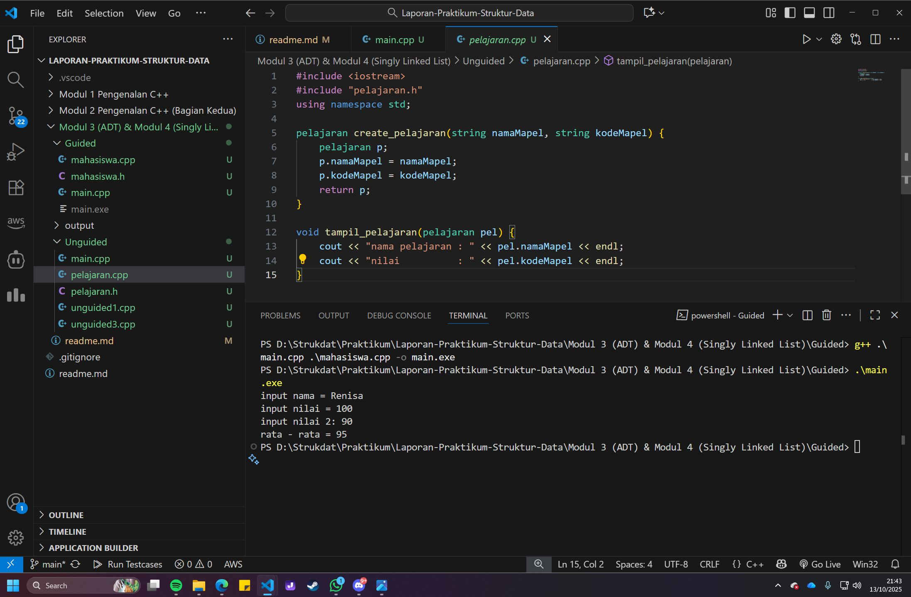
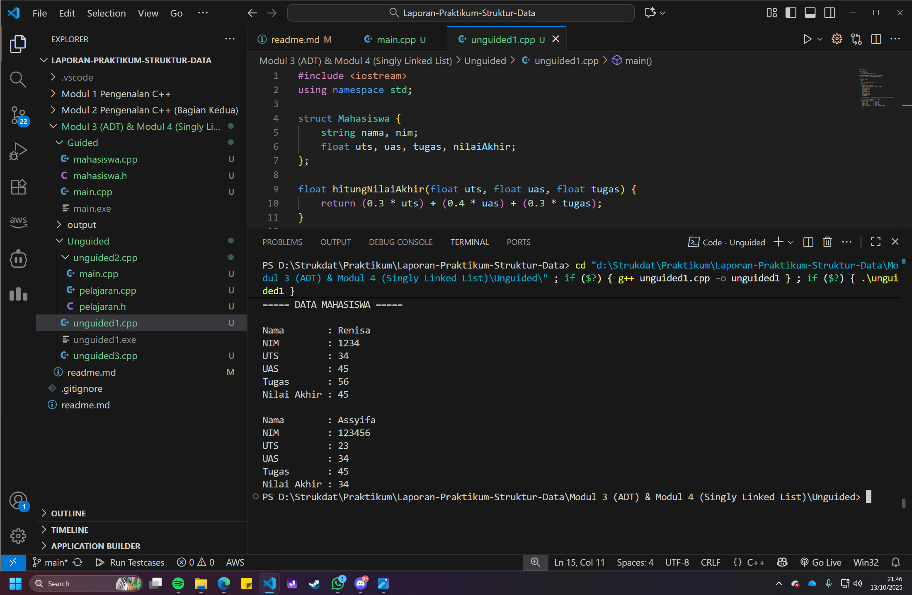
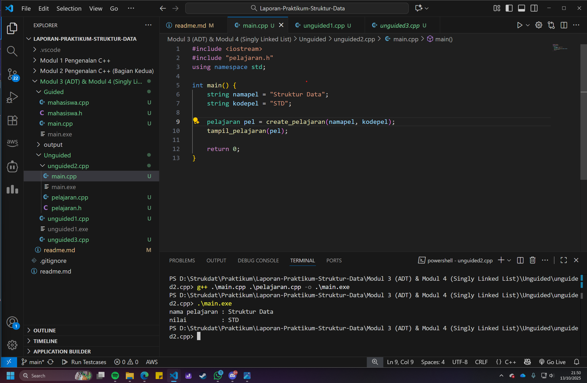
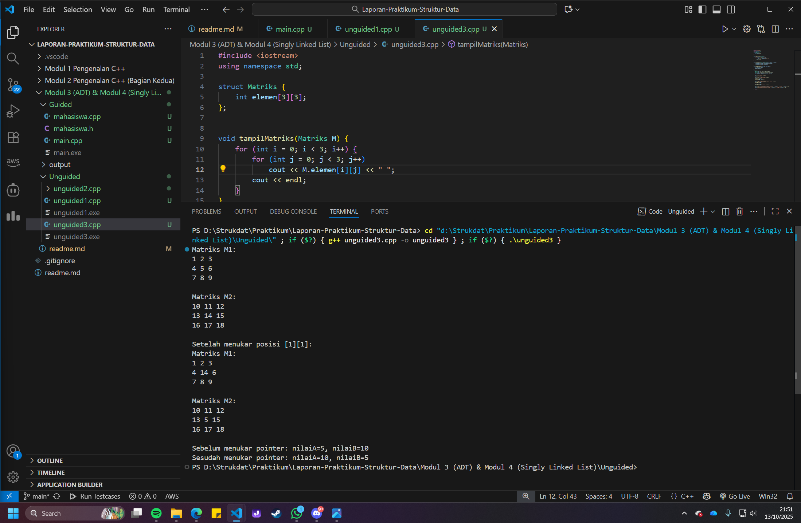

# <h1 align="center">Laporan Praktikum Modul 3 <br> Abstract Data Type (ADT)</h1>

<p align="center">Renisa Assyifa Putri - 103112400123</p>

## Dasar Teori

### 1. Pengertian Abstract Data Type (ADT)

**Abstract Data Type (ADT)** adalah konsep fundamental dalam pemrograman yang memisahkan antara **spesifikasi** (apa yang bisa dilakukan) dengan **implementasi** (bagaimana cara melakukannya). ADT mendefinisikan tipe data baru beserta operasi-operasi yang dapat dilakukan terhadap tipe data tersebut, tanpa mengekspos detail implementasinya kepada pengguna.

**Komponen ADT:**
1. **Data** : Struktur penyimpanan data internal
2. **Operasi** : Fungsi-fungsi untuk memanipulasi data
3. **Enkapsulasi** : Penyembunyian detail implementasi

**Contoh Konsep:**
```
ADT Stack:
- Data: Array atau Linked List (tersembunyi)
- Operasi: push(), pop(), top(), isEmpty() (publik)
```

### 2. Prinsip Encapsulation (Pengkapsulan)

Encapsulation adalah prinsip dimana detail internal representasi data disembunyikan dari pengguna. Pengguna hanya berinteraksi melalui interface (operasi) yang disediakan, tidak dapat mengakses representasi data secara langsung.

**Keuntungan Encapsulation:**
- **Abstraksi**: Pengguna fokus pada "apa" bukan "bagaimana"
- **Modularitas**: Kode lebih terorganisir dan mudah dipahami
- **Maintainability**: Implementasi dapat diubah tanpa mempengaruhi kode pengguna
- **Reusability**: ADT dapat digunakan kembali di berbagai program

**Contoh tanpa Encapsulation:**
```cpp
// Pengguna harus tahu detail internal
int stack[100];
int top = -1;
stack[++top] = 10;  // Pengguna akses langsung
```

**Contoh dengan Encapsulation:**
```cpp
// Pengguna tidak perlu tahu detail internal
Stack s;
s.push(10);  // Interface yang bersih
```

### 3. Implementasi ADT dengan Struct

Dalam C++, ADT dapat diimplementasikan menggunakan **struct** (atau **class**). Struct mengelompokkan data dan fungsi-fungsi terkait menjadi satu unit.

**Contoh ADT Mahasiswa:**
```cpp
// Definisi ADT dalam header file (mahasiswa.h)
struct Mahasiswa {
    char nim[10];
    int nilai1, nilai2;
};

// Operasi-operasi ADT
void inputMahasiswa(Mahasiswa &m);
float hitungRata(Mahasiswa m);
void tampilMahasiswa(Mahasiswa m);
```

**Implementasi Operasi:**
```cpp
// File implementasi (mahasiswa.cpp)
void inputMahasiswa(Mahasiswa &m) {
    cout << "NIM: ";
    cin >> m.nim;
    cout << "Nilai 1: ";
    cin >> m.nilai1;
    cout << "Nilai 2: ";
    cin >> m.nilai2;
}

float hitungRata(Mahasiswa m) {
    return (m.nilai1 + m.nilai2) / 2.0;
}
```

**Penggunaan ADT:**
```cpp
// File utama (main.cpp)
Mahasiswa mhs;
inputMahasiswa(mhs);  // Operasi input
float rata = hitungRata(mhs);  // Operasi hitung
cout << "Rata-rata: " << rata;  // Output hasil
```

### 4. Struktur File ADT

ADT biasanya diorganisir dalam 3 file terpisah:

**a. Header File (.h)**
- Berisi deklarasi struct dan fungsi
- Berfungsi sebagai "kontrak" atau interface
- Menggunakan header guard untuk mencegah multiple inclusion

```cpp
#ifndef NAMA_H_INCLUDED
#define NAMA_H_INCLUDED

// Deklarasi struct
struct TipeData { ... };

// Deklarasi fungsi
void operasi1(TipeData &t);
int operasi2(TipeData t);

#endif
```

**b. Implementation File (.cpp)**
- Berisi definisi (implementasi) dari fungsi-fungsi
- Detail algoritma ada di sini
- Include header file yang sesuai

```cpp
#include "nama.h"
#include <iostream>

void operasi1(TipeData &t) {
    // Implementasi operasi 1
}

int operasi2(TipeData t) {
    // Implementasi operasi 2
    return hasil;
}
```

**c. Main File (main.cpp)**
- Program utama yang menggunakan ADT
- Hanya include header file
- Tidak perlu tahu detail implementasi

```cpp
#include "nama.h"

int main() {
    TipeData data;
    operasi1(data);
    int hasil = operasi2(data);
    return 0;
}
```

### 5. Pass by Reference vs Pass by Value

Dalam ADT, pemilihan cara passing parameter sangat penting:

**Pass by Value:**
```cpp
float hitungRata(Mahasiswa m) {  // Menerima salinan
    return (m.nilai1 + m.nilai2) / 2.0;
}  // Nilai asli tidak berubah
```
- Digunakan untuk operasi yang hanya membaca data
- Tidak mengubah data asli
- Overhead: membuat salinan data

**Pass by Reference:**
```cpp
void inputMahasiswa(Mahasiswa &m) {  // Menerima referensi
    cin >> m.nim >> m.nilai1 >> m.nilai2;
}  // Mengubah nilai asli
```
- Digunakan untuk operasi yang memodifikasi data
- Mengubah data asli secara langsung
- Efisien: tidak ada overhead penyalinan

### 6. Keuntungan Menggunakan ADT

1. **Abstraksi**: Menyederhanakan kompleksitas dengan menyembunyikan detail
2. **Modularitas**: Kode terorganisir dalam modul-modul terpisah
3. **Reusability**: ADT dapat digunakan di berbagai program
4. **Maintainability**: Mudah dimodifikasi tanpa mempengaruhi kode lain
5. **Information Hiding**: Detail implementasi tersembunyi dari pengguna
6. **Flexibility**: Implementasi dapat diubah tanpa mengubah interface

### 7. Contoh ADT dalam Struktur Data

ADT adalah fondasi dari banyak struktur data:

**ADT Stack:**
```
Operasi:
- push(item): Menambah elemen ke puncak
- pop(): Menghapus elemen dari puncak
- top(): Melihat elemen puncak
- isEmpty(): Cek apakah kosong
```

**ADT Queue:**
```
Operasi:
- enqueue(item): Menambah elemen ke belakang
- dequeue(): Menghapus elemen dari depan
- front(): Melihat elemen depan
- isEmpty(): Cek apakah kosong
```

**ADT List:**
```
Operasi:
- insert(item, pos): Sisipkan elemen
- delete(pos): Hapus elemen
- search(item): Cari elemen
- get(pos): Ambil elemen
```

Semua ADT ini dapat diimplementasikan dengan array atau linked list, tetapi interfacenya tetap sama bagi pengguna.

## Guided

### mahasiswa.h

```cpp
#ifndef MAHASISWA_H_INCLUDED
#define MAHASISWA_H_INCLUDED

struct mahasiswa
{
    char nim[10];
    int nilai1, nilai2;
};
void inputMhs(mahasiswa &m);
float rata2(mahasiswa m);
#endif
```

File mahasiswa.h ini ibarat cetak biru atau blueprint. Isinya adalah definisi dari struct mahasiswa yang punya tiga anggota: nim, nilai1, dan nilai2. Selain itu, file ini juga berisi deklarasi dua fungsi, yaitu inputMhs() dan rata2(), yang nantinya akan diimplementasikan di file lain. Penggunaan #ifndef, #define, dan #endif (dikenal sebagai header guard) berfungsi untuk mencegah compiler membaca file ini berkali-kali, yang bisa menyebabkan error.
### mahasiswa.cpp

```cpp
#include "mahasiswa.h"
#include <iostream>

using namespace std;

void inputMhs(mahasiswa &m)
{
    cout << "input nama = ";
    cin >> (m).nim;
    cout << "input nilai = ";
    cin >> (m).nilai1;
    cout << "input nilai 2: ";
    cin >> (m).nilai2;
}
float rata2(mahasiswa m)
{
    return float(m.nilai1 + m.nilai2) / 2;
}
```

File ini adalah implementasi atau "dapur" dari fungsi yang sudah dideklarasikan di mahasiswa.h. Perintah #include "mahasiswa.h" nyambungin file ini ke blueprint-nya.

- Fungsi inputMhs bertugas untuk mengisi data ke dalam struct mahasiswa. Parameter mahasiswa &m menggunakan pass-by-reference (ditandai dengan &), artinya setiap perubahan pada m di dalam fungsi ini akan langsung mengubah variabel asli yang dikirim dari program utama.

- Fungsi rata2 bertugas menghitung rata-rata dari nilai1 dan nilai2. Hasilnya dikembalikan sebagai float supaya perhitungannya bisa menghasilkan angka desimal.
### main.cpp

```cpp
#include <iostream>
#include "mahasiswa.h"

using namespace std;

int main()
{
    mahasiswa mhs;
    inputMhs(mhs);
    cout << "rata - rata = " << rata2(mhs);
    return 0;
}
```

File main.cpp ini adalah program utama yang bertindak sebagai "pengguna" dari ADT mahasiswa. Di sini, kita membuat sebuah variabel bernama mhs dengan tipe mahasiswa. Selanjutnya, fungsi inputMhs(mhs) dipanggil untuk mengisi data ke variabel mhs. Terakhir, cout menampilkan hasil perhitungan dari fungsi rata2(mhs) ke layar.
### Output Code


## Unguided

1. **Buat program yang dapat menyimpan data mahasiswa (max. 10) ke dalam sebuah array** dengan field nama, NIM, UTS, UAS, tugas, dan nilai akhir. Nilai akhir diperoleh dari **fungsi** dengan rumus:

$$
\text{Nilai Akhir} = (0.3 \times \text{UTS}) + (0.4 \times \text{UAS}) + (0.3 \times \text{Tugas})
$$

```cpp
#include <iostream>
using namespace std;

struct Mahasiswa {
    string nama, nim;
    float uts, uas, tugas, nilaiAkhir;
};

float hitungNilaiAkhir(float uts, float uas, float tugas) {
    return (0.3 * uts) + (0.4 * uas) + (0.3 * tugas);
}

int main() {
    Mahasiswa mhs[10];
    int n;

    cout << "Jumlah mahasiswa (max 10): ";
    cin >> n;
    cin.ignore();

    for (int i = 0; i < n; i++) {
        cout << "\nData mahasiswa ke-" << i + 1 << endl;
        cout << "Nama : ";
        cin >> mhs[i].nama;
        cout << "NIM  : "
        cin >> mhs[i].nim;
        cout << "UTS  : ";
        cin >> mhs[i].uts;
        cout << "UAS  : ";
        cin >> mhs[i].uas;
        cout << "Tugas: ";
        cin >> mhs[i].tugas;
        cin.ignore();

        mhs[i].nilaiAkhir = hitungNilaiAkhir(mhs[i].uts, mhs[i].uas, mhs[i].tugas);
    }

    cout << "\n===== DATA MAHASISWA =====" << endl;
    for (int i = 0; i < n; i++) {
        cout << "\nNama        : " << mhs[i].nama;
        cout << "\nNIM         : " << mhs[i].nim;
        cout << "\nUTS         : " << mhs[i].uts;
        cout << "\nUAS         : " << mhs[i].uas;
        cout << "\nTugas       : " << mhs[i].tugas;
        cout << "\nNilai Akhir : " << mhs[i].nilaiAkhir << endl;
    }
    return 0;
}
```
### Output Code

Program ini dirancang untuk mengelola data nilai mahasiswa. Pertama, sebuah struct bernama Mahasiswa didefinisikan untuk membungkus semua data terkait (nama, NIM, dan nilai-nilai) agar lebih terstruktur. Terdapat juga fungsi hitungNilaiAkhir() yang terpisah, khusus untuk menghitung nilai akhir berdasarkan bobot yang ditentukan. Di dalam fungsi main(), program akan menanyakan berapa jumlah mahasiswa yang akan diinput. Kemudian, program melakukan perulangan untuk meminta data setiap mahasiswa. Setelah semua data terisi, nilai akhir untuk setiap mahasiswa dihitung menggunakan fungsi yang telah dibuat. Terakhir, program akan menampilkan kembali seluruh data mahasiswa beserta nilai akhir yang sudah dihitung.

2. Buatlah ADT pelajaran sebagai berikut di dalam file “pelajaran.h”:

```
Type pelajaran <
    namaMapel : string
    kodeMapel : string
>
    function create_pelajaran( namapel : string,
    kodepel : string ) → pelajaran
    procedure tampil_pelajaran( input pel : pelajaran )
```

Buatlah implementasi ADT pelajaran pada file “pelajaran.cpp” Cobalah hasil implementasi ADT pada file “main.cpp”

```cpp
using namespace std;
int main(){
    string namapel = "Struktur Data";
    string kodepel = "STD";
    pelajaran pel = create_pelajaran(namapel,kodepel);
    tampil_pelajaran(pel);
    return 0;
}
```

Contoh Output Hasil:

```
Nama pelajaran : Struktur data
Nilai : STD
```
### pelajaran.h

```cpp
#ifndef PELAJARAN_H_INCLUDED
#define PELAJARAN_H_INCLUDED
#include <string>

using namespace std;
struct pelajaran {
    string namaMapel;
    string kodeMapel;
};
pelajaran create_pelajaran(string namaMapel, string kodeMapel);
void tampil_pelajaran(pelajaran pel);

#endif
```
### pelajaran.cpp

```cpp
#include <iostream>
#include "pelajaran.h"

using namespace std;
pelajaran create_pelajaran(string namaMapel, string kodeMapel) {
    pelajaran p;
    p.namaMapel = namaMapel;
    p.kodeMapel = kodeMapel;
    return p;
}

void tampil_pelajaran(pelajaran pel) {
    cout << "nama pelajaran : " << pel.namaMapel << endl;
    cout << "nilai          : " << pel.kodeMapel << endl;
}
```

### main.cpp

```cpp
#include <iostream>
#include "pelajaran.h"

using namespace std;
int main() {
    string namapel = "Struktur Data";
    string kodepel = "STD";
    pelajaran pel = create_pelajaran(namapel, kodepel);
    tampil_pelajaran(pel);

    return 0;
}
```
### Output Code

Program ini mendemonstrasikan penerapan Abstract Data Type (ADT) dengan memisahkan kode ke dalam tiga file:
1. pelajaran.h (Header File): Berisi definisi struct pelajaran (yang menyimpan nama dan kode mapel) serta deklarasi fungsi create_pelajaran() dan prosedur tampil_pelajaran(). File ini berfungsi sebagai "kontrak" atau interface dari ADT.
2. pelajaran.cpp (Implementation File): Berisi kode implementasi dari fungsi dan prosedur yang dideklarasikan di file header. Fungsi create_pelajaran() digunakan untuk membuat objek pelajaran baru, sementara tampil_pelajaran() digunakan untuk mencetak datanya ke layar.
3. main.cpp (Driver File): Program utama yang menggunakan ADT pelajaran. Di sini, kita mendefinisikan nama dan kode pelajaran, lalu memanggil create_pelajaran() untuk membuat objeknya, dan terakhir memanggil tampil_pelajaran() untuk menampilkannya.


3. Buatlah program dengan ketentuan :

```
- 2 buah array 2D integer berukuran 3x3 dan 2 buah pointer integer
- fungsi/prosedur yang menampilkan isi sebuah array integer 2D
- fungsi/prosedur yang akan menukarkan isi dari 2 array integer 2D pada posisi tertentu
- fungsi/prosedur yang akan menukarkan isi dari variabel yang ditunjuk oleh 2 buah pointer
```

```cpp
#include <iostream>
using namespace std;

struct Matriks {
    int elemen[3][3];
};

void tampilMatriks(Matriks M) {
    for (int i = 0; i < 3; i++) {
        for (int j = 0; j < 3; j++)
            cout << M.elemen[i][j] << " ";
        cout << endl;
    }
}

void tukarElemen(Matriks &X, Matriks &Y, int baris, int kolom) {
    int sementara = X.elemen[baris][kolom];
    X.elemen[baris][kolom] = Y.elemen[baris][kolom];
    Y.elemen[baris][kolom] = sementara;
}

void tukarNilaiPointer(int *ptrA, int *ptrB) {
    int sementara = *ptrA;
    *ptrA = *ptrB;
    *ptrB = sementara;
}

int main() {
    Matriks M1 = {{{1,2,3},{4,5,6},{7,8,9}}};
    Matriks M2 = {{{10,11,12},{13,14,15},{16,17,18}}};
    int nilaiA = 5, nilaiB = 10;
    int *penunjukA = &nilaiA, *penunjukB = &nilaiB;

    cout << "Matriks M1:" << endl;
    tampilMatriks(M1);
    cout << endl << "Matriks M2:" << endl;
    tampilMatriks(M2);

    tukarElemen(M1, M2, 1, 1);

    cout << endl << "Setelah menukar posisi [1][1]:" << endl;
    cout << "Matriks M1:" << endl;
    tampilMatriks(M1);
    cout << endl << "Matriks M2:" << endl;
    tampilMatriks(M2);

    cout << endl << "Sebelum menukar pointer: nilaiA=" << nilaiA << ", nilaiB=" << nilaiB << endl;
    tukarNilaiPointer(penunjukA, penunjukB);
    cout << "Sesudah menukar pointer: nilaiA=" << nilaiA << ", nilaiB=" << nilaiB << endl;

    return 0;
}
```
### Output Code

Program ini mendemonstrasikan operasi pada matriks 3x3 dan variabel pointer.
- Struktur Matriks digunakan untuk membungkus array 2D, membuatnya lebih mudah dikelola sebagai satu unit data.
- Fungsi tampilMatriks() dibuat untuk mencetak seluruh elemen matriks ke layar.
- Fungsi tukarElemen() berfungsi untuk menukar nilai satu elemen spesifik (ditentukan oleh baris dan kolom) antara dua matriks.
- Fungsi tukarNilaiPointer() berfungsi untuk menukar nilai dari dua variabel integer dengan mengaksesnya melalui alamat memori (pointer).
Di dalam main(), program menginisialisasi dua matriks (M1 dan M2) dan dua variabel integer (nilaiA dan nilaiB) beserta pointernya. Kemudian, program menampilkan kondisi awal, melakukan penukaran elemen pada posisi [1][1] antar matriks, dan juga menukar nilai variabel melalui pointer, lalu menampilkan hasilnya untuk menunjukkan bahwa semua fungsi berjalan sesuai harapan.

## Kesimpulan

Praktikum Modul 3 tentang Abstract Data Type (ADT) telah memberikan pemahaman mendalam tentang konsep fundamental dalam pemrograman terstruktur dan berorientasi objek. Beberapa kesimpulan penting yang dapat diambil:

1. **Konsep ADT**: Abstract Data Type adalah paradigma pemrograman yang memisahkan spesifikasi dari implementasi. ADT mendefinisikan "apa yang dapat dilakukan" (operasi) tanpa mengekspos "bagaimana cara melakukannya" (implementasi detail). Pemisahan ini menciptakan abstraksi yang kuat dan membuat kode lebih mudah dipahami dan dikelola.

2. **Prinsip Encapsulation**: Enkapsulasi adalah inti dari ADT. Dengan menyembunyikan detail internal dan hanya mengekspos interface publik, ADT memberikan perlindungan terhadap akses langsung ke data internal. Ini mencegah penggunaan yang tidak sesuai dan memudahkan maintenance kode.

3. **Struktur Organisasi File**: Praktikum ini mendemonstrasikan best practice dalam mengorganisir kode ADT menjadi tiga file terpisah:
   - **Header file (.h)**: Deklarasi interface (kontrak)
   - **Implementation file (.cpp)**: Definisi fungsi (detail implementasi)
   - **Main file (main.cpp)**: Penggunaan ADT (aplikasi)
   
   Pemisahan ini meningkatkan modularitas dan memudahkan kolaborasi tim dalam pengembangan software.

4. **Penggunaan Struct**: Struct dalam C++ adalah cara efektif untuk mengimplementasikan ADT sederhana. Struct mengelompokkan data yang saling terkait menjadi satu unit logis, membuat kode lebih terstruktur dan mudah dipahami. Contoh ADT Mahasiswa dan Pelajaran menunjukkan bagaimana data dan operasi dapat dikapsulasi dengan baik.

5. **Pass by Reference**: Pemahaman tentang pass by reference (&) sangat penting dalam ADT. Parameter by reference memungkinkan fungsi untuk memodifikasi data asli tanpa overhead penyalinan data. Ini sangat berguna untuk operasi input dan modifikasi data dalam ADT.

6. **Header Guards**: Penggunaan `#ifndef`, `#define`, dan `#endif` (header guards) adalah praktik penting untuk mencegah multiple inclusion yang dapat menyebabkan error kompilasi. Setiap header file harus memiliki header guard yang unik.

7. **Modularitas dan Reusability**: ADT yang well-designed dapat digunakan kembali di berbagai program tanpa modifikasi. Contohnya, ADT Pelajaran dapat digunakan dalam sistem akademik, perpustakaan, atau aplikasi pendidikan lainnya dengan minimal atau tanpa perubahan.

8. **Operasi pada Data Kompleks**: Unguided soal 3 mendemonstrasikan bagaimana ADT dapat digunakan untuk operasi pada data kompleks seperti matriks 2D. Dengan membungkus array 2D dalam struct Matriks, operasi seperti tampil dan tukar menjadi lebih terorganisir dan mudah dipanggil.

9. **Separation of Concerns**: ADT menerapkan prinsip separation of concerns, dimana setiap komponen memiliki tanggung jawab yang jelas:
   - Struct untuk mendefinisikan struktur data
   - Fungsi untuk operasi-operasi spesifik
   - Main untuk logika aplikasi
   
   Pemisahan ini membuat kode lebih maintainable dan testable.

10. **Fondasi untuk Struktur Data Lanjutan**: Konsep ADT yang dipelajari di modul ini menjadi fondasi untuk memahami struktur data yang lebih kompleks seperti:
    - **Stack** (tumpukan) dengan operasi push/pop
    - **Queue** (antrian) dengan operasi enqueue/dequeue
    - **Linked List** (daftar berantai) dengan operasi insert/delete
    - **Tree** (pohon) dengan operasi traversal
    
    Semua struktur data ini dibangun dengan prinsip ADT yang sama.

11. **Information Hiding**: Salah satu keuntungan terbesar ADT adalah information hiding. Pengguna ADT tidak perlu (dan tidak boleh) mengetahui bagaimana data disimpan di memori atau bagaimana algoritma diimplementasikan. Mereka hanya perlu tahu operasi apa yang tersedia dan bagaimana menggunakannya.

12. **Flexibility dalam Implementasi**: Dengan ADT, implementasi internal dapat diubah (misalnya dari array ke linked list) tanpa mempengaruhi kode yang menggunakan ADT tersebut, selama interface tetap konsisten. Ini memberikan fleksibilitas besar dalam optimasi dan perbaikan kode.

Penerapan konsep ADT secara konsisten akan menghasilkan kode yang lebih profesional, mudah dipelihara, dan scalable. Pemahaman ADT sangat penting tidak hanya untuk mata kuliah struktur data, tetapi juga untuk pengembangan software secara umum, terutama dalam paradigma Object-Oriented Programming (OOP).

## Referensi

1. Wahyudi, J. (2013). Instruksi Bahasa Pemrograman ADT (Abstract Data Type) pada Virus dan Loop Batch. Media Infotama, 9(2). https://www.neliti.com/publications/153187/instruksi-bahasa-pemrograman-adt-abstract-data-type-pada-virus-dan-loop-batch

2. Muliono, R. (n.d.). DT(Abstract Data Type) (Makalah). Dokumen ajar PDF. https://rizkimuliono.blog.uma.ac.id/wp-content/uploads/sites/365/2017/05/ADT-Abstract-Data-Type.pdf

3. Universitas Bina Darma. (2021). RPS Struktur Data. Dokumen RPS. https://in.binadarma.ac.id/document/1690340116_RPS%20Struktur%20data%20Terbaru.pdf