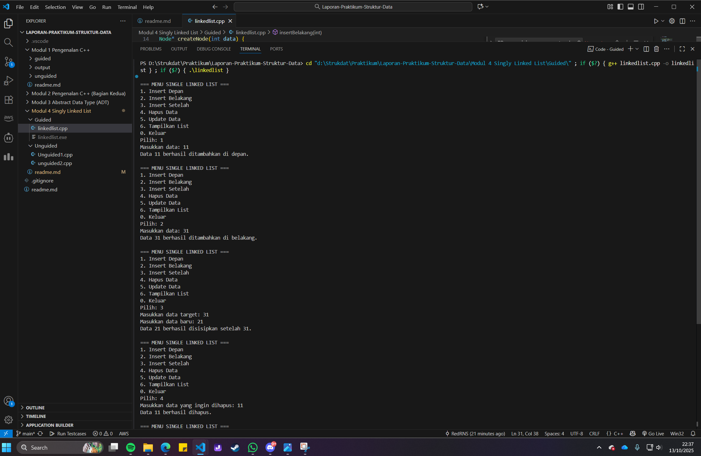
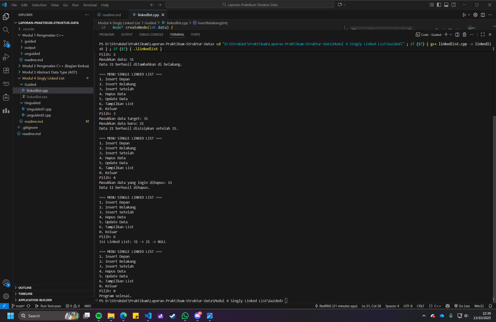
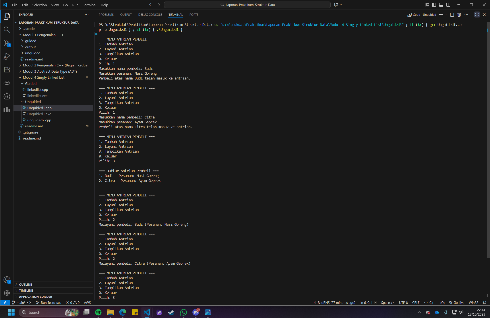
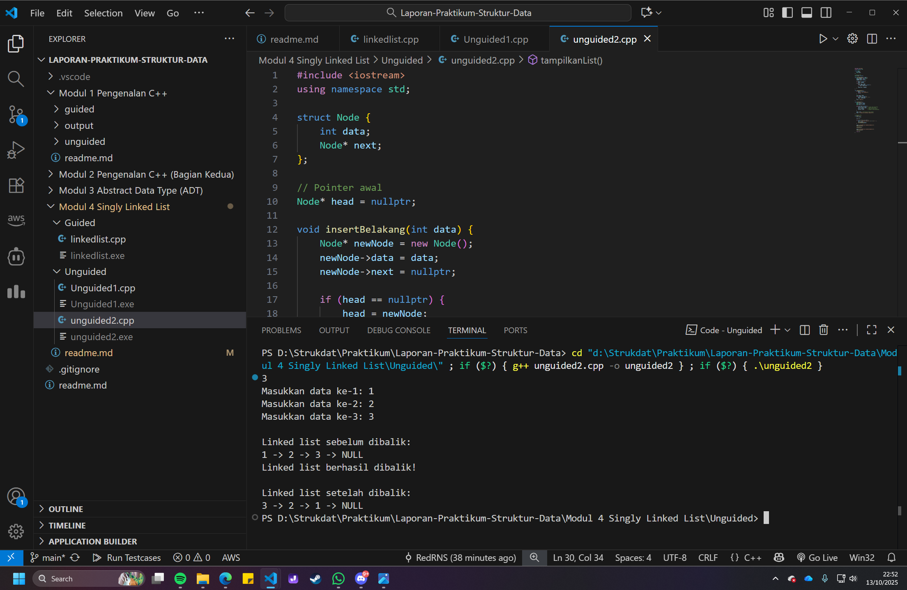

# <h1 align="center">Laporan Praktikum Modul 4 <br> Singly Linked List</h1>

<p align="center">Renisa Assyifa Putri - 103112400123</p>

## Dasar Teori - Singly Linked List

Modul ke-4 ini membahas Singly Linked List, sebuah struktur data di mana setiap elemen (disebut node) terhubung dalam satu rantai lurus. Bayangin aja ini kayak gerbong kereta, setiap gerbong (node) punya satu sambungan (pointer) yang menunjuk ke gerbong berikutnya.

Dalam Singly Linked List, ada dua istilah penting: head (node pertama) dan tail (node terakhir). Head adalah pintu masuk kita untuk mengakses seluruh "kereta", sementara tail adalah gerbong paling ujung yang sambungannya menunjuk ke NULL (kosong), menandakan akhir dari rantai.

Kelebihan utama linked list dibandingkan array adalah fleksibilitasnya. Nambah atau hapus data di tengah-tengah itu gampang, kita cuma perlu atur ulang sambungannya tanpa harus menggeser semua data lain. Tapi, kekurangannya adalah kita nggak bisa lompat langsung ke data tertentu. Untuk mencari data ke-10, misalnya, kita harus jalan dulu dari head melewati 9 node sebelumnya.

Ketika kita membuat struct Node yang berisi data dan pointer, lalu membuat fungsi-fungsi seperti insert, delete, dan traverse, pada dasarnya kita sedang membangun sebuah ADT (Abstract Data Type) Linked List. Kita mendefinisikan "apa saja" yang bisa dilakukan, sementara detail teknis tentang cara kerja pointer dan alokasi memori kita sembunyikan di dalam implementasi.

## Guided

```cpp
#include <iostream>
using namespace std;

// Struktur Node
struct Node {
    int data;
    Node* next;
};

// Pointer awal
Node* head = nullptr;

// Fungsi untuk membuat node baru
Node* createNode(int data) {
    Node* newNode = new Node();
    newNode->data = data;
    newNode->next = nullptr;
    return newNode;
}

// ========== INSERT DEPAN ==========
void insertDepan(int data) {
    Node* newNode = createNode(data);
    newNode->next = head;
    head = newNode;
    cout << "Data " << data << " berhasil ditambahkan di depan.\n";
}

// ========== INSERT BELAKANG ==========
void insertBelakang(int data) {
    Node* newNode = createNode(data);
    if (head == nullptr) {
        head = newNode;
    } else {
        Node* temp = head;
        while (temp->next != nullptr) {
            temp = temp->next;
        }
        temp->next = newNode;
    }
    cout << "Data " << data << " berhasil ditambahkan di belakang.\n";
}

// ========== INSERT SETELAH ==========
void insertSetelah(int target, int dataBaru) {
    Node* temp = head;
    while (temp != nullptr && temp->data != target) {
        temp = temp->next;
    }
    if (temp == nullptr) {
        cout << "Data " << target << " tidak ditemukan!\n";
    } else {
        Node* newNode = createNode(dataBaru);
        newNode->next = temp->next;
        temp->next = newNode;
        cout << "Data " << dataBaru << " berhasil disisipkan setelah " << target << ".\n";
    }
}

// ========== DELETE FUNCTION ==========
void hapusNode(int data) {
    if (head == nullptr) {
        cout << "List kosong!\n";
        return;
    }
    Node* temp = head;
    Node* prev = nullptr;

    // Jika data di node pertama
    if (temp != nullptr && temp->data == data) {
        head = temp->next;
        delete temp;
        cout << "Data " << data << " berhasil dihapus.\n";
        return;
    }

    // Cari node yang akan dihapus
    while (temp != nullptr && temp->data != data) {
        prev = temp;
        temp = temp->next;
    }

    // Jika data tidak ditemukan
    if (temp == nullptr) {
        cout << "Data " << data << " tidak ditemukan!\n";
        return;
    }
    prev->next = temp->next;
    delete temp;
    cout << "Data " << data << " berhasil dihapus.\n";
}

// ========== UPDATE FUNCTION ==========
void updateNode(int dataLama, int dataBaru) {
    Node* temp = head;
    while (temp != nullptr && temp->data != dataLama) {
        temp = temp->next;
    }
    if (temp == nullptr) {
        cout << "Data " << dataLama << " tidak ditemukan!\n";
    } else {
        temp->data = dataBaru;
        cout << "Data " << dataLama << " berhasil diupdate menjadi " << dataBaru << ".\n";
    }
}

// ========== DISPLAY FUNCTION ==========
void tampilkanList() {
    if (head == nullptr) {
        cout << "List kosong!\n";
        return;
    }
    Node* temp = head;
    cout << "Isi Linked List: ";
    while (temp != nullptr) {
        cout << temp->data << " -> ";
        temp = temp->next; //
    }
    cout << "NULL\n";
}

// ========== MAIN PROGRAM ==========
int main() {
    int pilihan, data, target, dataBaru;
    do {
        cout << "\n=== MENU SINGLE LINKED LIST ===\n";
        cout << "1. Insert Depan\n";
        cout << "2. Insert Belakang\n";
        cout << "3. Insert Setelah\n";
        cout << "4. Hapus Data\n";
        cout << "5. Update Data\n";
        cout << "6. Tampilkan List\n";
        cout << "0. Keluar\n";
        cout << "Pilih: ";
        cin >> pilihan;

        switch (pilihan) {
            case 1
                cout << "Masukkan data: ";
                cin >> data;
                insertDepan(data);
                break;
            case 2:
                cout << "Masukkan data: ";
                cin >> data;
                insertBelakang(data);
                break;
            case 3:
                cout << "Masukkan data target: ";
                cin >> target;
                cout << "Masukkan data baru: ";
                cin >> dataBaru;
                insertSetelah(target, dataBaru);
                break;
            case 4:
                cout << "Masukkan data yang ingin dihapus: ";
                cin >> data;
                hapusNode(data);
                break;
            case 5:
                cout << "Masukkan data lama: ";
                cin >> data;
                cout << "Masukkan data baru: ";
                cin >> dataBaru;
                updateNode(data, dataBaru);
                break;
            case 6:
                tampilkanList();
                break;
            case 0:
                cout << "Program selesai.\n";
                break;
            default:
                cout << "Pilihan tidak valid!\n";
        }
    } while (pilihan != 0);
    return 0;
}
```
### Output Code




Program ini adalah implementasi lengkap untuk mengelola singly linked list.

Struktur Dasar: Dimulai dengan struct Node yang punya dua komponen: data (untuk menyimpan nilai) dan next (pointer ke node selanjutnya). Ada juga pointer global head yang selalu menunjuk ke node pertama.

Operasi Penambahan: Terdapat tiga fungsi untuk menambah data:
insertDepan(): Menambah node baru di awal dan menjadikannya head yang baru.
insertBelakang(): Menelusuri list sampai akhir, lalu menyambungkan node baru di sana.
insertSetelah(): Mencari node dengan data tertentu, lalu menyisipkan node baru setelahnya.

Operasi Modifikasi & Penghapusan:
hapusNode(): Mencari node yang akan dihapus, lalu menyambungkan node sebelumnya dengan node sesudahnya, effectively "melepas" node target dari rantai sebelum menghapusnya.
updateNode(): Mencari node dengan data lama, lalu langsung mengganti nilainya dengan data baru.
Operasi Tampilan: tampilkanList() bekerja dengan cara berjalan dari head sampai NULL sambil mencetak data setiap node yang dilewati.
Program Utama: Fungsi main() menyediakan menu interaktif agar pengguna bisa memilih dan menjalankan semua operasi linked list yang sudah dibuat.

## Unguided

## Soal Latihan Modul 4

### Soal 1

1. Buatlah single linked list untuk Antrian yang menyimpan data pembeli( nama dan pesanan). program memiliki beberapa menu seperti tambah antrian,  layani antrian(hapus), dan tampilkan antrian. \*antrian pertama harus yang pertama dilayani

```cpp
#include <iostream>
#include <string>

using namespace std;

// Struktur Node untuk menyimpan data pembeli
struct Node {
    string nama;
    string pesanan;
    Node* next;
};

// Pointer depan (head) dan belakang (tail) antrian
Node* head = nullptr;
Node* tail = nullptr;

void tambahAntrian(string nama, string pesanan) {
    Node* newNode = new Node();
    newNode->nama = nama;
    newNode->pesanan = pesanan;
    newNode->next = nullptr;

    if (head == nullptr) { // Jika antrian kosong
        head = tail = newNode;
    } else { // Jika sudah ada antrian
        tail->next = newNode;
        tail = newNode;
    }
    cout << "Pembeli atas nama " << nama << " telah masuk ke antrian.\n";
}

void layaniAntrian() {
    if (head == nullptr) {
        cout << "Antrian kosong! Tidak ada yang dilayani.\n";
        return;
    }

    Node* temp = head;
    cout << "Melayani pembeli: " << temp->nama << " (Pesanan: " << temp->pesanan << ")\n";
    head = head->next;
    delete temp;
    if (head == nullptr) {
        tail = nullptr; // Jika antrian jadi kosong
    }
}

void tampilkanAntrian() {
    if (head == nullptr) {
        cout << "Antrian kosong!\n";
        return;
    }
    Node* temp = head;
    cout << "\n=== Daftar Antrian Pembeli ===\n";
    int nomor = 1;
    while (temp != nullptr) {
        cout << nomor << ". " << temp->nama << " - Pesanan: " << temp->pesanan << endl;
        temp = temp->next;
        nomor++;
    }
    cout << "==============================\n";
}

// Program utama
int main() {
    int pilihan;
    string nama, pesanan;

    do {
        cout << "\n=== MENU ANTRIAN PEMBELI ===\n";
        cout << "1. Tambah Antrian\n";
        cout << "2. Layani Antrian\n";
        cout << "3. Tampilkan Antrian\n";
        cout << "0. Keluar\n";
        cout << "Pilih: ";
        cin >> pilihan;
        cin.ignore();

        switch (pilihan) {
            case 1:
                cout << "Masukkan nama pembeli: ";
                getline(cin, nama);
                cout << "Masukkan pesanan: ";
                getline(cin, pesanan);
                tambahAntrian(nama, pesanan);
                break;
            case 2:
                layaniAntrian();
                break;
            case 3:
                tampilkanAntrian();
                break;
            case 0:
                cout << "Program selesai.\n";
                break;
            default:
                cout << "Pilihan tidak valid!\n";
        }
    } while (pilihan != 0);
    return 0;
}
```
### Output Code


Program ini adalah simulasi sistem antrian yang menerapkan prinsip First-In, First-Out (FIFO) menggunakan singly linked list.
- Struktur Data: Setiap Node menyimpan data nama dan pesanan pembeli. Program menggunakan dua pointer utama: head (untuk menunjuk antrian terdepan) dan tail (untuk menunjuk antrian terakhir).
- tambahAntrian(): Fungsi ini menambahkan pembeli baru di ujung belakang antrian. Node baru disambungkan setelah tail, dan tail kemudian diperbarui untuk menunjuk ke node baru tersebut. Ini memastikan penambahan data selalu efisien.
- layaniAntrian(): Fungsi ini melayani pembeli di urutan paling depan. Data pembeli di head ditampilkan, lalu node head dihapus dari list, dan head digeser ke node berikutnya. Ini adalah implementasi dari prinsip "yang pertama datang, yang pertama dilayani".
- tampilkanAntrian(): Menampilkan seluruh pembeli yang sedang mengantri dari head hingga tail.

### Soal 2

2. buatlah program kode untuk membalik (reverse) singly linked list (1-2-3 menjadi 3-2-1)

```cpp
#include <iostream>
using namespace std;

struct Node {
    int data;
    Node* next;
};

// Pointer awal
Node* head = nullptr;

void insertBelakang(int data) {
    Node* newNode = new Node();
    newNode->data = data;
    newNode->next = nullptr;

    if (head == nullptr) {
        head = newNode;
    } else {
        Node* temp = head;
        while (temp->next != nullptr) {
            temp = temp->next;
        }
        temp->next = newNode;
    }
}

void tampilkanList() {
    if (head == nullptr) {
        cout << "List kosong!\n";
        return;
    }

    Node* temp = head;
    while (temp != nullptr) {
        cout << temp->data << " -> ";
        temp = temp->next;
    }
    cout << "NULL\n";
}

void reverseList() {
    Node* prev = nullptr;
    Node* current = head;
    Node* next = nullptr;
    while (current != nullptr) {
        next = current->next;  // simpan node berikutnya
        current->next = prev;  // balik arah pointer
        prev = current;        // geser prev ke current
        current = next;        // pindah ke node berikutnya
    }
    head = prev; // ubah head ke node terakhi
    cout << "Linked list berhasil dibalik!\n";
}
// Program utama
int main() {
    int n, data;
    cin >> n;

    for (int i = 0; i < n; i++) {
        cout << "Masukkan data ke-" << i + 1 << ": ";
        cin >> data;
        insertBelakang(data);
    }
    cout << "\nLinked list sebelum dibalik:\n";
    tampilkanList();
    reverseList();
    cout << "\nLinked list setelah dibalik:\n";
    tampilkanList();
    return 0;
}
```
### Output Code

Program ini berfungsi untuk membalik urutan sebuah singly linked list. Proses pembalikan dilakukan dalam fungsi reverseList() dengan sebuah algoritma iteratif yang cerdas menggunakan tiga pointer: prev, current, dan next.
Logikanya seperti ini:
1. prev awalnya NULL, akan menjadi node baru yang ditunjuk.
2. current dimulai dari head, node yang sedang diproses.
3. next digunakan untuk menyimpan sementara node selanjutnya agar kita tidak kehilangan sisa rantai.
Dalam setiap iterasi, pointer next dari current dibalik arahnya untuk menunjuk ke prev. Setelah itu, prev dan current digeser satu langkah ke depan. Proses ini diulang sampai seluruh node selesai dibalik. Pada akhirnya, head di-update untuk menunjuk ke prev, yang kini menjadi elemen pertama dari list yang sudah terbalik.

## Referensi

1. Universitas Negeri Malang. (n.d.). Modul 6 Single & Double Linked List. Modul Struktur Data (PDF). https://elektro.um.ac.id/wp-content/uploads/2016/04/ASD-Modul-6-Linked-List.pdf
2. Universitas Esa Unggul. (n.d.). Linked List. Modul Kuliah Struktur Data. https://lms-paralel.esaunggul.ac.id/pluginfile.php?file=%2F86227%2Fmod_resource%2Fcontent%2F1%2FModul+Struktur+Data-Linked+List.pdf
3. Rumah Coding. (n.d.). "Struktur Data: Pengertian dan Implementasi Dasar Linked List". https://rumahcoding.co.id/linked-list-pengertian-dan-implementasi-dasar/
