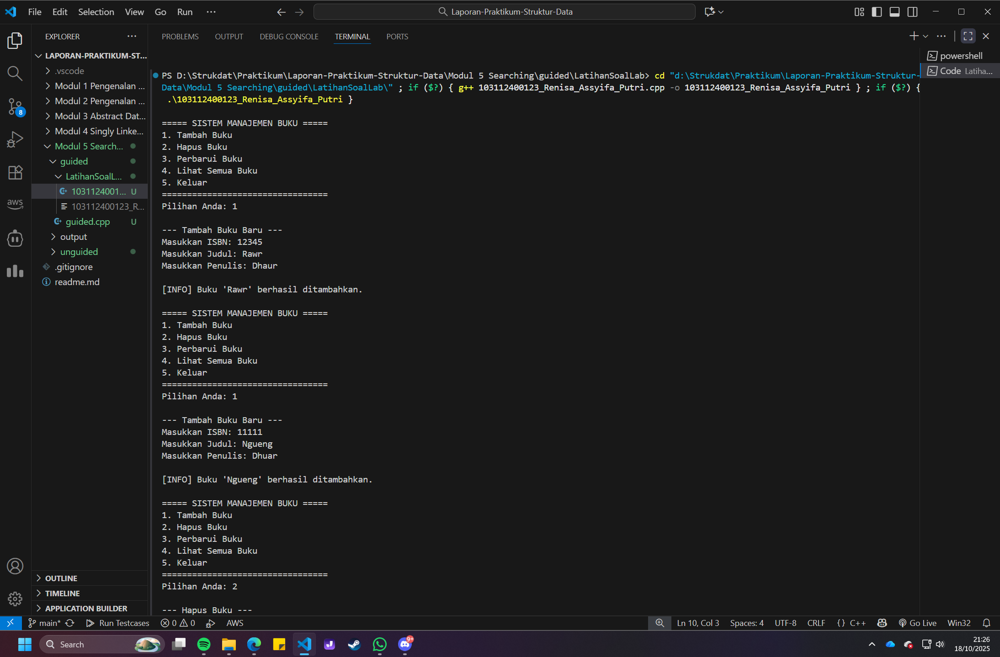
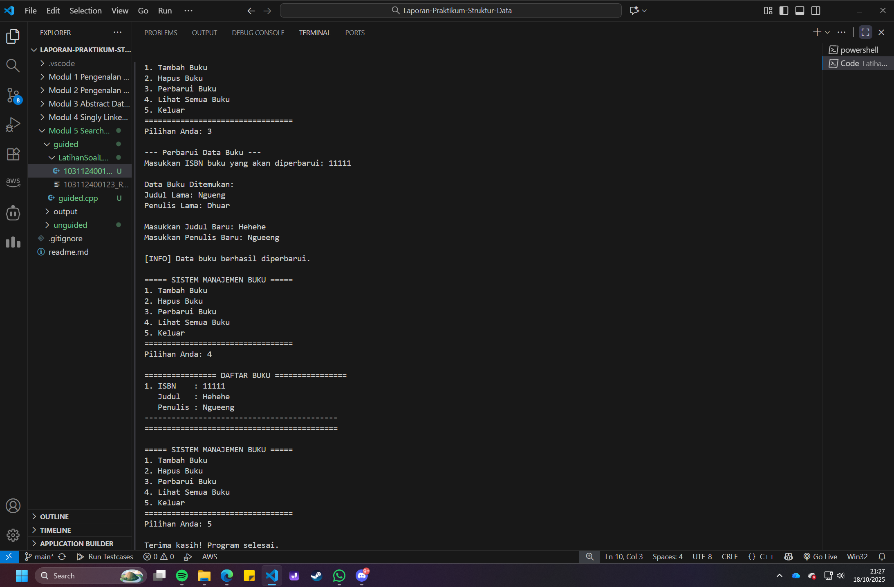
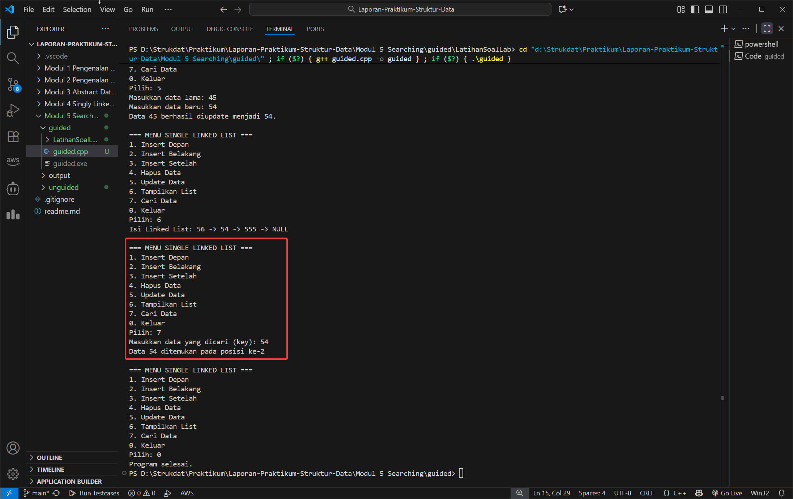
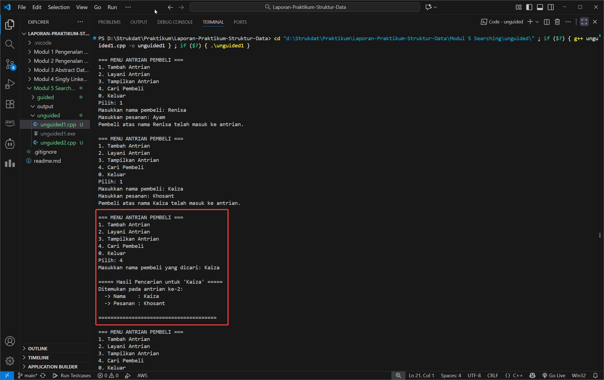
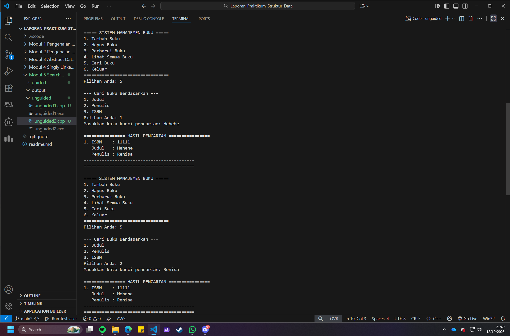
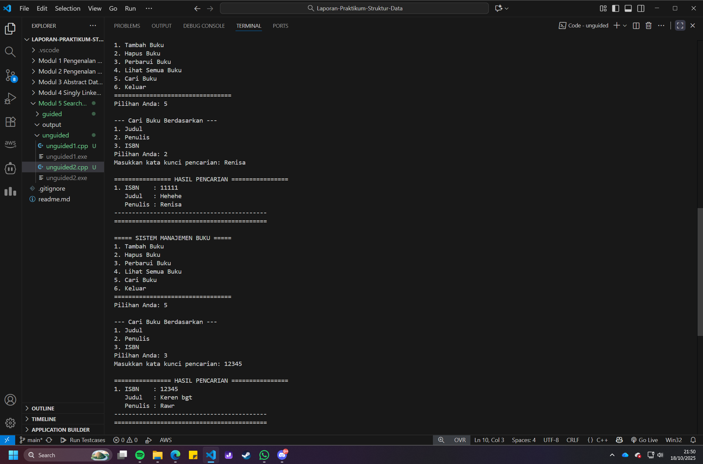

# <h1 align="center">Laporan Praktikum Modul 5 <br> Searching</h1>

<p align="center">Renisa Assyifa Putri - 103112400123</p>

## Dasar Teori - Searching

### 1. Pengertian Searching

Searching (pencarian) merupakan salah satu operasi fundamental dalam ilmu komputer dan struktur data yang bertujuan untuk menemukan lokasi atau keberadaan suatu elemen tertentu dalam kumpulan data. Operasi pencarian sangat krusial dalam berbagai aplikasi, mulai dari database management system, search engine, hingga sistem informasi modern yang memproses miliaran data setiap detiknya.

Secara formal, searching dapat didefinisikan sebagai proses menemukan posisi atau index dari elemen dengan nilai kunci (key) tertentu dalam struktur data. Jika elemen ditemukan, algoritma akan mengembalikan posisi elemen tersebut; jika tidak ditemukan, algoritma akan memberikan indikasi bahwa elemen tidak ada dalam struktur data.

### 2. Kompleksitas Algoritma Searching

Efisiensi algoritma searching diukur menggunakan notasi Big-O yang menganalisis time complexity dan space complexity:

**Time Complexity:**
- **Best Case**: Kasus terbaik ketika elemen ditemukan pada posisi pertama
- **Average Case**: Rata-rata waktu yang dibutuhkan untuk berbagai kemungkinan posisi data
- **Worst Case**: Kasus terburuk ketika elemen berada di posisi terakhir atau tidak ada dalam struktur data

**Space Complexity:**
Mengukur jumlah memori tambahan yang dibutuhkan algoritma untuk melakukan pencarian.

### 3. Sequential Search (Linear Search)

#### 3.1 Konsep Dasar Sequential Search

Sequential Search atau Linear Search adalah algoritma pencarian paling sederhana dan intuitif. Algoritma ini bekerja dengan cara memeriksa setiap elemen dalam struktur data secara berurutan dari awal hingga akhir, atau sampai elemen yang dicari ditemukan.

#### 3.2 Cara Kerja Sequential Search

Proses pencarian sequential mengikuti langkah-langkah berikut:

1. **Inisialisasi**: Mulai dari elemen pertama dalam struktur data
2. **Komparasi**: Bandingkan nilai elemen saat ini dengan nilai yang dicari (key)
3. **Kondisi Found**: Jika nilai cocok, pencarian berhasil dan posisi dikembalikan
4. **Iterasi**: Jika tidak cocok, lanjutkan ke elemen berikutnya
5. **Terminasi**: Proses berakhir ketika elemen ditemukan atau seluruh data sudah diperiksa

#### 3.3 Karakteristik Sequential Search

**Kelebihan:**
- Implementasi sangat sederhana dan mudah dipahami
- Dapat digunakan pada data yang tidak terurut (unsorted)
- Efektif untuk struktur data linked list yang tidak mendukung random access
- Tidak memerlukan preprocessing atau pengurutan data terlebih dahulu
- Space complexity O(1) - sangat efisien dalam penggunaan memori

**Kekurangan:**
- Time complexity O(n) - tidak efisien untuk dataset besar
- Pada worst case, harus memeriksa semua elemen
- Performa menurun drastis seiring bertambahnya jumlah data

#### 3.4 Analisis Kompleksitas Sequential Search

```
Time Complexity:
- Best Case: O(1)    - Elemen ditemukan di posisi pertama
- Average Case: O(n/2) ≈ O(n) - Elemen di tengah
- Worst Case: O(n)   - Elemen di posisi terakhir atau tidak ada

Space Complexity: O(1) - Hanya memerlukan variabel temporary
```

#### 3.5 Implementasi Sequential Search pada Linked List

Pada linked list, sequential search adalah satu-satunya metode pencarian yang praktis karena:
- Linked list tidak mendukung random access
- Setiap node hanya dapat diakses melalui pointer next
- Traversal harus dilakukan secara sekuensial dari head ke tail

### 4. Binary Search (Pencarian Biner)

#### 4.1 Konsep Dasar Binary Search

Binary Search adalah algoritma pencarian yang sangat efisien dengan pendekatan divide and conquer. Algoritma ini membagi search space menjadi dua bagian secara berulang, sehingga jumlah elemen yang perlu diperiksa berkurang secara eksponensial.

#### 4.2 Prasyarat Binary Search

**Syarat Mutlak:**
Data harus sudah terurut (sorted) secara ascending atau descending. Tanpa kondisi ini, binary search tidak akan memberikan hasil yang benar.

#### 4.3 Cara Kerja Binary Search

1. **Tentukan Batas**: Set indeks low = 0 dan high = n-1 (n = jumlah elemen)
2. **Hitung Middle**: Kalkulasi middle = (low + high) / 2
3. **Komparasi Middle**:
   - Jika array[middle] == key → elemen ditemukan
   - Jika array[middle] > key → cari di bagian kiri (high = middle - 1)
   - Jika array[middle] < key → cari di bagian kanan (low = middle + 1)
4. **Iterasi**: Ulangi langkah 2-3 hingga elemen ditemukan atau low > high

#### 4.4 Karakteristik Binary Search

**Kelebihan:**
- Time complexity O(log n) - sangat efisien untuk dataset besar
- Jumlah komparasi minimal dibanding sequential search
- Performa stabil dan predictable

**Kekurangan:**
- Hanya dapat digunakan pada data terurut
- Memerlukan preprocessing (sorting) jika data belum terurut
- Tidak cocok untuk linked list karena butuh random access
- Overhead sorting bisa memakan waktu untuk data dinamis

#### 4.5 Analisis Kompleksitas Binary Search

```
Time Complexity:
- Best Case: O(1)      - Elemen di posisi middle pertama
- Average Case: O(log n) - Rata-rata operasi
- Worst Case: O(log n)  - Pencarian hingga satu elemen tersisa

Space Complexity:
- Iterative: O(1)
- Recursive: O(log n) karena call stack
```

#### 4.6 Perbandingan Efisiensi

Untuk dataset dengan n = 1,000,000 elemen:
- **Sequential Search**: Worst case = 1,000,000 komparasi
- **Binary Search**: Worst case = log₂(1,000,000) ≈ 20 komparasi

Perbedaan ini menjadi sangat signifikan pada big data processing.

### 5. Variasi Algoritma Searching

#### 5.1 Jump Search

Algoritma yang melompati beberapa elemen dengan ukuran blok √n, kemudian melakukan linear search dalam blok tersebut.
- Time Complexity: O(√n)
- Cocok untuk data terurut dengan ukuran medium

#### 5.2 Interpolation Search

Menggunakan interpolasi matematis untuk memperkirakan posisi elemen yang dicari.
- Time Complexity: O(log log n) untuk uniform distribution
- Sangat efisien untuk data numerik yang terdistribusi merata

#### 5.3 Exponential Search

Mencari range dimana elemen mungkin berada dengan eksponensial, lalu gunakan binary search.
- Time Complexity: O(log n)
- Efektif untuk unbounded atau infinite arrays

### 6. Penerapan Searching dalam Praktik

#### 6.1 Database Systems
- B-Tree dan B+ Tree search untuk indexing
- Hash-based search untuk primary key lookup
- Full-text search menggunakan inverted index

#### 6.2 Search Engines
- Web crawling dan indexing
- Ranking algorithms (PageRank, TF-IDF)
- Query optimization menggunakan berbagai search strategies

#### 6.3 Artificial Intelligence
- Breadth-First Search (BFS)
- Depth-First Search (DFS)
- A* Search Algorithm untuk pathfinding
- Minimax search dalam game theory

### 7. Trade-offs dalam Pemilihan Algoritma Searching

Pemilihan algoritma searching yang tepat bergantung pada beberapa faktor:

1. **Karakteristik Data**:
   - Sorted vs Unsorted
   - Static vs Dynamic
   - Ukuran dataset

2. **Struktur Data**:
   - Array/Vector → Binary search optimal untuk sorted data
   - Linked List → Sequential search sebagai pilihan utama
   - Hash Table → O(1) average case dengan proper hash function
   - Tree → Specialized tree search algorithms

3. **Frekuensi Operasi**:
   - Read-heavy: Investasi sorting untuk binary search worth it
   - Write-heavy: Sequential search lebih praktis

4. **Constraint Resources**:
   - Memory-limited: Prefer O(1) space algorithms
   - Time-critical: Prefer O(log n) atau better time complexity

### 8. Implementasi Searching pada Modul Ini

Semua program dalam modul ini mengimplementasikan **Sequential Search** karena bekerja dengan **Singly Linked List** sebagai struktur data utama. Linked list bersifat sequential access, sehingga:

- Setiap node harus diakses melalui traversal dari head
- Tidak ada mekanisme untuk langsung "melompat" ke middle element
- Binary search secara teknis tidak applicable
- Sequential search menjadi pilihan natural dan efisien

Pendekatan ini mencerminkan realitas implementation dimana pemilihan algoritma sangat bergantung pada karakteristik struktur data yang digunakan.

## Guided Modul

```cpp
#include <iostream>
using namespace std;

// Struktur Node
struct Node {
    int data;
    Node* next;
};
Node* head = nullptr;

// Fungsi untuk membuat node baru
Node* createNode(int data) {
    Node* newNode = new Node();
    newNode->data = data;
    newNode->next = nullptr;
    return newNode;
}

// ========== INSERT DEPAN FUNCTION (Penambahan) ==========
void insertDepan(int data) {
    Node* newNode = createNode(data);
    // Logika Insert First: Node baru menunjuk ke head lama, lalu head menunjuk ke Node baru.
    newNode->next = head;
    head = newNode;
    cout << "Data " << data << " berhasil ditambahkan di depan.\n";
}

void insertBelakang(int data) {
    Node* newNode = createNode(data);
    if (head == nullptr) {
        head = newNode;
    } else {
        Node* temp = head;
        while (temp->next != nullptr) {
            temp = temp->next;
        }
        temp->next = newNode;
    }
    cout << "Data " << data << " berhasil ditambahkan di belakang.\n";
}

void insertSetelah(int target, int dataBaru) {
    Node* temp = head;
    while (temp != nullptr && temp->data != target) {
        temp = temp->next;
    }

    if (temp == nullptr) {
        cout << "Data " << target << " tidak ditemukan!\n";
    } else {
        Node* newNode = createNode(dataBaru);
        // Logika Insert After: Sambungkan newNode ke temp->next, lalu temp ke newNode
        newNode->next = temp->next;
        temp->next = newNode;
        cout << "Data " << dataBaru << " berhasil disisipkan setelah " << target << ".\n";
    }
}

// ========== DELETE FUNCTION ==========
void hapusNode(int data) {
    if (head == nullptr) {
        cout << "List kosong!\n";
        return;
    }

    Node* temp = head;
    Node* prev = nullptr;

    // Jika data di node pertama (Delete First)
    if (temp != nullptr && temp->data == data) {
        head = temp->next;
        delete temp;
        cout << "Data " << data << " berhasil dihapus.\n";
        return;
    }

    // Cari node yang akan dihapus
    while (temp != nullptr && temp->data != data) {
        prev = temp;
        temp = temp->next;
    }

    // Jika data tidak ditemukan
    if (temp == nullptr) {
        cout << "Data " << data << " tidak ditemukan!\n";
        return;
    }

    // Putuskan tautan: prev melompati temp
    prev->next = temp->next;
    delete temp;
    cout << "Data " << data << " berhasil dihapus.\n";
}

// ========== UPDATE FUNCTION ==========
void updateNode(int dataLama, int dataBaru) {
    Node* temp = head;
    while (temp != nullptr && temp->data != dataLama) {
        temp = temp->next;
    }

    if (temp == nullptr) {
        cout << "Data " << dataLama << " tidak ditemukan!\n";
    } else {
        temp->data = dataBaru;
        cout << "Data " << dataLama << " berhasil diupdate menjadi " << dataBaru << ".\n";
    }
}

// ========== SEARCH FUNCTION  ==========
void searchData(int key) {
    Node *temp = head;
    int pos = 1;
    bool found = false;

    while (temp != nullptr) {
        // Cek apakah data di node saat ini sama dengan key
        if (temp->data == key) {
            cout << "Data " << key << " ditemukan pada posisi ke-" << pos << endl;
            found = true;
            break; // Hentikan perulangan jika sudah ditemukan
        }
        temp = temp->next; // Geser ke node berikutnya
        pos++;             // Tambah posisi
    }

    // PENTING: Menggunakan 'if (!found)' untuk mengoreksi kesalahan logika asli
    if (!found) { 
        cout << "Data " << key << " tidak ditemukan dalam linked list.\n";
    }
}


// ========== DISPLAY FUNCTION ==========
void tampilkanList() {
    if (head == nullptr) {
        cout << "List kosong!\n";
        return;
    }

    Node* temp = head;
    cout << "Isi Linked List: ";
    while (temp != nullptr) {
        cout << temp->data << " -> ";
        temp = temp->next;
    }
    cout << "NULL\n";
}


// ========== MAIN PROGRAM ==========
int main() {
    int pilihan, data, target, dataBaru;

    do {
        cout << "\n=== MENU SINGLE LINKED LIST ===\n";
        cout << "1. Insert Depan\n";
        cout << "2. Insert Belakang\n";
        cout << "3. Insert Setelah\n";
        cout << "4. Hapus Data\n";
        cout << "5. Update Data\n";
        cout << "6. Tampilkan List\n";
        cout << "7. Cari Data\n"; 
        cout << "0. Keluar\n";
        cout << "Pilih: ";
        if (!(cin >> pilihan)) {
            // Menangani input non-integer
            cin.clear(); 
            cin.ignore(10000, '\n');
            pilihan = -1; // Set pilihan ke nilai default
        }

        switch (pilihan) {
            case 1:
                cout << "Masukkan data: ";
                cin >> data;
                insertDepan(data); 
                break;
            case 2:
                cout << "Masukkan data: ";
                cin >> data;
                insertBelakang(data);
                break;
            case 3:
                cout << "Masukkan data target: ";
                cin >> target;
                cout << "Masukkan data baru: ";
                cin >> dataBaru;
                insertSetelah(target, dataBaru);
                break;
            case 4:
                cout << "Masukkan data yang ingin dihapus: ";
                cin >> data;
                hapusNode(data);
                break;
            case 5:
                cout << "Masukkan data lama: ";
                cin >> data;
                cout << "Masukkan data baru: ";
                cin >> dataBaru;
                updateNode(data, dataBaru);
                break;
            case 6:
                tampilkanList();
                break;
            case 7: // Case baru untuk Search
                cout << "Masukkan data yang dicari (key): ";
                cin >> data;
                searchData(data);
                break;
            case 0:
                cout << "Program selesai.\n";
                break;
            default:
                cout << "Pilihan tidak valid!\n";
        }
    } while (pilihan != 0);

    return 0;
}
```
### Output Code




Program ini merupakan pengembangan dari implementasi Singly Linked List dari modul sebelumnya, dengan penambahan fungsionalitas utama yaitu pencarian data.

- Struktur & Operasi Dasar: Program ini masih menggunakan struct Node yang sama dan memiliki fungsi-fungsi dasar CRUD (Create, Read, Update, Delete) seperti insertDepan, hapusNode, dan updateNode.
- Fungsi searchData(int key): Ini adalah inti dari modul ini. Fungsi ini mengimplementasikan algoritma Sequential Search. Ia bekerja dengan cara menelusuri (traverse) list dari head satu per satu. Di setiap Node, ia membandingkan data yang tersimpan dengan key yang dicari. Sebuah variabel pos digunakan untuk melacak posisi node saat ini. Jika data ditemukan, fungsi akan mencetak posisinya dan berhenti. Jika sampai akhir list (temp == nullptr) data tidak ditemukan, sebuah flag found memastikan pesan "tidak ditemukan" akan ditampilkan.

## Guided Latihan Soal di Lab

```cpp
#include <iostream>
#include <string>

using namespace std;

struct infotype {
    string isbn;
    string judul;
    string penulis;
};

typedef struct elmlist *address;

struct elmlist {
    infotype info;
    address next;
};

struct List {
    address first;
};

void createList(List &L) {
    L.first = NULL;
}

address alokasi(infotype data) {
    address P = new elmlist;
    P->info.isbn = data.isbn;
    P->info.judul = data.judul;
    P->info.penulis = data.penulis;
    P->next = NULL;
    return P;
}

void dealokasi(address &P) {
    delete P;
}

address cariBuku(List L, string isbn) {
    address P = L.first;
    while (P != NULL) {
        if (P->info.isbn == isbn) {
            return P;
        }
        P = P->next;
    }
    return NULL;
}

void tambahBuku(List &L, infotype data) {
    address P = alokasi(data);
    if (L.first == NULL) {
        L.first = P;
    } else {
        address Q = L.first;
        while (Q->next != NULL) {
            Q = Q->next;
        }
        Q->next = P;
    }
    cout << "\n[INFO] Buku '" << data.judul << "' berhasil ditambahkan." << endl;
}

void hapusBuku(List &L, string isbn) {
    address P = cariBuku(L, isbn);

    if (P == NULL) {
        cout << "\n[ERROR] Buku dengan ISBN " << isbn << " tidak ditemukan." << endl;
        return;
    }

    if (P == L.first) {
        L.first = P->next;
    } else {
        address prev = L.first;
        while (prev->next != P) {
            prev = prev->next;
        }
        prev->next = P->next;
    }
    
    cout << "\n[INFO] Buku '" << P->info.judul << "' berhasil dihapus." << endl;
    dealokasi(P);
}

void updateBuku(List &L, string isbn) {
    address P = cariBuku(L, isbn);
    if (P != NULL) {
        cout << "\nData Buku Ditemukan:" << endl;
        cout << "Judul Lama: " << P->info.judul << endl;
        cout << "Penulis Lama: " << P->info.penulis << endl;
        
        cout << "\nMasukkan Judul Baru: ";
        cin.ignore();
        getline(cin, P->info.judul);
        
        cout << "Masukkan Penulis Baru: ";
        getline(cin, P->info.penulis);
        
        cout << "\n[INFO] Data buku berhasil diperbarui." << endl;
    } else {
        cout << "\n[ERROR] Buku dengan ISBN " << isbn << " tidak ditemukan." << endl;
    }
}

void lihatBuku(List L) {
    cout << "\n================ DAFTAR BUKU ================" << endl;
    if (L.first == NULL) {
        cout << "          (Tidak ada buku di daftar)" << endl;
    } else {
        address P = L.first;
        int i = 1;
        while (P != NULL) {
            cout << i << ". ISBN    : " << P->info.isbn << endl;
            cout << "   Judul   : " << P->info.judul << endl;
            cout << "   Penulis : " << P->info.penulis << endl;
            cout << "-------------------------------------------" << endl;
            P = P->next;
            i++;
        }
    }
    cout << "===========================================" << endl;
}

int main() {
    List daftar_buku;
    createList(daftar_buku);
    int pilihan;
    string isbn;
    infotype dataBuku;

    do {
        cout << "\n===== SISTEM MANAJEMEN BUKU =====" << endl;
        cout << "1. Tambah Buku" << endl;
        cout << "2. Hapus Buku" << endl;
        cout << "3. Perbarui Buku" << endl;
        cout << "4. Lihat Semua Buku" << endl;
        cout << "5. Keluar" << endl;
        cout << "=================================" << endl;
        cout << "Pilihan Anda: ";
        cin >> pilihan;

        switch (pilihan) {
            case 1:
                cout << "\n--- Tambah Buku Baru ---" << endl;
                cout << "Masukkan ISBN: ";
                cin >> dataBuku.isbn;
                cout << "Masukkan Judul: ";
                cin.ignore(); 
                getline(cin, dataBuku.judul);
                cout << "Masukkan Penulis: ";
                getline(cin, dataBuku.penulis);
                tambahBuku(daftar_buku, dataBuku);
                break;
            case 2:
                cout << "\n--- Hapus Buku ---" << endl;
                cout << "Masukkan ISBN buku yang akan dihapus: ";
                cin >> isbn;
                hapusBuku(daftar_buku, isbn);
                break;
            case 3:
                cout << "\n--- Perbarui Data Buku ---" << endl;
                cout << "Masukkan ISBN buku yang akan diperbarui: ";
                cin >> isbn;
                updateBuku(daftar_buku, isbn);
                break;
            case 4:
                lihatBuku(daftar_buku);
                break;
            case 5:
                cout << "\nTerima kasih! Program selesai." << endl;
                break;
            default:
                cout << "\n[ERROR] Pilihan tidak valid. Silakan coba lagi." << endl;
                break;
        }
    } while (pilihan != 5);

    return 0;
}
```
### Output Code



Program ini adalah contoh praktis penerapan Singly Linked List untuk mengelola data buku dalam sebuah sistem manajemen sederhana.

- Struktur Data: Menggunakan struct infotype untuk membungkus data buku (ISBN, judul, penulis) dan struct elmlist sebagai node dari linked list. Ini adalah pendekatan yang lebih terstruktur dan umum dipakai dalam pengembangan software.
- Fungsi cariBuku(List L, string isbn): Fungsi ini menjadi tulang punggung untuk operasi lain. Ia melakukan Sequential Search untuk menemukan sebuah buku berdasarkan ISBN-nya yang unik. Fungsi ini sangat efisien untuk tugas internal karena ia langsung mengembalikan pointer (address) ke node yang ditemukan. Pointer ini kemudian digunakan secara langsung oleh fungsi hapusBuku dan updateBuku untuk memodifikasi data tanpa perlu melakukan pencarian ulang.

## Unguided

## Soal Latihan Modul 5

### Soal 1

1. Buatlah searcing untuk mencari nama pembeli pada unguided sebelumnya!

```cpp
#include <iostream>
#include <string>
using namespace std;

// Struktur Node untuk menyimpan data pembeli
struct Node {
    string nama;
    string pesanan;
    Node* next;
};

// Pointer depan (head) dan belakang (tail) antrian
Node* head = nullptr;
Node* tail = nullptr;

void tambahAntrian(string nama, string pesanan) {
    Node* newNode = new Node();
    newNode->nama = nama;
    newNode->pesanan = pesanan;
    newNode->next = nullptr;

    if (head == nullptr) { // Jika antrian kosong
        head = tail = newNode;
    } else { // Jika sudah ada antrian
        tail->next = newNode;
        tail = newNode;
    }
    cout << "Pembeli atas nama " << nama << " telah masuk ke antrian.\n";
}

void layaniAntrian() {
    if (head == nullptr) {
        cout << "Antrian kosong! Tidak ada yang dilayani.\n";
        return;
    }

    Node* temp = head;
    cout << "Melayani pembeli: " << temp->nama << " (Pesanan: " << temp->pesanan << ")\n";

    head = head->next;
    delete temp;

    if (head == nullptr) {
        tail = nullptr; // Jika antrian jadi kosong
    }
}

void tampilkanAntrian() {
    if (head == nullptr) {
        cout << "Antrian kosong!\n";
        return;
    }

    Node* temp = head;
    cout << "\n=== Daftar Antrian Pembeli ===\n";
    int nomor = 1;
    while (temp != nullptr) {
        cout << nomor << ". " << temp->nama << " - Pesanan: " << temp->pesanan << endl;
        temp = temp->next;
        nomor++;
    }
    cout << "==============================\n";
}


// PENAMBAHAN FUNGSI BARU: Fungsi untuk mencari nama pembeli

void cariPembeli() {
    if (head == nullptr) {
        cout << "Antrian kosong! Tidak ada yang bisa dicari.\n";
        return;
    }

    string namaDicari;
    cout << "Masukkan nama pembeli yang dicari: ";
    getline(cin, namaDicari);

    Node* temp = head;
    bool ditemukan = false;
    int posisi = 1;

    cout << "\n===== Hasil Pencarian untuk '" << namaDicari << "' =====\n";
    while (temp != nullptr) {
        if (temp->nama.find(namaDicari) != string::npos) {
            cout << "Ditemukan pada antrian ke-" << posisi << ":\n";
            cout << "  -> Nama    : " << temp->nama << "\n";
            cout << "  -> Pesanan : " << temp->pesanan << "\n\n";
            ditemukan = true;
        }
        temp = temp->next;
        posisi++;
    }

    if (!ditemukan) {
        cout << "Pembeli dengan nama yang mengandung kata '" << namaDicari << "' tidak ditemukan.\n";
    }
    cout << "=======================================\n";
}


int main() {
    int pilihan;
    string nama, pesanan;

    do {
        cout << "\n=== MENU ANTRIAN PEMBELI ===\n";
        cout << "1. Tambah Antrian\n";
        cout << "2. Layani Antrian\n";
        cout << "3. Tampilkan Antrian\n";

        // PERUBAHAN 1: Menambahkan opsi menu baru
        cout << "4. Cari Pembeli\n";
        cout << "0. Keluar\n";
        cout << "Pilih: ";
        cin >> pilihan;
        
        // Menangani jika input bukan angka
        if (cin.fail()) {
            cout << "\n[ERROR] Input harus berupa angka.\n";
            cin.clear();
            cin.ignore(10000, '\n');
            pilihan = -1;
            continue;
        }
        cin.ignore(); 

        switch (pilihan) {
            case 1:
                cout << "Masukkan nama pembeli: ";
                getline(cin, nama);
                cout << "Masukkan pesanan: ";
                getline(cin, pesanan);
                tambahAntrian(nama, pesanan);
                break;
            case 2:
                layaniAntrian();
                break;
            case 3:
                tampilkanAntrian();
                break;

            // PERUBAHAN 2: Menambahkan case untuk menu baru
            case 4:
                cariPembeli();
                break;
            case 0:
                cout << "Program selesai.\n";
                break;
            default:
                cout << "Pilihan tidak valid!\n";
        }
    } while (pilihan != 0);

    return 0;
}
```
### Output Code


Program ini merupakan modifikasi dari program antrian pembeli di modul 4 dengan menambahkan fitur pencarian.

- Sistem Antrian (FIFO): Program tetap mempertahankan logika First-In, First-Out menggunakan pointer head dan tail untuk operasi tambahAntrian (menambah di belakang) dan layaniAntrian (menghapus dari depan).
- Fungsi cariPembeli(): Fitur baru ini mengimplementasikan Sequential Search untuk mencari pembeli berdasarkan nama. Uniknya, fungsi ini menggunakan string::find yang memungkinkan pencarian substring (pencocokan sebagian kata). Artinya, jika kita mencari "Ren", maka pembeli dengan nama "Renisa" akan ditemukan. Ini membuat fitur pencarian menjadi lebih fleksibel dan user-friendly, karena pengguna tidak perlu mengetik nama lengkap secara persis.

### Soal 2

2. Gunakan latihan pada pertemuan minggu ini dan tambahkan searching untuk mencari buku berdasarkan judul, penulis, dan ISBN!

```cpp
#include <iostream>
#include <string>

using namespace std;

struct infotype {
    string isbn;
    string judul;
    string penulis;
};

typedef struct elmlist *address;

struct elmlist {
    infotype info;
    address next;
};

struct List {
    address first;
};

void createList(List &L) {
    L.first = NULL;
}

address alokasi(infotype data) {
    address P = new elmlist;
    P->info.isbn = data.isbn;
    P->info.judul = data.judul;
    P->info.penulis = data.penulis;
    P->next = NULL;
    return P;
}

void dealokasi(address &P) {
    delete P;
}

// PERUBAHAN 1: Nama fungsi diubah agar lebih spesifik
// Fungsi ini hanya mencari berdasarkan ISBN dan mengembalikan address
// karena dibutuhkan oleh fungsi hapus dan update.

address cariBukuByISBN(List L, string isbn) {
    address P = L.first;
    while (P != NULL) {
        if (P->info.isbn == isbn) {
            return P;
        }
        P = P->next;
    }
    return NULL;
}


// PENAMBAHAN FUNGSI BARU: Fungsi untuk mencari buku
// Fungsi ini akan menampilkan semua buku yang cocok dengan kriteria
// pencarian (Judul, Penulis, atau ISBN).

void cariDanTampilkanBuku(List L) {
    if (L.first == NULL) {
        cout << "\n[INFO] Daftar buku masih kosong, tidak ada yang bisa dicari." << endl;
        return;
    }

    int pilihanCari;
    cout << "\n--- Cari Buku Berdasarkan ---" << endl;
    cout << "1. Judul" << endl;
    cout << "2. Penulis" << endl;
    cout << "3. ISBN" << endl;
    cout << "Pilihan Anda: ";
    cin >> pilihanCari;

    if (cin.fail() || pilihanCari < 1 || pilihanCari > 3) {
        cin.clear(); 
        cin.ignore(10000, '\n'); 
        cout << "\n[ERROR] Pilihan tidak valid." << endl;
        return;
    }

    string keyword;
    cout << "Masukkan kata kunci pencarian: ";
    cin.ignore(); 
    getline(cin, keyword);

    address P = L.first;
    bool ditemukan = false;
    int i = 1;

    cout << "\n================ HASIL PENCARIAN ================" << endl;
    while (P != NULL) {
        bool cocok = false;
        // Pilihan 1: Cari berdasarkan judul (bisa sebagian kata)
        if (pilihanCari == 1 && P->info.judul.find(keyword) != string::npos) {
            cocok = true;
        // Pilihan 2: Cari berdasarkan penulis (bisa sebagian kata)
        } else if (pilihanCari == 2 && P->info.penulis.find(keyword) != string::npos) {
            cocok = true;
        // Pilihan 3: Cari berdasarkan ISBN (harus sama persis)
        } else if (pilihanCari == 3 && P->info.isbn == keyword) {
            cocok = true;
        }

        if (cocok) {
            cout << i << ". ISBN    : " << P->info.isbn << endl;
            cout << "   Judul   : " << P->info.judul << endl;
            cout << "   Penulis : " << P->info.penulis << endl;
            cout << "-------------------------------------------" << endl;
            ditemukan = true;
            i++;
        }
        P = P->next;
    }

    if (!ditemukan) {
        cout << "   (Buku dengan kata kunci '" << keyword << "' tidak ditemukan)" << endl;
    }
    cout << "===========================================" << endl;
}


void tambahBuku(List &L, infotype data) {
    address P = alokasi(data);
    if (L.first == NULL) {
        L.first = P;
    } else {
        address Q = L.first;
        while (Q->next != NULL) {
            Q = Q->next;
        }
        Q->next = P;
    }
    cout << "\n[INFO] Buku '" << data.judul << "' berhasil ditambahkan." << endl;
}

void hapusBuku(List &L, string isbn) {
    // PERUBAHAN 2: Memanggil fungsi cariBukuByISBN
    address P = cariBukuByISBN(L, isbn);

    if (P == NULL) {
        cout << "\n[ERROR] Buku dengan ISBN " << isbn << " tidak ditemukan." << endl;
        return;
    }

    if (P == L.first) {
        L.first = P->next;
    } else {
        address prev = L.first;
        while (prev->next != P) {
            prev = prev->next;
        }
        prev->next = P->next;
    }

    cout << "\n[INFO] Buku '" << P->info.judul << "' berhasil dihapus." << endl;
    dealokasi(P);
}

void updateBuku(List &L, string isbn) {
    // PERUBAHAN 3: Memanggil fungsi cariBukuByISBN
    address P = cariBukuByISBN(L, isbn);
    if (P != NULL) {
        cout << "\nData Buku Ditemukan:" << endl;
        cout << "Judul Lama: " << P->info.judul << endl;
        cout << "Penulis Lama: " << P->info.penulis << endl;

        cout << "\nMasukkan Judul Baru: ";
        cin.ignore();
        getline(cin, P->info.judul);

        cout << "Masukkan Penulis Baru: ";
        getline(cin, P->info.penulis);

        cout << "\n[INFO] Data buku berhasil diperbarui." << endl;
    } else {
        cout << "\n[ERROR] Buku dengan ISBN " << isbn << " tidak ditemukan." << endl;
    }
}

void lihatBuku(List L) {
    cout << "\n================ DAFTAR BUKU ================" << endl;
    if (L.first == NULL) {
        cout << "               (Tidak ada buku di daftar)" << endl;
    } else {
        address P = L.first;
        int i = 1;
        while (P != NULL) {
            cout << i << ". ISBN    : " << P->info.isbn << endl;
            cout << "   Judul   : " << P->info.judul << endl;
            cout << "   Penulis : " << P->info.penulis << endl;
            cout << "-------------------------------------------" << endl;
            P = P->next;
            i++;
        }
    }
    cout << "===========================================" << endl;
}

int main() {
    List daftar_buku;
    createList(daftar_buku);
    int pilihan;
    string isbn;
    infotype dataBuku;

    do {
        cout << "\n===== SISTEM MANAJEMEN BUKU =====" << endl;
        cout << "1. Tambah Buku" << endl;
        cout << "2. Hapus Buku" << endl;
        cout << "3. Perbarui Buku" << endl;
        cout << "4. Lihat Semua Buku" << endl;

        // PERUBAHAN 4: Menambahkan opsi menu baru
        cout << "5. Cari Buku" << endl;
        cout << "6. Keluar" << endl;
        cout << "=================================" << endl;
        cout << "Pilihan Anda: ";
        cin >> pilihan;
        
        // Menangani jika input bukan angka
        if (cin.fail()) {
            cout << "\n[ERROR] Input harus berupa angka." << endl;
            cin.clear();
            cin.ignore(10000, '\n'); 
            pilihan = 0; 
            continue; 
        }


        switch (pilihan) {
            case 1:
                cout << "\n--- Tambah Buku Baru ---" << endl;
                cout << "Masukkan ISBN: ";
                cin >> dataBuku.isbn;
                cout << "Masukkan Judul: ";
                cin.ignore();
                getline(cin, dataBuku.judul);
                cout << "Masukkan Penulis: ";
                getline(cin, dataBuku.penulis);
                tambahBuku(daftar_buku, dataBuku);
                break;
            case 2:
                cout << "\n--- Hapus Buku ---" << endl;
                cout << "Masukkan ISBN buku yang akan dihapus: ";
                cin >> isbn;
                hapusBuku(daftar_buku, isbn);
                break;
            case 3:
                cout << "\n--- Perbarui Data Buku ---" << endl;
                cout << "Masukkan ISBN buku yang akan diperbarui: ";
                cin >> isbn;
                updateBuku(daftar_buku, isbn);
                break;
            case 4:
                lihatBuku(daftar_buku);
                break;

            // PERUBAHAN 5: Menambahkan case untuk menu baru
            case 5:
                cariDanTampilkanBuku(daftar_buku);
                break;
            case 6:
                cout << "\nTerima kasih! Program selesai." << endl;
                break;
            default:
                cout << "\n[ERROR] Pilihan tidak valid. Silakan coba lagi." << endl;
                break;
        }

    // PERUBAHAN 6: Kondisi loop diubah karena opsi keluar jadi nomor 6
    } while (pilihan != 6);

    return 0;
}
```
### Output Code



Program ini adalah upgrade dari latihan manajemen buku, di mana fitur pencariannya dibuat lebih komprehensif dan interaktif.

- Pemisahan Fungsi Pencarian: Program ini cerdas dalam memisahkan dua jenis pencarian. cariBukuByISBN tetap ada untuk pencarian internal yang butuh pointer (untuk hapus & update). Sementara itu, fungsi baru cariDanTampilkanBuku dibuat khusus untuk interaksi dengan pengguna.
- Fungsi cariDanTampilkanBuku(List L): Fungsi ini memberikan pilihan kepada pengguna untuk mencari berdasarkan Judul, Penulis, atau ISBN. Berdasarkan pilihan tersebut, fungsi ini melakukan Sequential Search ke seluruh list. Untuk pencarian Judul dan Penulis, ia menggunakan string::find untuk pencocokan parsial, sedangkan untuk ISBN ia menggunakan perbandingan == untuk pencocokan yang eksak. Pendekatan ini adalah cerminan dari implementasi fitur pencarian di dunia nyata, di mana pengguna diberikan berbagai filter untuk menemukan data yang mereka inginkan.

## Kesimpulan

Modul 5 tentang Searching memberikan pemahaman mendalam tentang algoritma pencarian dan implementasinya pada struktur data linked list. Berikut adalah kesimpulan komprehensif dari pembelajaran modul ini:

### 1. Fundamental Searching sebagai Operasi Kritis

Searching merupakan operasi fundamental yang menjadi backbone dari hampir semua sistem informasi modern. Kemampuan untuk menemukan data dengan cepat dan efisien menentukan performa keseluruhan aplikasi. Pemahaman mendalam tentang algoritma searching tidak hanya penting untuk implementasi teknis, tetapi juga untuk membuat keputusan arsitektural yang tepat dalam software design.

### 2. Sequential Search: Simplicity dengan Trade-offs

Sequential search membuktikan bahwa algoritma sederhana tetap memiliki tempat penting dalam computer science. Dengan time complexity O(n), algoritma ini mungkin tidak seefisien binary search, namun memiliki keunggulan praktis yang signifikan:

- **Universal applicability**: Dapat digunakan pada data sorted maupun unsorted
- **Minimal overhead**: Tidak memerlukan preprocessing atau struktur data khusus
- **Natural fit untuk linked list**: Sesuai dengan karakteristik sequential access
- **Implementation simplicity**: Mudah dipahami, di-debug, dan dimaintain

Pembelajaran ini mengajarkan bahwa "optimal" tidak selalu berarti "fastest algorithm", tetapi algoritma yang paling sesuai dengan constraint dan requirement sistem.

### 3. Struktur Data Menentukan Algoritma yang Applicable

Salah satu insight paling penting dari modul ini adalah pemahaman bahwa pemilihan algoritma sangat bergantung pada struktur data yang digunakan. Linked list dengan karakteristik sequential access-nya membuat sequential search menjadi pilihan natural:

- **No random access**: Linked list tidak mendukung direct indexing seperti array
- **Pointer-based traversal**: Akses ke node hanya mungkin melalui pointer next
- **Binary search impracticality**: Meskipun data terurut, binary search tidak efisien pada linked list karena mencari middle element memerlukan O(n/2) traversal

Ini menunjukkan pentingnya memahami karakteristik intrinsik setiap struktur data sebelum memilih algoritma.

### 4. Time Complexity sebagai Performance Metric

Modul ini memperkuat pemahaman tentang analisis kompleksitas algoritma:

**Sequential Search Analysis:**
- Best case O(1): Data di posisi pertama
- Average case O(n/2) \u2248 O(n): Data di tengah
- Worst case O(n): Data di akhir atau tidak ada

**Binary Search Comparison:**
- O(log n) untuk sorted array dengan random access
- Menunjukkan perbedaan dramatis untuk large datasets
- n = 1,000,000: Sequential = 1M komparasi vs Binary = ~20 komparasi

Pemahaman ini krusial untuk membuat informed decisions tentang kapan optimization diperlukan.

### 5. Practical Implementation dalam Konteks Real-World

Implementasi praktik dalam modul ini (sistem manajemen buku, linked list CRUD) mendemonstrasikan bagaimana searching terintegrasi dalam aplikasi nyata:

- **Search as enabling operation**: Pencarian memungkinkan operasi update dan delete
- **User experience consideration**: Fungsi cariDanTampilkanBuku menunjukkan pentingnya UX dalam search interface
- **Multiple search criteria**: Implementasi pencarian berdasarkan ISBN, judul, dan penulis mencerminkan real-world requirements
- **Partial matching**: Penggunaan string::find untuk flexible search menunjukkan adaptasi algoritma untuk kebutuhan praktis

### 6. Error Handling dan Robustness

Program-program dalam modul ini menunjukkan pentingnya defensive programming:

- **Input validation**: Pengecekan cin.fail() untuk menangani invalid input
- **Null checking**: Validasi list kosong sebelum operasi
- **Clear user feedback**: Pesan informatif untuk kondisi found/not found
- **Graceful degradation**: Program tidak crash ketika data tidak ditemukan

Aspek ini sama pentingnya dengan correctness algoritma itu sendiri.

### 7. Sequential Search pada Linked List: Natural Fit

Modul ini membuktikan bahwa sequential search adalah algoritma yang perfectly suited untuk linked list:

- **Single traversal**: Efisien karena setiap node hanya dikunjungi sekali
- **Early termination**: Break statement ketika data ditemukan mengoptimalkan average case
- **Memory efficient**: O(1) space complexity dengan hanya menggunakan pointer temporary
- **Simplicity in implementation**: Logika straightforward mengurangi bug potential

### 8. Trade-offs dalam Software Engineering

Pembelajaran terpenting adalah pemahaman tentang engineering trade-offs:

**Time vs Space:**
- Sequential search: O(n) time, O(1) space
- Some advanced search: Better time dengan additional space requirements

**Simplicity vs Performance:**
- Sequential: Mudah implement dan maintain
- Complex algorithms: Better performance dengan increased complexity

**Flexibility vs Efficiency:**
- Unsorted data: Flexibility dengan sequential search
- Sorted data: Efficiency dengan binary search tapi lost flexibility

### 9. Foundation untuk Advanced Searching

Konsep-konsep dalam modul ini menjadi foundation untuk mempelajari algoritma searching yang lebih advanced:

- **Hash-based search**: O(1) average case dengan hash tables
- **Tree-based search**: Binary Search Tree, AVL Tree, B-Tree
- **Graph search algorithms**: BFS, DFS, Dijkstra, A*
- **String searching**: KMP, Rabin-Karp, Boyer-Moore
- **Approximate search**: Fuzzy matching, similarity search

### 10. Integration dengan Operasi CRUD

Modul ini menunjukkan bagaimana searching terintegrasi dengan operasi CRUD (Create, Read, Update, Delete):

- **Update operation**: Memerlukan search untuk menemukan node yang akan diupdate
- **Delete operation**: Search menentukan node yang akan dihapus dan predecessor-nya
- **Read operation**: Search itu sendiri adalah bentuk read
- **Create validation**: Search dapat digunakan untuk mencegah duplikasi

Ini mendemonstrasikan bahwa searching bukan operasi isolated, tetapi enabling operation untuk operasi data lainnya.

### 11. Code Quality dan Best Practices

Implementasi dalam modul ini mendemonstrasikan software engineering best practices:

- **Modular functions**: Setiap fungsi memiliki single responsibility
- **Descriptive naming**: Nama variabel dan fungsi yang self-documenting
- **Comments dan documentation**: Inline comments menjelaskan logika kompleks
- **Consistent style**: Indentation dan formatting yang konsisten
- **User-friendly interface**: Menu-driven program dengan clear instructions

### 12. Aplikabilitas Universal Searching

Sequential search yang dipelajari di modul ini applicable pada berbagai scenarios:

- **Small datasets**: Overhead sorting tidak worth it untuk data kecil
- **Dynamic data**: Data yang sering berubah tidak practical untuk maintain sorted order
- **One-time search**: Jika hanya search sekali, sorting overhead > sequential search
- **Linked list structures**: Natural choice untuk pointer-based structures
- **Stream processing**: Dapat digunakan untuk data stream yang belum complete

### 13. Performance Optimization Awareness

Meskipun sequential search O(n), modul ini mengajarkan beberapa optimization strategies:

- **Early termination**: Break segera setelah data ditemukan
- **Sentinel nodes**: Dapat mengurangi conditional checking (advanced technique)
- **Move-to-front heuristic**: Menempatkan frequently accessed data di depan
- **Caching results**: Untuk repeated searches pada static data

### 14. Pentingnya Empirical Testing

Modul ini menekankan pentingnya testing dan verification:

- **Compilation success**: Memastikan code syntactically correct
- **Functional testing**: Verifikasi semua operasi berjalan dengan benar
- **Edge case handling**: Test dengan list kosong, single element, dll
- **Performance measurement**: Awareness tentang execution time untuk different inputs

### 15. Bridging Theory dan Practice

Kesimpulan terpenting adalah bagaimana modul ini successfully bridges gap antara teori algoritma dan implementasi praktis. Mahasiswa tidak hanya mempelajari "apa itu sequential search", tetapi juga:

- **Kapan menggunakannya**: Context dan appropriate scenarios
- **Bagaimana mengimplementasikannya**: Practical coding skills
- **Mengapa memilihnya**: Understanding trade-offs dan decision-making
- **Apa limitasinya**: Awareness tentang constraints dan alternatives

Pemahaman holistik ini adalah fondasi untuk menjadi software engineer yang competent, capable of making informed architectural decisions berdasarkan deep understanding of algorithms, data structures, dan their interactions dalam real-world applications.

Modul Searching ini bukan hanya tentang menemukan data dalam linked list, tetapi tentang developing computational thinking, understanding complexity analysis, dan appreciating the elegant simplicity of well-designed algorithms. Skills ini akan invaluable untuk mempelajari advanced data structures dan algorithms di modul-modul selanjutnya seperti sorting, tree structures, dan graph algorithms.

## Referensi

1. Vimal P.Parmar. (2015). "Comparing Linear Search and Binary Search Algorithms to Search an Element from a Linear List Implemented through Static Array, Dynamic Array and Linked List ". International Journal of Computer Applications, 121(3), 15-18. https://research.ijcaonline.org/volume121/number3/pxc3904495.pdf
2. Prof.Mrs. Tejaswini.A. Puranik. (2025). "Performance Analysis of Sorting and Searching Algorithms". International Journal of Innovations & Advancement in Computer Science, 6(11), 368-372. https://www.researchgate.net/publication/394971225_Performance_Analysis_of_Sorting_and_Searching_Algorithms