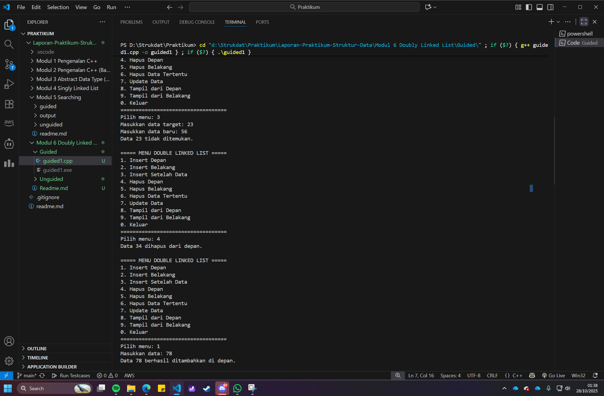
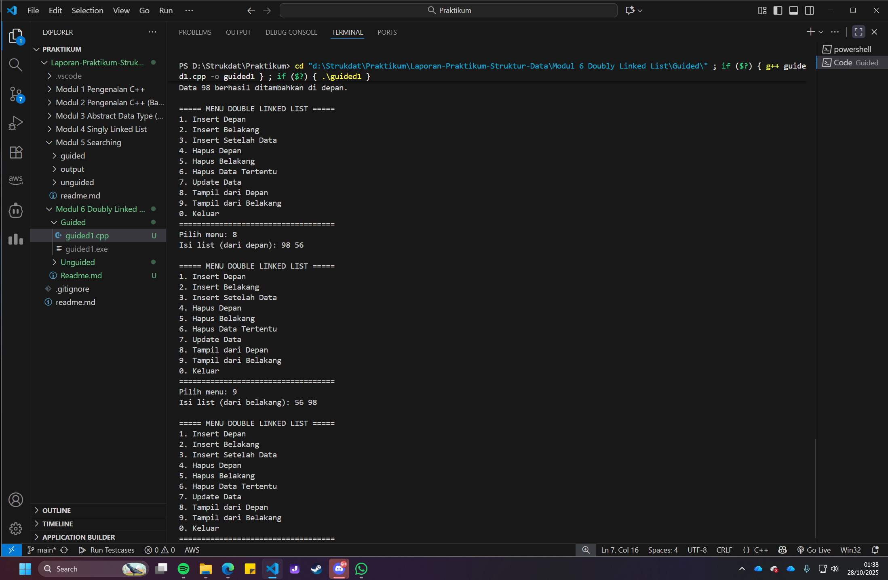
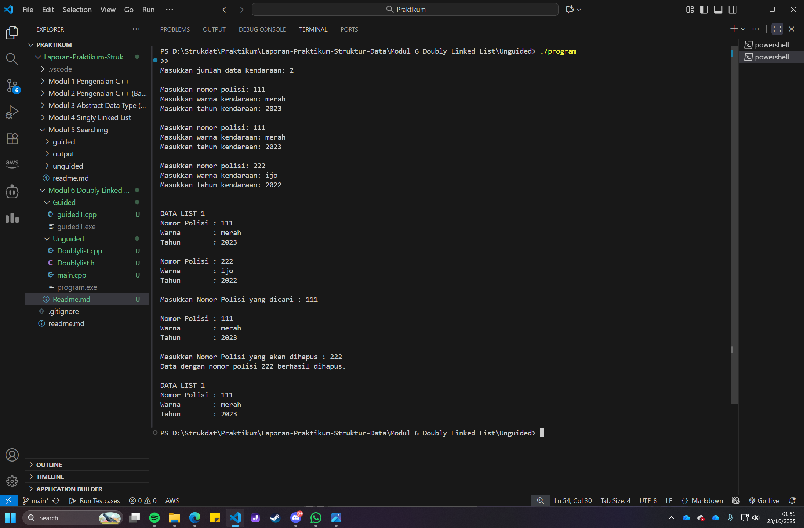

# <h1 align="center">Laporan Praktikum Modul 6 <br> Doubly Linked List</h1>

<p align="center">Renisa Assyifa Putri - 103112400123</p>


## Dasar Teori - Doubly Linked List

Modul ini membahas Doubly Linked List (DLL) yang merupakan pengembangan dari Single Linked List (SLL). Perbedaan utamanya terletak pada struktur node, dimana setiap node dalam DLL memiliki dua pointer yaitu pointer next yang menunjuk ke node selanjutnya dan pointer prev yang menunjuk ke node sebelumnya.

Struktur dua arah ini memberikan beberapa keunggulan. Menurut Goodrich dkk. (2011), kelebihan utama DLL adalah kemampuannya melakukan penelusuran (traversal) data secara bidirectional (maju dan mundur) dengan mudah. Hal ini membuat operasi seperti insertion atau deletion data di tengah list menjadi lebih efisien karena tidak perlu melakukan looping dari awal untuk menemukan node sebelumnya, cukup mengakses node->prev.

DLL banyak digunakan dalam berbagai aplikasi. Sebagai contoh, Wahyuni dkk. (2022) dalam penelitiannya menjelaskan penggunaan DLL untuk membuat fitur music player dimana pointer next digunakan untuk fungsi "Next Song" dan pointer prev untuk "Previous Song". Aplikasi lain yang menggunakan konsep ini adalah fitur undo/redo di text editor dan history "Forward/Backward" di web browser.

Meskipun memiliki banyak keunggulan, DLL juga memiliki kekurangan. Karena setiap node harus menyimpan satu pointer tambahan (prev), kebutuhan memorinya lebih besar dibandingkan SLL. Selain itu, implementasi operasinya terutama insert dan delete lebih kompleks karena harus mengelola dan mengupdate lebih banyak pointer agar list tidak terputus (Goodrich dkk., 2011).

## Guided

### Guided 1

```cpp
#include <iostream>
using namespace std;

struct Node {
    int data;
    Node* prev;
    Node* next;
};

Node* head = nullptr;
Node* tail = nullptr;

void insertDepan(int data) {
    Node* newNode = new Node();
    newNode->data = data;
    newNode->prev = nullptr;
    newNode->next = head;

    if (head != nullptr) {
        head->prev = newNode;
    } else {
        tail = newNode;
    }
    head = newNode;
    cout << "Data " << data << " berhasil ditambahkan di depan.\n";
}

void insertBelakang(int data) {
    Node* newNode = new Node();
    newNode->data = data;
    newNode->prev = tail;
    newNode->next = nullptr;

    if (tail != nullptr) {
        tail->next = newNode;
    } else {
        head = newNode;
    }
    tail = newNode;
    cout << "Data " << data << " berhasil ditambahkan di belakang.\n";
}

void insertSetelah(int target, int data) {
    Node* current = head;
    while (current != nullptr && current->data != target) {
        current = current->next;
    }
    if (current == nullptr) {
        cout << "Data " << target << " tidak ditemukan.\n";
        return;
    }

    Node* newNode = new Node();
    newNode->data = data;
    newNode->prev = current;
    newNode->next = current->next;

    if (current->next != nullptr) {
        current->next->prev = newNode;
    } else {
        tail = newNode;
    }
    current->next = newNode;
    cout << "Data " << data << " berhasil disisipkan setelah " << target << ".\n";
}

void hapusDepan() {
    if (head == nullptr) {
        cout << "List kosong.\n";
        return;
    }
    Node* temp = head;
    head = head->next;
    if (head != nullptr) {
        head->prev = nullptr;
    } else {
        tail = nullptr;
    }
    cout << "Data " << temp->data << " dihapus dari depan.\n";
    delete temp;
}

void hapusBelakang() {
    if (tail == nullptr) {
        cout << "List kosong.\n";
        return;
    }
    Node* temp = tail;
    tail = tail->prev;

    if (tail != nullptr) {
        tail->next = nullptr;
    } else {
        head = nullptr;
    }
    cout << "Data " << temp->data << " dihapus dari belakang.\n";
    delete temp;
}

void hapusData (int target) {
    if (head == nullptr) {
        cout << "List kosong.\n";
        return;
    }

    Node* current = head;
    while (current != nullptr && current->data != target) {
        current = current->next;
    }

    if (current == nullptr) {
        cout << "Data " << target << " tidak ditemukan.\n";
        return;
    }

    if (current == head) {
        hapusDepan();
    } else if (current == tail) {
        hapusBelakang();
    } else {
        current->prev->next = current->next;
        current->next->prev = current->prev;
        cout << "Data " << target << " dihapus.\n";
        delete current;
    }
}

void updateData(int oldData, int newData) {
    Node* current = head;
    while (current != nullptr && current->data != oldData)
        current = current->next;

    if (current == nullptr) {
        cout << "Data " << oldData << " tidak ditemukan.\n";
        return;
    }
    current->data = newData;
    cout << "Data " << oldData << " diubah menjadi " << newData << ".\n";
}

void tampilDepan() {
    if (head == nullptr) {
        cout << "List kosong.\n";
        return;
    }
    cout << "Isi list (dari depan): ";
    Node* current = head;
    while (current != nullptr) {
        cout << current->data << " ";
        current = current->next;
    }
    cout << "\n";
}

// ====================================
// Fungsi: Tampilkan dari belakang
// ====================================

void tampilBelakang() {
    if (tail == nullptr) {
        cout << "List kosong.\n";
        return;
    }
    cout << "Isi list (dari belakang): ";
    Node* current = tail;
    while (current != nullptr) {
        cout << current->data << " ";
        current = current->prev;
    }
    cout << "\n";
}

// ====================================
// MAIN PROGRAM (MENU INTERAKTIF)
// ====================================
int main() {
    int pilihan, data, target, oldData, newData;
    do {
        cout << "\n===== MENU DOUBLE LINKED LIST =====\n";
        cout << "1. Insert Depan\n";
        cout << "2. Insert Belakang\n";
        cout << "3. Insert Setelah Data\n";
        cout << "4. Hapus Depan\n";
        cout << "5. Hapus Belakang\n";
        cout << "6. Hapus Data Tertentu\n";
        cout << "7. Update Data\n";
        cout << "8. Tampil dari Depan\n";
        cout << "9. Tampil dari Belakang\n";
        cout << "0. Keluar\n";
        cout << "===================================\n";
        cout << "Pilih menu: ";
        cin >> pilihan;

        switch (pilihan) {
            case 1:
                cout << "Masukkan data: ";
                cin >> data;
                insertDepan(data);
                break;
            case 2:
                cout << "Masukkan data: ";
                cin >> data;
                insertBelakang(data);
                break;
            case 3:
                cout << "Masukkan data target: ";
                cin >> target;
                cout << "Masukkan data baru: ";
                cin >> data;
                insertSetelah(target, data);
                break;
            case 4:
                hapusDepan();
                break;
            case 5:
                hapusBelakang();
                break;
            case 6:
                cout << "Masukkan data yang ingin dihapus: ";
                cin >> target;
                hapusData(target);
                break;
            case 7:
                cout << "Masukkan data lama: ";
                cin >> oldData;
                cout << "Masukkan data baru: ";
                cin >> newData;
                updateData(oldData, newData);
                break;
            case 8:
                tampilDepan();
                break;
            case 9:
                tampilBelakang();
                break;
            case 0:
                cout << "👋 Keluar dari program.\n";
                break;
            default:
                cout << "Pilihan tidak valid.\n";
        }
    } while (pilihan != 0);
    return 0;
}
```

### Output Guided 1




### Penjelasan Guided 1

Program ini merupakan implementasi Doubly Linked List dengan interface menu interaktif yang memungkinkan pengguna untuk mengelola data melalui operasi tambah, hapus, ubah, dan tampilkan data.

Setiap data disimpan dalam `Node` yang memiliki koneksi dua arah (`prev` dan `next`). Alur program dikontrol menggunakan loop `do-while` yang menampilkan menu pilihan kepada pengguna.

1. **Insert (Depan, Belakang, Setelah)**: Saat pengguna memilih menambah data, program membuat `Node` baru dan mengatur pointer dari node baru tersebut beserta node tetangganya untuk menyambungkan node baru ke list, baik di posisi `head` (depan), `tail` (belakang), atau di antara dua node.

2. **Hapus (Depan, Belakang, Tertentu)**: Saat pengguna memilih hapus, program mencari node yang dimaksud terlebih dahulu. Setelah ditemukan, program menyambungkan ulang pointer `next` dari node sebelumnya dengan pointer `prev` dari node sesudahnya untuk melewati node yang akan dihapus, kemudian node tersebut dihapus dari memori.

3. **Tampil (Depan, Belakang)**: Fungsi ini menunjukkan keunggulan DLL dimana `tampilDepan()` melakukan iterasi dari `head` menggunakan `current->next`, sedangkan `tampilBelakang()` melakukan iterasi dari `tail` menggunakan `current->prev`.

4. **Update**: Fungsi ini mencari data lama dalam list, kemudian jika ditemukan akan mengganti nilainya dengan data baru.

Program berjalan secara kontinyu sampai pengguna memilih opsi '0' untuk keluar.


## Unguided

### Soal 1

> 1. Buatlah ADT Doubly Linked list sebagai berikut di dalam file “Doublylist.h”:

```
Type infotype : kendaraan <
	nopol : string 
	warna : string 
	thnBuat : integer > 

Type address : pointer to ElmList Type ElmList < 
	info : infotype
	next :address 
	prev : address > 
	
Type List < 
	First : address 
	Last : address 
>
procedure CreateList( input/output L : List ) 
function alokasi( x : infotype ) → address 
procedure dealokasi(input/output P : address ) 
procedure printInfo( input L : List ) 
procedure insertLast(input/output L : List, 
	input P : address ) 
```

> Buatlah implementasi ADT Doubly Linked list pada file “Doublylist.cpp” dan coba hasil implementasi ADT pada file “main.cpp”.

### Contoh Output
```
Masukkan nomor polisi: D001  
Masukkan warna kendaraan: hitam  
Masukkan tahun kendaraan: 90  

Masukkan nomor polisi: D003  
Masukkan warna kendaraan: putih  
Masukkan tahun kendaraan: 70  

Masukkan nomor polisi: D001  
Masukkan warna kendaraan: merah  
Masukkan tahun kendaraan: 80  
Nomor polisi sudah terdaftar  

Masukkan nomor polisi: D004  
Masukkan warna kendaraan: kuning  
Masukkan tahun kendaraan: 90  
```

```
No Polisi : D004  
Warna     : kuning  
Tahun     : 90  

No Polisi : D003  
Warna     : putih  
Tahun     : 70  

No Polisi : D001  
Warna     : hitam  
Tahun     : 90  
```

#### 1. Doublylist.h

```cpp
#ifndef DOUBLYLIST_H
#define DOUBLYLIST_H

#include <iostream>
#include <string>
using namespace std;
struct Kendaraan {
    string nomorPolisi;
    string warna;
    int tahun;
};

typedef Kendaraan InfoKendaraan;

struct Node {
    InfoKendaraan data;
    Node* next;
    Node* prev;
};

typedef Node* Address;

struct List {
    Address first;
    Address last;
};

void buatListKosong(List &daftarKendaraan);
Address buatNodeBaru(InfoKendaraan kendaraanBaru);
void hapusNode(Address node);
void tambahKendaraanDiAkhir(List &daftarKendaraan, Address nodeBaru);
void tampilkanKendaraan(List daftarKendaraan);
Address cariKendaraan(List daftarKendaraan, string nomorPolisi);
void hapusKendaraanPertama(List &daftarKendaraan, Address &node);
void hapusKendaraanTerakhir(List &daftarKendaraan, Address &node);
void hapusKendaraanSetelah(Address sebelum, Address &node);

#endif
```

#### 2. Doublylist.cpp

```cpp
#include "Doublylist.h"

void buatListKosong(List &daftarKendaraan) {
    daftarKendaraan.first = nullptr;
    daftarKendaraan.last = nullptr;
}

Address buatNodeBaru(InfoKendaraan kendaraanBaru) {
    Address node = new Node;
    node->data = kendaraanBaru;
    node->next = nullptr;
    node->prev = nullptr;
    return node;
}

void hapusNode(Address node) {
    delete node;
}

void tambahKendaraanDiAkhir(List &daftarKendaraan, Address nodeBaru) {
    if (daftarKendaraan.first == nullptr) {
        daftarKendaraan.first = nodeBaru;
        daftarKendaraan.last = nodeBaru;
    } else {
        daftarKendaraan.last->next = nodeBaru;
        nodeBaru->prev = daftarKendaraan.last;
        daftarKendaraan.last = nodeBaru;
    }
}

void tampilkanKendaraan(List daftarKendaraan) {
    Address node = daftarKendaraan.first;
    cout << "\nDATA LIST 1\n";
    while (node != nullptr) {
        cout << "Nomor Polisi : " << node->data.nomorPolisi << endl;
        cout << "Warna        : " << node->data.warna << endl;
        cout << "Tahun        : " << node->data.tahun << endl << endl;
        node = node->next;
    }
}

Address cariKendaraan(List daftarKendaraan, string nomorPolisi) {
    Address node = daftarKendaraan.first;
    while (node != nullptr) {
        if (node->data.nomorPolisi == nomorPolisi) {
            return node;
        }
        node = node->next;
    }
    return nullptr;
}

void hapusKendaraanPertama(List &daftarKendaraan, Address &node) {
    if (daftarKendaraan.first != nullptr) {
        node = daftarKendaraan.first;
        if (daftarKendaraan.first == daftarKendaraan.last) {
            daftarKendaraan.first = nullptr;
            daftarKendaraan.last = nullptr;
        } else {
            daftarKendaraan.first = daftarKendaraan.first->next;
            daftarKendaraan.first->prev = nullptr;
            node->next = nullptr;
        }
    }
}

void hapusKendaraanTerakhir(List &daftarKendaraan, Address &node) {
    if (daftarKendaraan.last != nullptr) {
        node = daftarKendaraan.last;
        if (daftarKendaraan.first == daftarKendaraan.last) {
            daftarKendaraan.first = nullptr;
            daftarKendaraan.last = nullptr;
        } else {
            daftarKendaraan.last = daftarKendaraan.last->prev;
            daftarKendaraan.last->next = nullptr;
            node->prev = nullptr;
        }
    }
}

void hapusKendaraanSetelah(Address sebelum, Address &node) {
    if (sebelum != nullptr && sebelum->next != nullptr) {
        node = sebelum->next;
        sebelum->next = node->next;
        if (node->next != nullptr) {
            node->next->prev = sebelum;
        }
        node->next = nullptr;
        node->prev = nullptr;
    }
}
```

#### 3. main.cpp

```cpp
#include "Doublylist.h"

bool cekDuplikat(List daftarKendaraan, string nomorPolisi) {
    Address node = daftarKendaraan.first;
    while (node != nullptr) {
        if (node->data.nomorPolisi == nomorPolisi) {
            return true;
        }
        node = node->next;
    }
    return false;
}

int main() {
    List daftarKendaraan;
    buatListKosong(daftarKendaraan);

    int jumlah;
    cout << "Masukkan jumlah data kendaraan: ";
    cin >> jumlah;
    cout << endl;

    for (int i = 0; i < jumlah; i++) {
        InfoKendaraan kendaraanBaru;

        cout << "Masukkan nomor polisi: ";
        cin >> kendaraanBaru.nomorPolisi;

        if (cekDuplikat(daftarKendaraan, kendaraanBaru.nomorPolisi)) {
            cout << "Nomor polisi sudah terdaftar\n\n";
            i--;
            continue;
        }
        cout << "Masukkan warna kendaraan: ";
        cin >> kendaraanBaru.warna;
        cout << "Masukkan tahun kendaraan: ";
        cin >> kendaraanBaru.tahun;
        cout << endl;

        Address nodeBaru = buatNodeBaru(kendaraanBaru);
        tambahKendaraanDiAkhir(daftarKendaraan, nodeBaru);
    }

    tampilkanKendaraan(daftarKendaraan);
    string nomorDicari;
    cout << "Masukkan Nomor Polisi yang dicari : ";
    cin >> nomorDicari;

    Address ditemukan = cariKendaraan(daftarKendaraan, nomorDicari);
    if (ditemukan != nullptr) {
        cout << "\nNomor Polisi : " << ditemukan->data.nomorPolisi << endl;
        cout << "Warna        : " << ditemukan->data.warna << endl;
        cout << "Tahun        : " << ditemukan->data.tahun << endl;
    } else {
        cout << "Data tidak ditemukan.\n";
    }

    string nomorDihapus;
    cout << "\nMasukkan Nomor Polisi yang akan dihapus : ";
    cin >> nomorDihapus;

    Address nodeDihapus = cariKendaraan(daftarKendaraan, nomorDihapus);
    if (nodeDihapus != nullptr) {
        if (nodeDihapus == daftarKendaraan.first) {
            hapusKendaraanPertama(daftarKendaraan, nodeDihapus);
        } else if (nodeDihapus == daftarKendaraan.last) {
            hapusKendaraanTerakhir(daftarKendaraan, nodeDihapus);
        } else {
            hapusKendaraanSetelah(nodeDihapus->prev, nodeDihapus);
        }
        hapusNode(nodeDihapus);
        cout << "Data dengan nomor polisi " << nomorDihapus << " berhasil dihapus.\n";
    } else {
        cout << "Data tidak ditemukan.\n";
    }
    tampilkanKendaraan(daftarKendaraan);
    return 0;
}
```

#### Output Soal 1


### Soal 2

> 2. Carilah elemen dengan nomor polisi D001 dengan membuat fungsi baru. fungsi findElm( L : List, x : infotype ) : address

#### Contoh Output Soal 2

```
Masukkan Nomor Polisi yang dicari : 111

Nomor Polisi : 111
Warna        : merah
Tahun        : 2023

Nomor Polisi : 222
Warna        : ijo
Tahun        : 2022
```

#### Output Soal 2


### Soal 3

> 3. Hapus elemen dengan nomor polisi D003 dengan procedure delete. 

```
procedure deleteFirst( input/output L : List,  
P : address ) - -
procedure deleteLast( input/output L : List,  
P : address )
procedure deleteAfter( input Prec : address,  
input/output P : address )
```

#### Contoh Output Soal 3
```
Masukkan Nomor Polisi yang akan dihapus : 222
Data dengan nomor polisi D003 berhasil dihapus.

DATA LIST 1

Nomor Polisi : 111
Warna        : merah
Tahun        : 2023
```

#### Output Soal 3


### Penjelasan Soal 1 - 3

Program ini merupakan implementasi Abstract Data Type (ADT) Doubly Linked List untuk sistem pendataan kendaraan. Struktur program dibagi menjadi tiga file yaitu `Doublylist.h` (deklarasi header), `Doublylist.cpp` (implementasi fungsi), dan `main.cpp` (program utama).

Program bertujuan untuk menyimpan data kendaraan (nomor polisi, warna, tahun) secara dinamis. Pada `main.cpp`, program meminta pengguna memasukkan jumlah data yang akan diinput.

Untuk setiap data, program melakukan tahapan berikut:

1. **Input & Validasi**: Pengguna memasukkan data kendaraan. Fungsi `cekDuplikat()` digunakan untuk memastikan tidak ada nomor polisi yang sama dalam list. Jika nomor polisi sudah terdaftar, program menolak input dan meminta pengguna mengulangi.

2. **Alokasi & Insersi**: Jika data valid, fungsi `buatNodeBaru()` (alokasi) dipanggil untuk menyiapkan `Node` baru di memori. Kemudian `tambahKendaraanDiAkhir()` (insertLast) digunakan untuk menambahkan node baru tersebut di akhir list sebagai `tail` baru.

3. **Display & Search**: Setelah semua data tersimpan, fungsi `tampilkanKendaraan()` (printInfo) dipanggil untuk menampilkan seluruh isi list dari awal hingga akhir. Program juga mendemonstrasikan fungsi `cariKendaraan()` (findElm) dimana pengguna dapat mencari data berdasarkan nomor polisi.

4. **Deletion**: Pada bagian akhir, program melakukan simulasi penghapusan data. Pengguna memasukkan nomor polisi yang akan dihapus, kemudian program mencari node tersebut. Jika ditemukan, program mengecek posisinya dan menggunakan fungsi yang sesuai: `hapusKendaraanPertama()` jika di depan, `hapusKendaraanTerakhir()` jika di belakang, atau `hapusKendaraanSetelah()` jika di tengah. Setelah pointer diatur ulang, `hapusNode()` (dealokasi) dipanggil untuk membebaskan memori.

### Referensi

[1] Goodrich, M. T., Tamassia, R., & Mount, D. M. (2011). Data Structures and Algorithms in C++ (2nd ed.). John Wiley & Sons.

[2] Wahyuni, R. S., Hatta, H. R., & Syafa'ah, L. (2022). "Implementation of Doubly Linked List for Music Player Application." TELKOMNIKA (Telecommunication Computing Electronics and Control), 20(1), 195-202. DOI: 10.12928/telkomnika.v20i1.21325.

[3] Ginting, A. S. B., dkk. (2021). "Analysis of data structure implementation for e-commerce shopping cart feature." Journal of Physics: Conference Series, 1811, 012095. DOI: 10.1088/1742-6596/1811/1/012095.


