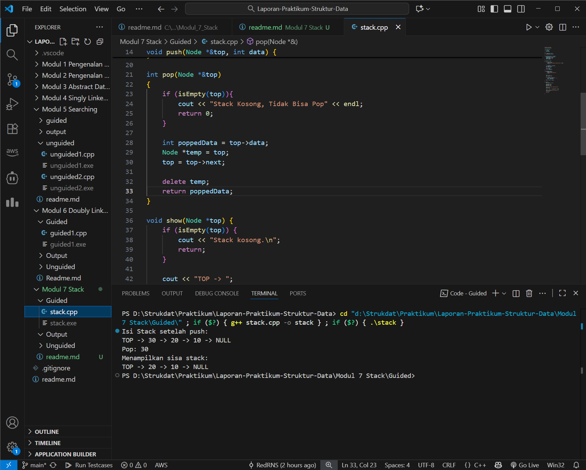
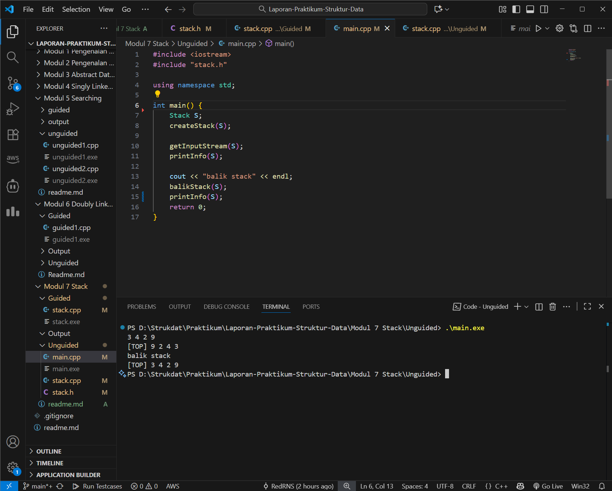
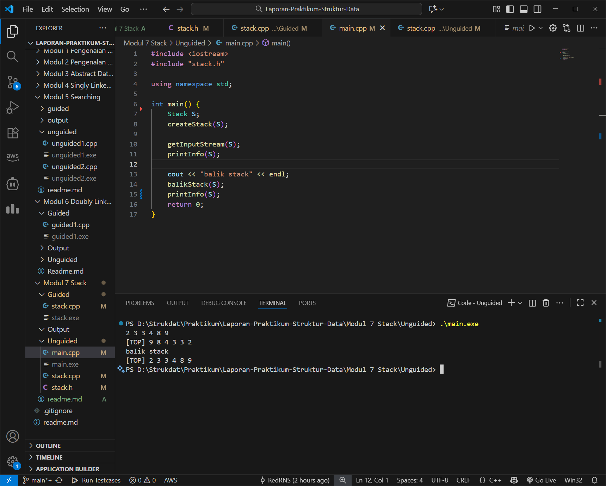
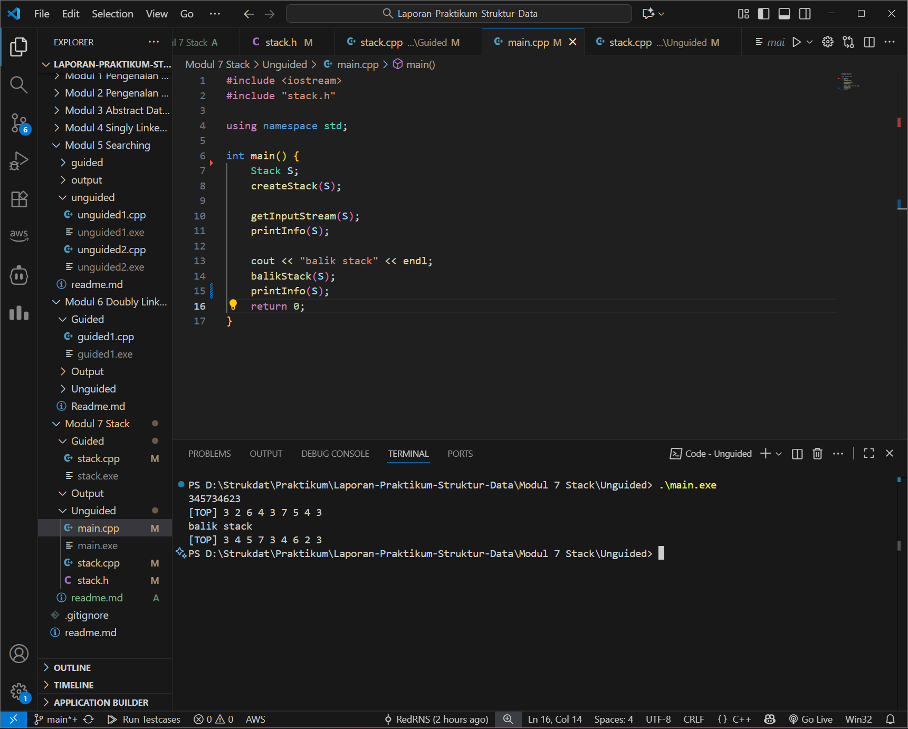

# <h1 align="center">Laporan Praktikum Modul 7 <br>Stack</h1>

<p align="center">Renisa Assyifa Putri - 103112400123</p>

## Dasar Teori

Stack atau tumpukan adalah struktur data linear yang menerapkan prinsip LIFO (Last In, First Out), yaitu data yang terakhir masuk akan menjadi yang pertama keluar. Akses data pada stack hanya bisa dilakukan dari satu sisi, yaitu bagian paling atas yang disebut top.

Beberapa operasi dasar dalam Stack meliputi:
- Push: Menambahkan elemen baru ke posisi paling atas (top).
- Pop: Mengambil atau menghapus elemen di posisi paling atas.
- Peek/Top: Melihat nilai data teratas tanpa menghapusnya.
- isEmpty: Mengecek apakah stack kosong atau tidak.

Stack dapat diimplementasikan menggunakan Array atau Linked List. Implementasi dengan Array lebih sederhana namun memiliki ukuran yang tetap dan bisa terjadi stack overflow jika penuh. Sedangkan implementasi dengan Linked List lebih fleksibel karena ukurannya dinamis, dimana setiap data disimpan dalam node yang saling terhubung. Stack memiliki banyak aplikasi dalam komputasi seperti manajemen memori (call stack), fitur undo-redo pada aplikasi, dan operasi matematika (konversi infix ke postfix). 

## Guided

### Guided 1

```cpp
#include <iostream>
using namespace std;

// Struktur Node
struct Node {
    int data;
    Node* next;
};

bool isEmpty(Node *top) {
    return top == nullptr;
}

void push(Node *&top, int data) {
    Node* newNode = new Node();
    newNode->data = data;
    newNode->next = top;
    top = newNode;
}

int pop(Node *&top)
{
    if (isEmpty(top)){
        cout << "Stack Kosong, Tidak Bisa Pop" << endl;
        return 0;
    }

    int poppedData = top->data;
    Node *temp = top;
    top = top->next;

    delete temp;
    return poppedData;
}

void show(Node *top) {
    if (isEmpty(top)) {
        cout << "Stack kosong.\n";
        return;
    }

    cout << "TOP -> ";
    Node *temp = top;

    while (temp != nullptr) {
        cout << temp->data << " -> ";
        temp = temp->next;
    }
    cout << "NULL" << endl;
}

int main(){
    Node *stack = nullptr;

    push(stack, 10);
    push(stack, 20);
    push(stack, 30);

    cout << "Isi Stack setelah push:\n";
    show(stack);

    cout << "Pop: " << pop(stack) << endl;

    cout << "Menampilkan sisa stack: \n";
    show(stack);

    return 0;

}
```

#### Output Guided 1



#### Penjelasan Guided 1

Program ini mengimplementasikan struktur data Stack menggunakan Linked List dalam bahasa C++. Berbeda dengan array, setiap elemen direpresentasikan sebagai `struct Node` yang berisi nilai (`data`) dan pointer (`next`) yang menunjuk ke node di bawahnya.

Fungsi utama yang digunakan yaitu `push()` untuk menambahkan node baru di bagian top, `pop()` untuk mengambil dan menghapus node teratas, serta `isEmpty()` untuk mengecek apakah stack kosong. Fungsi `show()` digunakan untuk menampilkan isi stack dengan melakukan iterasi dari top sampai `NULL`. Pada fungsi `main()`, program menambahkan angka 10, 20, dan 30 ke dalam stack, kemudian melakukan operasi `pop()` untuk membuktikan prinsip LIFO dimana angka 30 (yang terakhir masuk) keluar pertama kali.

## Unguided

### Soal 1

Buatlah ADT Stack menggunakan ARRAY sebagai berikut di dalam file “stack.h”

```
Type infotype : integer
Type Stack <
info : array [20] of integer
top : integer
>
procedure CreateStack( input/output S : Stack )
procedure push(input/output S : Stack,
	input x : infotype)
function pop(input/output t S : Stack )
	→ infotype
procedure printInfo( input S : Stack )
procedure balikStack(input/output S :
	Stack )
```

Buatlah implementasi ADT Stack menggunakan Array pada file “stack.cpp” dan “main.cpp”

```cpp
int main()
{
    cout << "Hello world!" <<
endl;
    Stack S;
    createStack(S);
    Push(S,3);
    Push(S,4);
    Push(S,8);
    pop(S)
    Push(S,2);
    Push(S,3);
    pop(S);
    Push(S,9);
    printInfo(S);
    cout<<"balik stack"<<endl;
    balikStack(S);
    printInfo(S);
    return 0;
}
```

stack.h

```
#ifndef STACK_H
#define STACK_H

#define MAX 20
typedef int infotype;

typedef struct {
    infotype info[MAX];
    int top;
} Stack;

void createStack(Stack &S);
bool isEmpty(Stack S);
bool isFull(Stack S);
void push(Stack &S, infotype x);
infotype pop(Stack &S);
void printInfo(Stack S);
void balikStack(Stack &S);

#endif
```

#### 2. stack.cpp

```cpp
#include <iostream>
#include "stack.h"

using namespace std;

void createStack(Stack &S) {
    S.top = -1;
}

bool isEmpty(Stack S) {
    return S.top == -1;
}

bool isFull(Stack S) {
    return S.top == MAX - 1;
}


void push(Stack &S, infotype x) {
    if (!isFull(S)) {
        S.top++;
        S.info[S.top] = x;
    } else {
        cout << "Stack penuh!" << endl;
    }
}

infotype pop(Stack &S) {
    if (!isEmpty(S)) {
        infotype x = S.info[S.top];
        S.top--;
        return x;
    } else {
        cout << "Stack kosong!" << endl;
        return -9999;
    }
}

void printInfo(Stack S) {
    if (isEmpty(S)) {
        cout << "Stack kosong!" << endl;
    } else {
        cout << "[TOP] ";
        for (int i = S.top; i >= 0; i--) {
            cout << S.info[i] << " ";
        }
        cout << endl;
    }
}

void balikStack(Stack &S) {
    Stack temp;
    createStack(temp);
    while (!isEmpty(S)) {
        push(temp, pop(S));
    }
    S = temp;
}
```

#### 3. main.cpp

```cpp
#include <iostream>
#include "stack.h"

using namespace std;

void createStack(Stack &S) {
    S.top = -1;
}

bool isEmpty(Stack S) {
    return S.top == -1;
}

bool isFull(Stack S) {
    return S.top == MAX - 1;
}


void push(Stack &S, infotype x) {
    if (!isFull(S)) {
        S.top++;
        S.info[S.top] = x;
    } else {
        cout << "Stack penuh!" << endl;
    }
}

infotype pop(Stack &S) {
    if (!isEmpty(S)) {
        infotype x = S.info[S.top];
        S.top--;
        return x;
    } else {
        cout << "Stack kosong!" << endl;
        return -9999;
    }
}

void printInfo(Stack S) {
    if (isEmpty(S)) {
        cout << "Stack kosong!" << endl;
    } else {
        cout << "[TOP] ";
        for (int i = S.top; i >= 0; i--) {
            cout << S.info[i] << " ";
        }
        cout << endl;
    }
}

void balikStack(Stack &S) {
    Stack temp;
    createStack(temp);
    while (!isEmpty(S)) {
        push(temp, pop(S));
    }
    S = temp;
}
```

#### Output Soal 1



#### Penjelasan Soal 1

Pada soal ini, Stack diimplementasikan menggunakan Array statis dengan kapasitas maksimal 20 elemen sesuai definisi di file header (`stack.h`). Variabel `top` diinisialisasi dengan nilai -1 di fungsi `createStack()` sebagai penanda stack masih kosong.

Fungsi yang digunakan meliputi `push()` untuk menambah data dengan menaikkan indeks `top`, `pop()` untuk mengambil data dengan menurunkan indeks `top`, dan `printInfo()` untuk menampilkan data dari indeks `top` sampai 0. Selain itu ada fungsi `balikStack()` yang membalik urutan elemen stack dengan memindahkan seluruh isi stack ke stack sementara. Hasilnya, urutan data yang awalnya [9, 2, 4, 3] menjadi terbalik setelah fungsi dijalankan.

### Soal 2

> Tambahkan prosedur pushAscending( in/out S : Stack, in x : integer)

```cpp
int main()
{
	cout << "Hello world!" << endl;
	Stack S;
	createStack(S);
	pushAscending(S,3);
	pushAscending(S,4);
	pushAscending(S,8);
	pushAscending(S,2);
	pushAscending(S,3);
	pushAscending(S,9);
	printInfo(S);
	cout<<"balik stack"<<endl;
	balikStack(S);
	printInfo(S);
	return 0;
}
```

#### 1. main.cpp

```cpp
#include <iostream>
#include "stack.h"

using namespace std;

int main() {
    cout << "Hello world!" << endl;

    Stack S;
    createStack(S);
    pushAscending(S, 3);
    pushAscending(S, 4);
    pushAscending(S, 8);
    pushAscending(S, 2);
    pushAscending(S, 3);
    pushAscending(S, 9);
    printInfo(S);

    cout << "balik stack" << endl;
    balikStack(S);
    printInfo(S);
    return 0;
}
```

#### 2. stack.cpp

```cppcpp
#include <iostream>
#include "stack.h"

using namespace std;

void createStack(Stack &S) {
    S.top = -1;
}

bool isEmpty(Stack S) {
    return S.top == -1;
}

bool isFull(Stack S) {
    return S.top == MAX - 1;
}

void push(Stack &S, infotype x) {
    if (!isFull(S)) {
        S.top++;
        S.info[S.top] = x;
    } else {
        cout << "Stack penuh!" << endl;
    }
}

void pushAscending(Stack &S, infotype x) {
    Stack temp;
    createStack(temp);

    while (!isEmpty(S) && S.info[S.top] > x) {
        push(temp, pop(S));
    }

    push(S, x);

    while (!isEmpty(temp)) {
        push(S, pop(temp));
    }
}

infotype pop(Stack &S) {
    if (!isEmpty(S)) {
        infotype x = S.info[S.top];
        S.top--;
        return x;
    } else {
        cout << "Stack kosong!" << endl;
        return -9999;
    }
}

void printInfo(Stack S) {
    if (isEmpty(S)) {
        cout << "Stack kosong!" << endl;
    } else {
        cout << "[TOP] ";
        for (int i = S.top; i >= 0; i--) {
            cout << S.info[i] << " ";
        }
        cout << endl;
    }
}

void balikStack(Stack &S) {
    Stack temp;
    createStack(temp);
    while (!isEmpty(S)) {
        push(temp, pop(S));
    }
    S = temp;
}
```

#### 3. stack.h

```cpp
#ifndef STACK_H
#define STACK_H

#define MAX 20
typedef int infotype;

typedef struct {
    infotype info[MAX];
    int top;
} Stack;

void createStack(Stack &S);
bool isEmpty(Stack S);
bool isFull(Stack S);
void push(Stack &S, infotype x);
infotype pop(Stack &S);
void printInfo(Stack S);
void balikStack(Stack &S);
void pushAscending(Stack &S, infotype x);
#endif
```

#### Output Soal 2



#### Penjelasan Soal 2

Pada soal kedua, program ditambahkan dengan prosedur `pushAscending()` yang berfungsi menjaga agar elemen dalam stack selalu terurut menaik (ascending) setiap kali ada data baru yang masuk.

Cara kerjanya adalah dengan membandingkan data input dengan data di `top`. Jika data di `top` lebih besar dari input, data tersebut dipindahkan dulu ke stack sementara menggunakan `pop`. Setelah menemukan posisi yang tepat atau stack kosong, data input baru dimasukkan dengan `push`, kemudian data dari stack sementara dikembalikan ke stack utama. Hasilnya, meskipun input dimasukkan secara acak, isi stack tetap tersusun berurutan dari nilai terkecil ke terbesar.

### Soal 3

> Tambahkan prosedur getInputStream( in/out S : Stack ). Prosedur akan terus membaca dan menerima input user dan memasukkan setiap input ke dalam stack hingga user menekan tombol enter. Contoh: gunakan cin.get() untuk mendapatkan inputan user.

```cpp
int main()
{
	cout << "Hello world!" << endl;
	Stack S;
	createStack(S);
	getInputStream(S);
	printInfo(S);
	cout<<"balik stack"<<endl;
	balikStack(S);
	printInfo(S);
	return 0;
}
```

#### 1. main.cpp

```cpp
#include <iostream>
#include "stack.h"

using namespace std;

int main() {
    cout << "Hello world!" << endl;
    Stack S;
    createStack(S);

    getInputStream(S);
    printInfo(S);

    cout << "balik stack" << endl;
    balikStack(S);
    printInfo(S);
    return 0;
}
```

stack.cpp

```
#include <iostream>
#include "stack.h"

using namespace std;

void createStack(Stack &S) {
    S.top = -1;
}

bool isEmpty(Stack S) {
    return S.top == -1;
}

bool isFull(Stack S) {
    return S.top == MAX - 1;
}

void push(Stack &S, infotype x) {
    if (!isFull(S)) {
        S.top++;
        S.info[S.top] = x;
    } else {
        cout << "Stack penuh!" << endl;
    }
}

void pushAscending(Stack &S, infotype x) {
    Stack temp;
    createStack(temp);

    while (!isEmpty(S) && S.info[S.top] > x) {
        push(temp, pop(S));
    }

    push(S, x);

    while (!isEmpty(temp)) {
        push(S, pop(temp));
    }
}

infotype pop(Stack &S) {
    if (!isEmpty(S)) {
        infotype x = S.info[S.top];
        S.top--;
        return x;
    } else {
        cout << "Stack kosong!" << endl;
        return -9999;
    }
}

void printInfo(Stack S) {
    if (isEmpty(S)) {
        cout << "Stack kosong!" << endl;
    } else {
        cout << "[TOP] ";
        for (int i = S.top; i >= 0; i--) {
            cout << S.info[i] << " ";
        }
        cout << endl;
    }
}

void balikStack(Stack &S) {
    Stack temp;
    createStack(temp);
    while (!isEmpty(S)) {
        push(temp, pop(S));
    }
    S = temp;
}

void getInputStream(Stack &S) {
    char ch;
    while (true) {
        ch = cin.get();
        if (ch == '\n') break;
        if (ch >= '0' && ch <= '9') {
            push(S, ch - '0');
        }
    }
}
```

stack.h

```
#ifndef STACK_H
#define STACK_H

#define MAX 20
typedef int infotype;

typedef struct {
    infotype info[MAX];
    int top;
} Stack;

void createStack(Stack &S);
bool isEmpty(Stack S);
bool isFull(Stack S);
void push(Stack &S, infotype x);
infotype pop(Stack &S);
void printInfo(Stack S);
void balikStack(Stack &S);
void pushAscending(Stack &S, infotype x);
void getInputStream(Stack &S);

#endif
```

#### Output Soal 3



#### Penjelasan Soal 3

Pada soal ketiga ditambahkan fitur interaktif melalui prosedur `getInputStream()` yang memungkinkan program menerima input angka dari pengguna dalam satu baris, kemudian memisahkannya menjadi elemen integer untuk dimasukkan ke stack.

Program menggunakan fungsi `cin.get()` untuk membaca input karakter per karakter sampai tombol Enter ditekan. Setiap karakter angka dikonversi menjadi integer sebelum di-`push` ke stack. Pada fungsi `main()`, program menunjukkan bagaimana deretan angka yang diketik pengguna tersusun dalam stack, ditampilkan, kemudian dibalik urutannya menggunakan fungsi `balikStack()`

## Referensi

[1] Modul Praktikum 4 – Stack, Universitas Negeri Malang. Modul Struktur Data (PDF) https://elektro.um.ac.id/wp-content/uploads/2016/04/Struktur-Data-Modul-Praktikum-4-Stack.pdf

[2] JUTECH. "Penggunaan Struktur Data Stack dalam Pemrograman C++ dengan Pendekatan Array dan Linked List". Jurnal JUTECH. [Online PDF]. Tersedia: https://jurnal.stkippersada.ac.id/jurnal/index.php/jutech/article/download/4263/pd

[3] Trivusi. (2022). Struktur Data Stack: Pengertian, Karakteristik, dan Kegunaannya. [Online]. Tersedia: https://trivusi.web.id/2022/07/struktur-data-stack.html