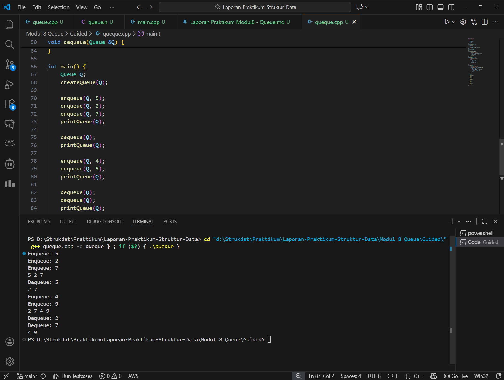
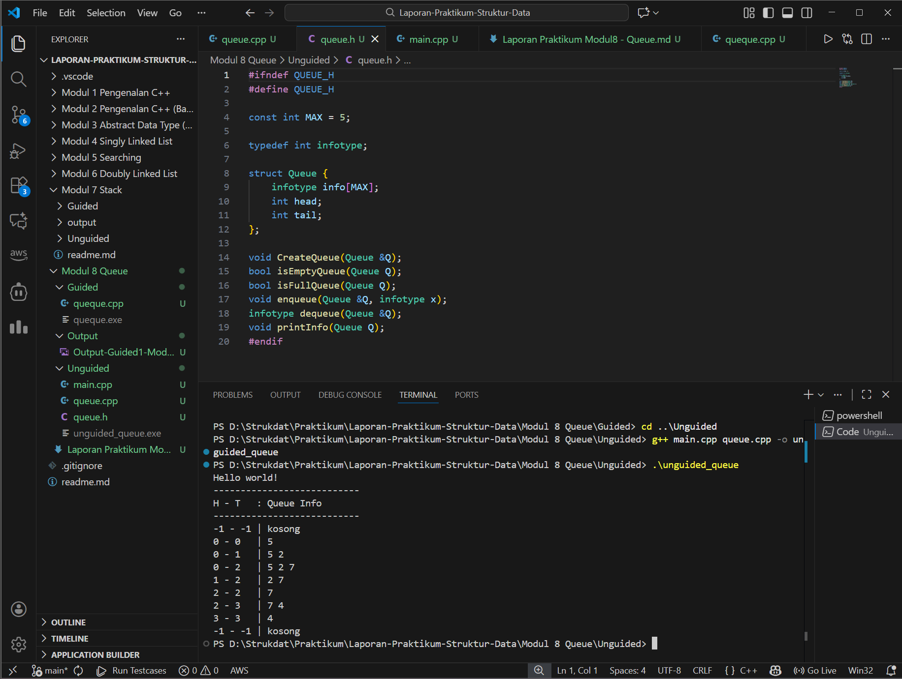

# <h1 align="center">Laporan Praktikum Modul 7 <br>Queue</h1>

<p align="center">Renisa Assyifa Putri - 103112400123</p>

## Dasar Teori - Queue

Pada modul ke-8 ini, materi difokuskan pada struktur data Queue atau antrean. Queue adalah struktur data linear yang bekerja berdasarkan prinsip FIFO (First In, First Out). Artinya, elemen data yang pertama kali masuk ke dalam antrean akan menjadi elemen yang pertama kali dikeluarkan. Konsep ini sangat mirip dengan antrean di dunia nyata, seperti antrean nasabah di bank atau pembeli di kasir, di mana orang yang datang lebih awal akan dilayani terlebih dahulu.

Dalam operasionalnya, Queue memiliki dua gerbang utama, yaitu front (depan) sebagai tempat data keluar, dan rear (belakang) sebagai pintu masuk data baru. Terdapat beberapa operasi fundamental dalam Queue, antara lain enqueue untuk memasukkan data ke posisi belakang, dequeue untuk menghapus data dari posisi depan, serta peek untuk melihat data terdepan tanpa menghapusnya. Selain itu, terdapat fungsi validasi seperti isEmpty untuk mengecek apakah antrean kosong dan isFull untuk memastikan apakah kapasitas penyimpanan sudah penuh.

Implementasi Queue dapat dilakukan menggunakan dua cara utama, yaitu dengan Array atau Linked List. Penggunaan Array biasa memiliki kelemahan di mana ruang memori di bagian depan bisa terbuang sia-sia seiring pergerakan indeks antrean. Oleh karena itu, sering digunakan variasi Circular Queue, di mana indeks terakhir akan kembali tersambung ke indeks awal untuk memaksimalkan penggunaan memori. Di sisi lain, implementasi menggunakan Linked List menawarkan fleksibilitas kapasitas yang lebih dinamis karena ukurannya dapat bertambah sesuai jumlah data tanpa batasan indeks array yang statis. Struktur data ini sangat krusial dalam dunia komputasi, contohnya dalam manajemen penjadwalan proses CPU (CPU scheduling), antrean cetak printer, hingga algoritma pencarian jalur seperti Breadth First Search (BFS).

## Guided
---

```cpp
#include <iostream>
using namespace std;

#define MAX 5

struct Queue {
    int data[MAX];
    int head;
    int tail;
};

void createQueue(Queue &Q) {
    Q.head = -1;
    Q.tail = -1;
}

bool isEmpty(Queue Q) {
    return (Q.head == -1 && Q.tail == -1);
}

bool isFull(Queue Q) {
    return (Q.tail == MAX - 1);
}

void printQueue(Queue Q) {
    if (isEmpty(Q)) {
        cout << "Queue Kosong\n";
    } else {
        for (int i = Q.head; i <= Q.tail; i++) {
            cout << Q.data[i] << " ";
        }
        cout << endl;
    }
}

void enqueue(Queue &Q, int x) {
    if (isFull(Q)) {
        cout << "Queue Penuh\n";
    } else {
        if (isEmpty(Q)) {
            Q.head = Q.tail = 0;
        } else {
            Q.tail++;
        }
        Q.data[Q.tail] = x;
        cout << "Enqueue: " << x << endl;
    }
}

void dequeue(Queue &Q) {
    if (isEmpty(Q)) {
        cout << "Queue Kosong\n";
    } else {
        cout << "Dequeue: " << Q.data[Q.head] << endl;
        if (Q.head == Q.tail) {
            Q.head = Q.tail = -1;
        } else {
            for (int i = Q.head; i < Q.tail; i++) {
                Q.data[i] = Q.data[i + 1];
            }
            Q.tail--;
        }
    }
}

int main() {
    Queue Q;
    createQueue(Q);

    enqueue(Q, 5);
    enqueue(Q, 2);
    enqueue(Q, 7);
    printQueue(Q);

    dequeue(Q);
    printQueue(Q);

    enqueue(Q, 4);
    enqueue(Q, 9);
    printQueue(Q);

    dequeue(Q);
    dequeue(Q);
    printQueue(Q);
    return 0;
	}
```
### Output Code

Program di atas mendemonstrasikan pembuatan struktur data Queue menggunakan array statis dengan kapasitas maksimum 5 elemen. Variabel head dan tail digunakan sebagai penunjuk indeks awal dan akhir antrean, yang diinisialisasi dengan nilai -1 untuk menandakan kondisi kosong.

Logika program ini menggunakan pendekatan pergeseran elemen (shifting). Pada saat operasi enqueue, data baru ditambahkan di posisi tail. Sedangkan pada saat operasi dequeue, data pada posisi head (indeks 0) diambil, lalu data-data yang berada di belakangnya akan digeser maju satu langkah ke depan untuk mengisi kekosongan. Hal ini menjaga agar elemen terdepan selalu berada pada indeks ke-0. Jika antrean menjadi kosong setelah operasi penghapusan, indeks head dan tail akan diatur ulang kembali ke posisi -1. Program utama (main) menguji fungsi-fungsi ini dengan memasukkan beberapa angka, menampilkannya, lalu menghapus sebagian data untuk memvalidasi logika FIFO yang berjalan.


## Unguided

## Soal Latihan Modul 8

### Soal 1

> 1. Buatlah ADT Queue menggunakan ARRAY sebagai berikut di dalam file “queue.h”:

```
Type infotype: integer
Type Queue: <
    info : array [5] of infotype {index array dalam C++
    dimulai dari 0}
    head, tail : integer
>
procedure CreateQueue (input/output Q: Queue)
function isEmptyQueue (Q: Queue) → boolean
function isFullQueue (Q: Queue) → boolean
procedure enqueue (input/output Q: Queue, input x: infotype)
function dequeue (input/output Q: Queue) → infotype
procedure printInfo (input Q: Queue)
```

> Buatlah implementasi ADT Queue pada file “queue.cpp” dengan menerapkan mekanisme
   queue Alternatif 1 (head diam, tail bergerak).

```
int main() {
    cout << "Hello World" << endl;
    Queue Q;
    createQueue(Q);
    cout<<"----------------------"<<endl;
    cout<<" H - T \t | Queue info"<<endl;
    cout<<"----------------------"<<endl;
    printInfo(Q);
    enqueue(Q,5); printInfo(Q);
    enqueue(Q,2); printInfo(Q);
    enqueue(Q,7); printInfo(Q);
    dequeue(Q); printInfo(Q);
    enqueue(Q,4); printInfo(Q);
    dequeue(Q); printInfo(Q);
    dequeue(Q); printInfo(Q);
    return 0;
}
```
### queue.h
```cpp
#ifndef QUEUE_H
#define QUEUE_H

const int MAX = 5;

typedef int infotype;

struct Queue {
    infotype info[MAX];
    int head;
    int tail;
};

void CreateQueue(Queue &Q);
bool isEmptyQueue(Queue Q);
bool isFullQueue(Queue Q);
void enqueue(Queue &Q, infotype x);
infotype dequeue(Queue &Q);
void printInfo(Queue Q);
#endif
```
### queue.cpp
```cpp
#include <iostream>
#include "queue.h"

using namespace std;

void CreateQueue(Queue &Q) {
    Q.head = -1;
    Q.tail = -1;
}

bool isEmptyQueue(Queue Q) {
    return (Q.tail == -1);
}

bool isFullQueue(Queue Q) {
    return (Q.tail == MAX - 1);
}

void enqueue(Queue &Q, infotype x) {
    if (isFullQueue(Q)) {
        cout << "Queue Full!" << endl;
        return;
    }
    if (isEmptyQueue(Q)) {
        Q.head = 0;
        Q.tail = 0;
    } else {
        Q.tail++;
    }
    Q.info[Q.tail] = x;
}

infotype dequeue(Queue &Q) {
    if (isEmptyQueue(Q)) {
        cout << "Queue Empty!" << endl;
        return -1;
    }
    infotype x = Q.info[Q.head];
    for (int i = 0; i < Q.tail; i++) {
        Q.info[i] = Q.info[i + 1];
    }
    Q.tail--;
    if (Q.tail < 0) {
        Q.head = Q.tail = -1;
    }
    return x;
}

void printInfo(Queue Q) {
    cout << Q.head << " - " << Q.tail << "\t| ";
    if (isEmptyQueue(Q)) {
        cout << "empty queue" << endl;
        return;
    }
    for (int i = 0; i <= Q.tail; i++) {
        cout << Q.info[i] << " ";
    }
    cout << endl;
}
```
### main.cpp
```cpp
#include <iostream>
#include "queue.h"

using namespace std;
int main() {
    cout << "Hello world!" << endl;
    cout << "---------------------------" << endl;
    cout << "H - T\t: Queue Info" << endl;
    cout << "---------------------------" << endl;

    Queue Q;
    CreateQueue(Q);
    printInfo(Q);

    enqueue(Q, 5);  printInfo(Q);
    enqueue(Q, 2);  printInfo(Q);
    enqueue(Q, 7);  printInfo(Q);
    dequeue(Q);     printInfo(Q);
    dequeue(Q);     printInfo(Q);
    enqueue(Q, 4);  printInfo(Q);
    dequeue(Q);     printInfo(Q);
    dequeue(Q);     printInfo(Q);
    return 0;
}
```

---
### Soal 2

>2. Buatlah implementasi ADT Queue pada file “queue.cpp” dengan menerapkan mekanisme
   queue Alternatif 2 (head bergerak, tail bergerak).
### queue.h
```cpp
#ifndef QUEUE_H
#define QUEUE_H

const int MAX = 5;

typedef int infotype;

struct Queue {
    infotype info[MAX];
    int head;
    int tail;
};

void CreateQueue(Queue &Q);
bool isEmptyQueue(Queue Q);
bool isFullQueue(Queue Q);
void enqueue(Queue &Q, infotype x);
infotype dequeue(Queue &Q);
void printInfo(Queue Q);
#endif
```
### queue.cpp
```cpp
#include <iostream>
#include "queue.h"

using namespace std;

void CreateQueue(Queue &Q) {
    Q.head = -1;
    Q.tail = -1;
}

bool isEmptyQueue(Queue Q) {
    return (Q.head == -1);
}

bool isFullQueue(Queue Q) {
    return (Q.tail == MAX - 1);
}

void enqueue(Queue &Q, infotype x) {
    if (isFullQueue(Q)) {
        cout << "Queue Full!" << endl;
        return;
    }
    if (isEmptyQueue(Q)) {
        Q.head = Q.tail = 0;
    } else {
        Q.tail++;
    }
    Q.info[Q.tail] = x;
}

infotype dequeue(Queue &Q) {
    if (isEmptyQueue(Q)) {
        cout << "Queue Empty!" << endl;
        return -1;
    }
    infotype x = Q.info[Q.head];
    Q.head++;
    if (Q.head > Q.tail) {
        Q.head = Q.tail = -1;
    }
    return x;
}
void printInfo(Queue Q) {
    cout << Q.head << " - " << Q.tail << "\t| ";
    if (isEmptyQueue(Q)) {
        cout << "empty queue" << endl;
        return;
    }
    for (int i = Q.head; i <= Q.tail; i++) {
        cout << Q.info[i] << " ";
    }
    cout << endl;
}
```
### main.cpp
```cpp
#include <iostream>
#include "queue.h"

using namespace std;
int main() {
    cout << "Hello world!" << endl;
    cout << "---------------------------" << endl;
    cout << "H - T\t: Queue Info" << endl;
    cout << "---------------------------" << endl;

    Queue Q;
    CreateQueue(Q);
    printInfo(Q);

    enqueue(Q, 5);  printInfo(Q);
    enqueue(Q, 2);  printInfo(Q);
    enqueue(Q, 7);  printInfo(Q);
    dequeue(Q);     printInfo(Q);
    dequeue(Q);     printInfo(Q);
    enqueue(Q, 4);  printInfo(Q);
    dequeue(Q);     printInfo(Q);
    dequeue(Q);     printInfo(Q);
    return 0;
}
```

### Soal 3

> 3. Buatlah implementasi ADT Queue pada file “queue.cpp” dengan menerapkan mekanisme
   queue Alternatif 3 (head dan tail berputar).
### queue.h
```cpp
#ifndef QUEUE_H
#define QUEUE_H

const int MAX = 5;

typedef int infotype;

struct Queue {
    infotype info[MAX];
    int head;
    int tail;
};

void CreateQueue(Queue &Q);
bool isEmptyQueue(Queue Q);
bool isFullQueue(Queue Q);
void enqueue(Queue &Q, infotype x);
infotype dequeue(Queue &Q);
void printInfo(Queue Q);
#endif
```
### queue.cpp
```cpp
#include <iostream>
#include "queue.h"
using namespace std;

void CreateQueue(Queue &Q) {
    Q.head = -1;
    Q.tail = -1;
}

bool isEmptyQueue(Queue Q) {
    return (Q.head == -1);
}

bool isFullQueue(Queue Q) {
    return ((Q.tail + 1) % MAX == Q.head);
}

void enqueue(Queue &Q, infotype x) {
    if (isFullQueue(Q)) {
        cout << "Queue Full!" << endl;
        return;
    }

    if (isEmptyQueue(Q)) {
        Q.head = Q.tail = 0;
    } else {
        Q.tail = (Q.tail + 1) % MAX;
    }

    Q.info[Q.tail] = x;
}

infotype dequeue(Queue &Q) {
    if (isEmptyQueue(Q)) {
        cout << "Queue Empty!" << endl;
        return -1;
    }

    infotype x = Q.info[Q.head];

    if (Q.head == Q.tail) {
        Q.head = Q.tail = -1;
    } else {
        Q.head = (Q.head + 1) % MAX;
    }

    return x;
}

void printInfo(Queue Q) {
    cout << Q.head << " - " << Q.tail << "\t| ";

    if (isEmptyQueue(Q)) {
        cout << "empty queue" << endl;
        return;
    }

    int i = Q.head;
    while (true) {
        cout << Q.info[i] << " ";
        if (i == Q.tail) break;
        i = (i + 1) % MAX;
    }
    cout << endl;
}
```
### main.cpp
```cpp
#include <iostream>
#include "queue.h"

using namespace std;
int main() {
    cout << "Hello world!" << endl;
    cout << "---------------------------" << endl;
    cout << "H - T\t: Queue Info" << endl;
    cout << "---------------------------" << endl;

    Queue Q;
    CreateQueue(Q);
    printInfo(Q);

    enqueue(Q, 5);  printInfo(Q);
    enqueue(Q, 2);  printInfo(Q);
    enqueue(Q, 7);  printInfo(Q);
    dequeue(Q);     printInfo(Q);
    dequeue(Q);     printInfo(Q);
    enqueue(Q, 4);  printInfo(Q);
    dequeue(Q);     printInfo(Q);
    dequeue(Q);     printInfo(Q);
    return 0;
}
```

---
### Output Code Soal 1-3 


### Penjelasan Soal 1 - 3
Ketiga soal latihan di atas menyajikan tiga pendekatan berbeda dalam mengimplementasikan ADT Queue menggunakan bahasa C++. Meskipun ketiganya sama-sama menjalankan fungsi dasar antrean seperti enqueue dan dequeue, mekanisme internal pengelolaan indeks dan memorinya memiliki perbedaan yang signifikan.

Pada Alternatif 1 (Soal 1), implementasi menggunakan metode pergeseran elemen. Karakteristik utamanya adalah posisi head yang selalu tetap di indeks 0. Setiap kali terjadi pengambilan data (dequeue), seluruh elemen yang tersisa di dalam array akan digeser ke kiri (maju) untuk mengisi tempat yang kosong. Kelebihannya adalah urutan data terlihat rapi dari awal array, namun kelemahannya terletak pada beban komputasi tambahan karena sistem harus melakukan looping untuk menggeser data setiap kali ada elemen yang keluar.

Pada Alternatif 2 (Soal 2), digunakan metode floating head dan tail. Berbeda dengan cara pertama, di sini tidak ada pergeseran data sama sekali. Saat data diambil, indeks head cukup dinaikkan satu langkah (increment). Hal ini membuat proses eksekusi lebih cepat secara waktu (time complexity). Namun, kelemahannya adalah pemborosan memori, karena ruang indeks di bagian depan yang sudah ditinggalkan oleh head tidak bisa digunakan kembali hingga antrean di-reset total.

Pada Alternatif 3 (Soal 3), diterapkan konsep Circular Queue atau antrean melingkar. Ini adalah solusi paling optimal untuk implementasi menggunakan array. Mekanismenya memungkinkan indeks tail yang sudah mencapai ujung array untuk berputar kembali ke indeks 0 jika ruang tersebut kosong. Dengan menggunakan operasi modulus, penggunaan memori menjadi sangat efisien karena tidak ada ruang array yang terbuang percuma (seperti pada alternatif 2) dan tidak memerlukan proses geser data yang berat (seperti pada alternatif 1).

Secara garis besar, ketiga kode tersebut berhasil membuktikan prinsip FIFO, di mana perbedaan output yang muncul murni disebabkan oleh strategi manajemen indeks array yang dipilih dalam masing-masing skenario.

---
### Referensi
---

[1] Modul Praktikum Struktur Data – Queue, Universitas Negeri Malang.  
[https://elektro.um.ac.id/wp-content/uploads/2016/04/Struktur-Data-Modul-Praktikum-5-Queue.pdf](https://elektro.um.ac.id/wp-content/uploads/2016/04/Struktur-Data-Modul-Praktikum-5-Queue.pdf)
[2] Abdillah, G. (2021). “Struktur Data Queue: Konsep, Operasi, dan Implementasi.” Trivusi.  
https://trivusi.web.id/2022/07/struktur-data-queue.html
[3] Khotimah, K. (2020). “Implementasi Queue Menggunakan Array dan Linked List dalam Pemrograman C++.” _Jurnal Teknologi dan Sistem Informasi_, 8(2).  
https://jurnal.stkippersada.ac.id/jurnal/index.php/jutech/article/download/4264/pdf

---


