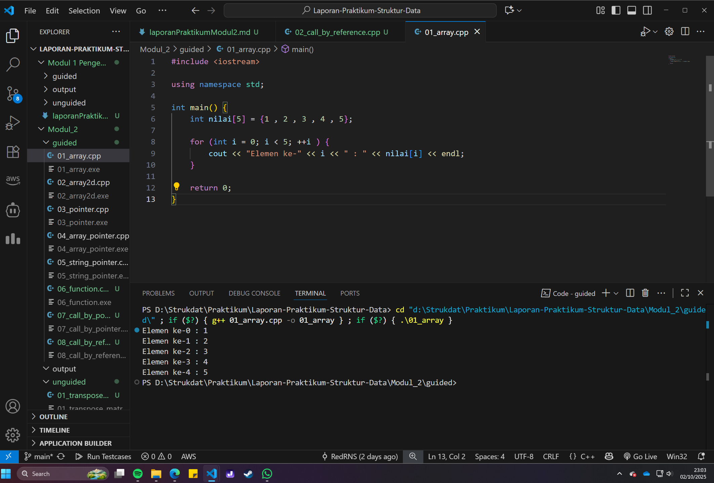
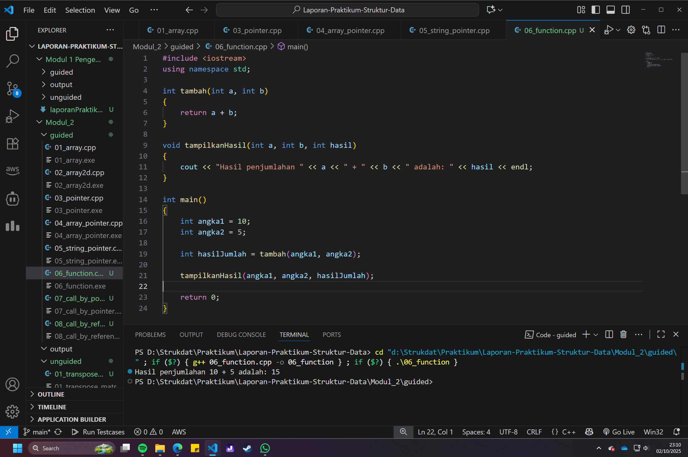
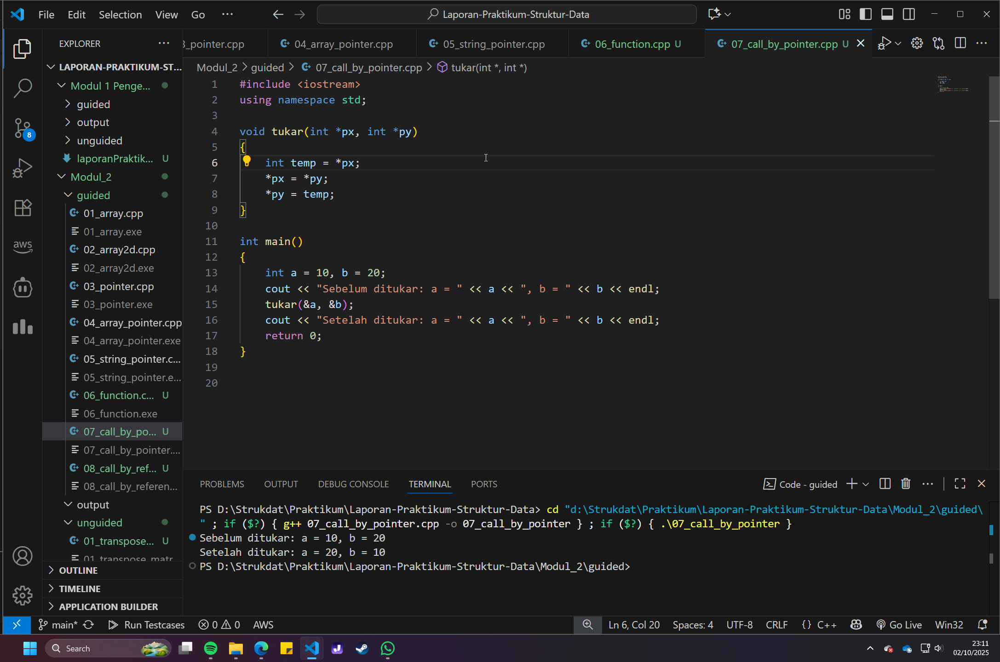
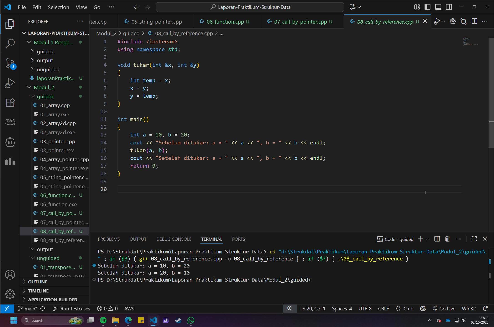
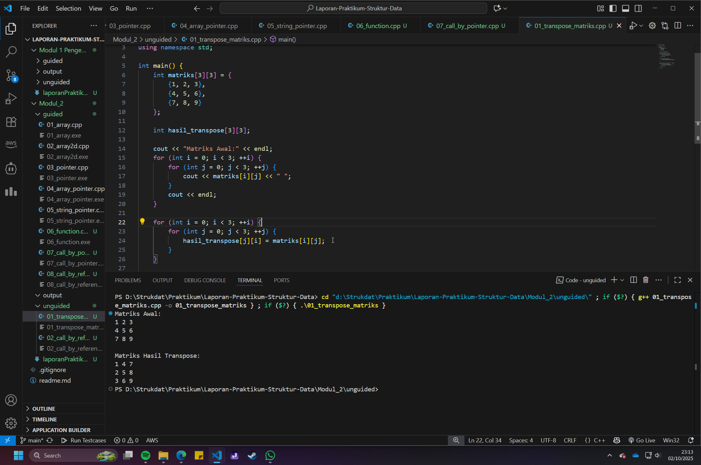
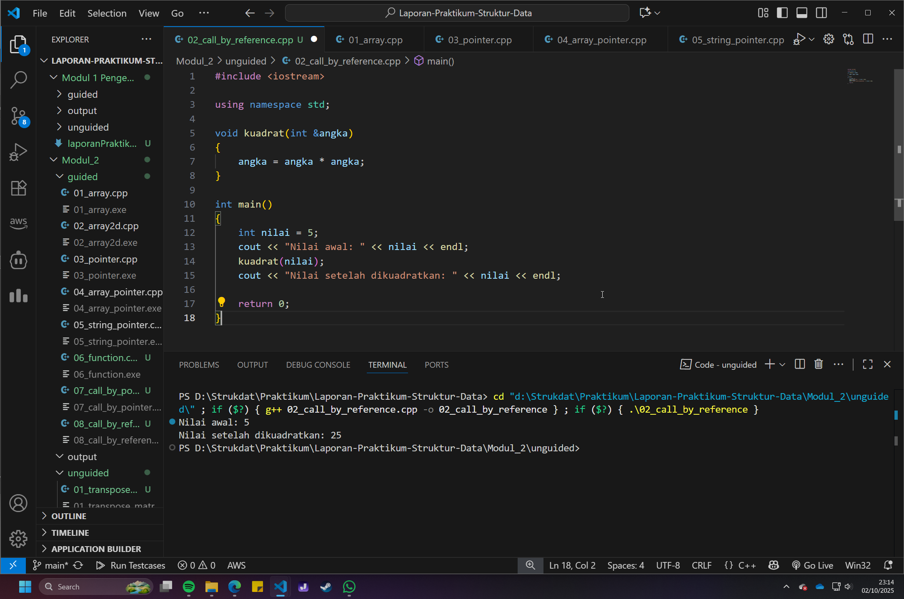

# <h1 align="center">Laporan Praktikum Modul 2 <br> Pengenalan C++ (Bagian Kedua)</h1>

<p align="center">Renisa Assyifa Putri - 103112400123</p>

## Dasar Teori

Pada modul kedua, pembahasan difokuskan pada konsep manajemen memori yang lebih mendalam di C++ melalui penggunaan Array dan Pointer. Array adalah sebuah struktur data yang digunakan untuk menyimpan kumpulan elemen dengan tipe data yang sama dalam satu nama variabel. Setiap elemen dalam array dapat diakses secara individual melalui sebuah indeks, yang dimulai dari 0 untuk elemen pertama. Array dapat berwujud satu dimensi (seperti daftar), dua dimensi (seperti tabel atau matriks), hingga multidimensi untuk data yang lebih kompleks.

Pointer adalah fitur fundamental dalam C++ yang merupakan variabel khusus untuk menyimpan alamat memori dari variabel lain. Setiap variabel yang dideklarasikan dalam program akan dialokasikan pada sebuah alamat unik di dalam memori (RAM). Dengan menggunakan operator address-of (&), kita bisa mendapatkan alamat memori dari sebuah variabel. Sebaliknya, dengan operator dereferensi (*), kita bisa mengakses atau memanipulasi nilai yang berada di alamat yang ditunjuk oleh sebuah pointer. Terdapat hubungan yang sangat erat antara array dan pointer; nama sebuah array pada dasarnya berfungsi sebagai pointer konstan yang menunjuk ke alamat elemen pertamanya.

Konsep pointer menjadi sangat penting ketika diimplementasikan dalam fungsi, terutama dalam mekanisme pelemparan parameter. Terdapat tiga cara utama: call by value, di mana fungsi hanya menerima salinan nilai; call by pointer, di mana fungsi menerima alamat memori variabel sehingga dapat mengubah nilai aslinya; dan call by reference, yang secara sintaksis lebih sederhana namun memiliki kapabilitas yang sama dengan call by pointer untuk memodifikasi variabel asli di luar fungsi. Pemahaman ini krusial untuk membuat program yang efisien dan modular.

## Guided

### Soal 1 Array Satu Dimensi

```cpp
#include <iostream>

using namespace std;

int main() {
    int nilai[5] = {1 , 2 , 3 , 4 , 5};

    for (int i = 0; i < 5; ++i ) {
        cout << "Elemen ke-" << i << " : " << nilai[i] << endl;
    }

    return 0;
}
```

> Output
> 

Program ini mendemonstrasikan deklarasi dan inisialisasi sebuah array satu dimensi bernama nilai yang memiliki 5 elemen bertipe integer. Program kemudian menggunakan perulangan for untuk mengakses dan mencetak setiap elemen array ke layar, dimulai dari indeks ke-0 hingga ke-4.

### Soal 2 Array Dua Dimensi

```cpp
#include <iostream>

using namespace std;

int main() {
    int matriks[3][3] = {
        {1, 2, 3},
        {4, 5, 6},
        {7, 8, 9}
    };

    for (int i = 0; i < 3; ++i) {
        for (int j = 0; j < 3; ++j) {
            cout << matriks[i][j] << " ";
        }
        // memindah baris setelah setiap baris matriks selesai dicetak
        cout << endl;
    }

    return 0;
}
```

> Output
> 

Program ini menunjukkan penggunaan array dua dimensi untuk merepresentasikan sebuah matriks berukuran 3x3. Program menggunakan perulangan bersarang (nested loop) untuk mengakses setiap elemen berdasarkan indeks baris (i) dan kolom (j), lalu menampilkannya dalam format matriks yang sesuai.

### Soal 3 Pengenalan Pointer

```cpp
#include <iostream>

using namespace std;

int main() {
    int umur = 25;
    int *p_umur;
    p_umur = &umur;

    cout << "Nilai umur: " << umur << endl;
    cout << "Alamat memori 'umur': " << &umur << endl;
    cout << "Nilai 'p_umur' (alamat): " << p_umur << endl;
    cout << "Nilai yang diakses 'p_umur': " << *p_umur << endl;
    cout << "Alamat memori dari pointer 'p_umur' itu sendiri: " << &p_umur << endl;

    return 0;
}
```

> Output
> 

Kode ini menjelaskan konsep dasar pointer. Sebuah variabel pointer p_umur dideklarasikan dan diinisialisasi dengan alamat memori dari variabel umur menggunakan operator &. Program kemudian menampilkan nilai asli, alamat memori variabel, nilai yang disimpan oleh pointer (yang merupakan alamat), nilai yang diakses melalui pointer menggunakan operator *, serta alamat memori dari variabel pointer itu sendiri.

### Soal 4 Hubungan Array dan Pointer

```cpp
#include <iostream>
using namespace std;

int main() {
    int data[5] = {10, 20, 30, 40, 50};
    int *p_data = data; 
    
    cout << "Mengakses elemen array menggunakan cara normal:" << endl;

    for (int i = 0; i < 5; ++i) 
    {
        cout << "Nilai elemen ke-" << i << " : " << data[i] << endl;
    }

    cout << "\nMengakses elemen array menggunakan pointer:" << endl;

    for (int i = 0; i < 5; ++i) 
    {
        cout << "Nilai elemen ke-" << i << " : " << *(p_data + i) << endl;
    }

    return 0;
}
```

> Output
> 

Program ini mengilustrasikan hubungan antara array dan pointer. Elemen-elemen array data diakses dengan dua cara berbeda: pertama, menggunakan notasi indeks data[i] yang umum; kedua, menggunakan notasi pointer *(p_data + i), yang memanfaatkan aritmatika pointer untuk berpindah ke alamat elemen berikutnya dalam array.

### Soal 5 Pointer dan String

```cpp
#include <iostream>
using namespace std;

int main() {
    char pesan_array[] = "Nasi Padang";
    char *pesan_pointer = "Ayam Bakar 23";

    cout << "String Array: " << pesan_array << endl;
    cout << "String Pointer: " << pesan_pointer << endl;

    // Mengubah karakter dalam array diperbolehkan
    pesan_array[0] = 'h';
    cout << "String Array setelah diubah: " << pesan_array << endl;

    // Pointer dapat diubah untuk menunjuk ke string lain
    pesan_pointer = "Sariman";
    cout << "String Pointer setelah menunjuk ke string lain: " << pesan_pointer << endl;

    return 0;
}
```

> Output
> 

Program ini menunjukkan perbedaan mendasar antara string yang dideklarasikan sebagai array karakter (char[]) dan sebagai pointer karakter (char *). String sebagai array memungkinkan modifikasi pada tiap karakternya, sementara string sebagai pointer bersifat read-only (literal string), namun pointernya sendiri dapat diarahkan untuk menunjuk ke alamat string literal yang lain.

### Soal 6 Fungsi dan Prosedur

```cpp
#include <iostream>
using namespace std;

int tambah(int a, int b)
{
    return a + b;
}

void tampilkanHasil(int a, int b, int hasil)
{
    cout << "Hasil penjumlahan " << a << " + " << b << " adalah: " << hasil << endl;
}

int main()
{
    int angka1 = 10;
    int angka2 = 5;

    int hasilJumlah = tambah(angka1, angka2);

    tampilkanHasil(angka1, angka2, hasilJumlah);

    return 0;
}
```

> Output
> 

Kode ini membedakan antara fungsi dan prosedur. Fungsi tambah dirancang untuk mengembalikan sebuah nilai hasil penjumlahan (return value). Sebaliknya, tampilkanHasil adalah sebuah prosedur (void) yang hanya menjalankan tugas tertentu, yaitu menampilkan hasil ke layar, tanpa mengembalikan nilai apa pun.

### Soal 7 Call by Pointer

```cpp
#include <iostream>
using namespace std;

void tukar(int *px, int *py)
{
    int temp = *px;
    *px = *py;
    *py = temp;
}

int main()
{
    int a = 10, b = 20;
    cout << "Sebelum ditukar: a = " << a << ", b = " << b << endl;
    tukar(&a, &b);
    cout << "Setelah ditukar: a = " << a << ", b = " << b << endl;
    return 0;
}
```

> Output
> 

Program ini mendemonstrasikan mekanisme call by pointer. Fungsi tukar menerima parameter berupa pointer integer (int*). Di dalam main, alamat dari variabel a dan b dilewatkan ke fungsi menggunakan operator &. Hal ini memungkinkan fungsi tukar untuk memanipulasi dan mengubah nilai asli dari variabel a dan b secara langsung.

### Soal 8 Call by Reference

```cpp
#include <iostream>
using namespace std;

void tukar(int &x, int &y)
{
    int temp = x;
    x = y;
    y = temp;
}

int main()
{
    int a = 10, b = 20;
    cout << "Sebelum ditukar: a = " << a << ", b = " << b << endl;
    tukar(a, b);
    cout << "Setelah ditukar: a = " << a << ", b = " << b << endl;
    return 0;
}
```

> Output
> 

Program ini mengimplementasikan call by reference, sebuah alternatif yang lebih sederhana secara sintaksis dibandingkan call by pointer. Dengan mendeklarasikan parameter sebagai referensi (int &), fungsi tukar dapat secara langsung mengubah nilai variabel a dan b dari main tanpa perlu menggunakan operator & saat pemanggilan atau operator * di dalam fungsi.

## Unguided

### Soal 1

Buatlah sebuah program untuk melakukan transpose pada sebuah matriks persegi berukuran 3x3. Operasi transpose adalah mengubah baris menjadi kolom dan sebaliknya. Inisialisasi matriks awal di dalam kode, kemudian buat logika untuk melakukan transpose dan simpan hasilnya ke dalam matriks baru. Terakhir, tampilkan matriks awal dan matriks hasil transpose.

```cpp
#include <iostream>

using namespace std;

int main() {
    int matriks[3][3] = {
        {1, 2, 3},
        {4, 5, 6},
        {7, 8, 9}
    };

    int hasil_transpose[3][3];

    cout << "Matriks Awal:" << endl;
    for (int i = 0; i < 3; ++i) {
        for (int j = 0; j < 3; ++j) {
            cout << matriks[i][j] << " ";
        }
        cout << endl;
    }

    for (int i = 0; i < 3; ++i) {
        for (int j = 0; j < 3; ++j) {
            hasil_transpose[j][i] = matriks[i][j];
        }
    }

    
    cout << "\nMatriks Hasil Transpose:" << endl;
    for (int i = 0; i < 3; ++i) {
        for (int j = 0; j < 3; ++j) {
            cout << hasil_transpose[i][j] << " ";
        }
        cout << endl; 
    }

    return 0;
}
```
Program di atas dirancang untuk melakukan operasi transpose pada matriks 3x3. Awalnya, matriks sumber diinisialisasi dan ditampilkan. Inti dari program ini terletak pada perulangan bersarang di mana elemen dari matriks sumber pada posisi [i][j] disalin ke matriks tujuan pada posisi [j][i]. Proses ini secara efektif menukar posisi baris dan kolom. Akhirnya, matriks hasil transpose dicetak ke layar untuk menunjukkan hasilnya.

> Output
> 

### Soal 2

Buatlah program yang menunjukkan penggunaan call by reference. Buat sebuah prosedur bernama kuadratkan yang menerima satu parameter integer secara referensi (&). Prosedur ini akan mengubah nilai asli variabel yang dilewatkan dengan nilai kuadratnya. Tampilkan nilai variabel di main() sebelum dan sesudah memanggil prosedur untuk membuktikan perubahannya.

```cpp
#include <iostream>

using namespace std;

void kuadrat(int &angka)
{
    angka = angka * angka;
}

int main()
{
    int nilai = 5;
    cout << "Nilai awal: " << nilai << endl;
    kuadrat(nilai);
    cout << "Nilai setelah dikuadratkan: " << nilai << endl;

    return 0;
}
```
Program ini secara spesifik mendemonstrasikan konsep call by reference. Sebuah variabel nilai diinisialisasi di fungsi main. Prosedur kuadratkan didefinisikan untuk menerima parameter int &angka, yang artinya ia menerima referensi (alias) ke variabel asli, bukan salinannya. Ketika prosedur ini dipanggil, operasi angka = angka * angka langsung memodifikasi variabel nilai di main. Hasilnya, nilai variabel sebelum dan sesudah pemanggilan prosedur terbukti berbeda, menunjukkan bahwa perubahan terjadi pada variabel asli.

> Output
> 

## Referensi

1. Mustakim, M., & Maulana, H. (2024). Penggunaan Struktur Data Stack dalam Pemrograman C++ dengan Pendekatan Array dan Linked List. JUTECH : Jurnal Teknologi Dan Sistem Informasi, 5(2), 484-490. https://jurnal.stkippersada.ac.id/jurnal/index.php/jutech/article/view/4263

2. Syafii, M. (2021). Pemrograman Komputer Menggunakan C++. Universitas Andalas. http://repo.unand.ac.id/32011/

3. Setiadi, B. (2020). Dasar Logika dan Algoritma Pemrograman dengan C++. Unika Soegijapranata. https://www.unika.ac.id/wp-content/uploads/2021/02/ebook-Berdi-Dasar-Logika-Pemrograman-C.pdf


